# 2주차 학습 노트: 모델에서 실리콘까지

## PyTorch, JAX·OpenXLA, Modular MAX·Mojo로 이해하는 AI 실행 스택

> **핵심 질문**  
> 모델의 연산 하나가 가속기에서 실행되기까지 어떤 단계를 거치며, 각 단계는 무엇을 담당할까?

- 문서 확인일: **2026-09-19**
- 공통 예제: **`Y = ReLU(X @ W + b)`**
- 대상: 모델 코드는 익숙하지만 컴파일러·런타임·가속기 내부의 연결은 처음 정리하는 학습자
- 범위: 모델의 수식과 텐서 연산부터, 칩의 연산 장치와 메모리에서 실제 계산이 일어나는 지점까지
- 범위 밖: 반도체 RTL 설계·제조, 상세 Roofline 분석, 고성능 matmul tiling 구현, 제품별 성능 순위

### 예제와 도식을 읽기 전에

1. **이 문서의 Mermaid 도식은 개념도다.** 특정 버전에서 캡처한 실제 컴파일러 그래프나 프로파일러 결과가 아니다.
2. **완결형 코드도 이 문서 작성 과정에서 실제 실행하지는 않았다.** 공식 문서의 API와 공개 예제를 확인해 구성했으며, 설치 버전·운영체제·드라이버에 따라 조정이 필요할 수 있다.
3. **`의사 코드`, `개념적 IR`이라고 표시한 블록은 실행 대상이 아니다.** 실제 IR은 함께 제공한 출력 코드로 확인한다.
4. **코드의 정확성 비교와 성능 비교는 별개다.** 예제의 `assert_close`는 수치 결과를 점검하지만 성능 우위를 증명하지 않는다.
5. Mojo 공식 문서에서는 확인 당시 **1.1.0** 표시를 확인했다. MAX와 Mojo의 패키지 구성·import 경로는 변경될 수 있으므로, 서로 호환되는 배포 환경을 사용한다.
6. Mermaid를 지원하는 Markdown 뷰어에서 열면 도식으로 표시된다. 지원하지 않는 뷰어에서는 `mermaid` 코드 블록으로 보인다.

---

## 목차

1. [이번 주에 알아야 할 큰 그림](#1-이번-주에-알아야-할-큰-그림)
2. [공통 예제의 수학과 텐서](#2-공통-예제의-수학과-텐서)
3. [모델에서 연산으로: Transformer를 펼쳐 보기](#3-모델에서-연산으로-transformer를-펼쳐-보기)
4. [연산에서 그래프·IR로](#4-연산에서-그래프ir로)
5. [IR에서 실행 코드로: 컴파일러의 결정](#5-ir에서-실행-코드로-컴파일러의-결정)
6. [실행 요청에서 커널 실행으로: 런타임과 비동기성](#6-실행-요청에서-커널-실행으로-런타임과-비동기성)
7. [커널에서 칩 내부로: GPU와 TPU](#7-커널에서-칩-내부로-gpu와-tpu)
8. [PyTorch 경로와 예제](#8-pytorch-경로와-예제)
9. [JAX·OpenXLA 경로와 예제](#9-jaxopenxla-경로와-예제)
10. [Modular MAX·Mojo 경로와 예제](#10-modular-maxmojo-경로와-예제)
11. [Triton으로 커널 경계를 직접 보기](#11-triton으로-커널-경계를-직접-보기)
12. [세 스택을 같은 기준으로 비교하기](#12-세-스택을-같은-기준으로-비교하기)
13. [작게 해볼 수 있는 관찰 실험](#13-작게-해볼-수-있는-관찰-실험)
14. [자주 생기는 오해와 문제 찾기](#14-자주-생기는-오해와-문제-찾기)
15. [스터디 발표와 토론 가이드](#15-스터디-발표와-토론-가이드)
16. [용어 사전과 최종 요약](#16-용어-사전과-최종-요약)
17. [공식 자료와 추가 읽기](#17-공식-자료와-추가-읽기)

---

## 1. 이번 주에 알아야 할 큰 그림

### 1.1 한 문장으로 정리

**AI 모델 실행은 수학적 계산을 여러 수준의 표현으로 바꾸고, 하드웨어에 맞게 실행 계획을 만든 뒤, 실제 데이터를 이동시키며 계산하는 과정이다.**

Python 코드 한 줄이 GPU의 단일 명령어 하나로 바뀌는 것은 아니다. 중간에 여러 계층이 있고, 각 계층은 서로 다른 질문에 답한다.

| 계층 | 주요 질문 | 입력 | 출력 |
|---|---|---|---|
| 모델·텐서 연산 | 무엇을 계산할까? | 모델 정의, 입력, 가중치 | 텐서 연산의 의미와 관계 |
| 그래프·IR | 계산을 기계가 분석하기 좋은 형태로 어떻게 표현할까? | 프로그램, shape·dtype 등 | 그래프 또는 중간 표현 |
| 컴파일러 | 이 계산을 이 장치에서 어떻게 실행할까? | IR, 대상 하드웨어 정보 | 실행 코드와 실행에 필요한 계획 |
| 런타임 | 지금 어떤 데이터로 언제 실행할까? | 실행 가능한 프로그램, 실제 버퍼 | 실행 요청, 완료 상태, 출력 버퍼 |
| 칩 내부 | 데이터를 어디서 가져와 어떤 장치에서 계산할까? | 명령, 주소, 데이터 | 실제 연산 결과와 메모리 상태 변화 |

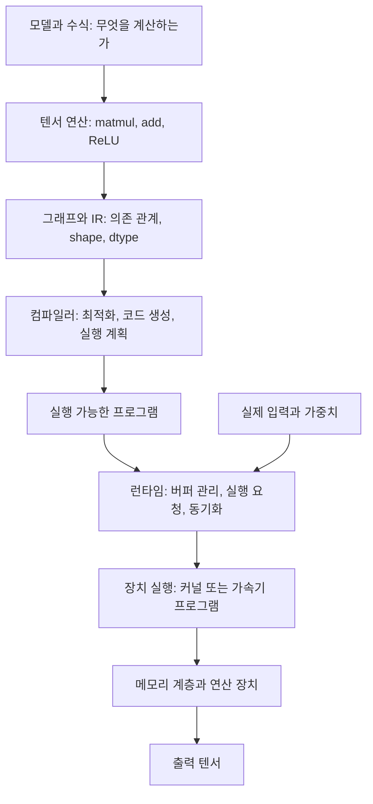

### 1.2 컴파일과 실행을 구분하자

컴파일 단계는 주로 **어떤 일을 어떤 방법으로 할지 준비하는 과정**이다. 실행 단계는 **실제 데이터에 그 준비된 프로그램을 적용하는 과정**이다.

- 컴파일러가 `X`의 shape와 dtype을 알더라도, 반드시 `X`의 실제 값 전체를 알고 있는 것은 아니다.
- 상수나 정적 인자로 취급한 값은 컴파일 과정에 사용될 수 있다.
- 가중치는 구현에 따라 런타임 입력, 별도 바인딩되는 데이터, 컴파일 시 알려진 상수 등으로 다룰 수 있다.
- 모든 프레임워크가 매번 모델 전체를 하나의 프로그램으로 컴파일하는 것은 아니다.
- eager 실행에서도 이미 컴파일된 라이브러리 커널을 호출할 수 있다. **eager는 칩이 Python을 직접 실행한다는 뜻이 아니다.**

### 1.3 이번 주의 성공 기준

다음 질문에 답할 수 있으면 목적을 달성한 것이다.

1. `X @ W`의 입력과 출력 shape를 설명할 수 있는가?
2. 계산 그래프와 최종 실행 코드를 구분할 수 있는가?
3. 컴파일러와 런타임의 책임을 구분할 수 있는가?
4. Python 함수가 반환되어도 가속기 계산이 끝나지 않을 수 있음을 설명할 수 있는가?
5. GPU·TPU에서 행렬곱과 원소별 연산이 어떤 장치와 메모리를 사용하는지 큰 그림을 그릴 수 있는가?
6. OpenXLA와 Mojo가 같은 종류의 기술이 아니라는 점을 설명할 수 있는가?

---

## 2. 공통 예제의 수학과 텐서

### 2.1 기호와 shape

이 문서에서는 다음 표기를 일관되게 사용한다.

| 기호 | shape | 의미 |
|---|---|---|
| `X` | `[N, K]` | 입력 행렬 |
| `W` | `[K, M]` | 가중치 행렬 |
| `b` | `[M]` | 출력 열마다 더하는 편향 |
| `A = X @ W` | `[N, M]` | 행렬곱 결과 |
| `Z = A + b` | `[N, M]` | 편향을 더한 결과 |
| `Y = ReLU(Z)` | `[N, M]` | 최종 출력 |

수식으로 쓰면 다음과 같다.

$$
A_{ij} = \sum_{k=0}^{K-1} X_{ik}W_{kj}
$$

$$
Z_{ij} = A_{ij} + b_j
$$

$$
Y_{ij} = \max(0, Z_{ij})
$$

여기서 `b`는 모든 행에 같은 값이 적용되는 **broadcast** 대상이다. 논리적으로 `[N, M]`에 맞춰 사용되지만, 반드시 메모리에 `N`번 복제되는 것은 아니다.

> 이 문서의 `W`는 `[입력 차원, 출력 차원]`이다. PyTorch `nn.Linear`가 저장하는 weight는 보통 `[출력 차원, 입력 차원]`이므로 API와 비교할 때 전치 관계를 확인해야 한다. 아래 예제는 혼동을 줄이기 위해 직접 `x @ w`를 사용한다.

### 2.2 손으로 계산할 수 있는 숫자 예제

```python
# 파일 예시: 01_numpy_reference.py
# 필요 패키지: numpy
import numpy as np

x = np.array([
    [1.0, -2.0, 3.0],
    [0.0,  1.0, -1.0],
], dtype=np.float32)

w = np.array([
    [ 1.0, 2.0],
    [ 0.0, -1.0],
    [-1.0, 1.0],
], dtype=np.float32)

b = np.array([0.5, -1.0], dtype=np.float32)

a = x @ w
z = a + b
y = np.maximum(z, 0.0)

expected = np.array([
    [0.0, 6.0],
    [1.5, 0.0],
], dtype=np.float32)

np.testing.assert_allclose(y, expected)
print("A =\n", a)
print("Z =\n", z)
print("Y =\n", y)
```

수학적으로 기대되는 값은 다음과 같다. 아래는 프로그램 실행 로그가 아니라 위 식으로 계산한 정답이다.

```text
A = [[-2.0,  7.0],
     [ 1.0, -2.0]]

Z = [[-1.5,  6.0],
     [ 1.5, -3.0]]

Y = [[ 0.0,  6.0],
     [ 1.5,  0.0]]
```

### 2.3 논리적 중간값과 물리적 버퍼는 다르다

수학적으로 `A`, `Z`, `Y`를 따로 정의할 수 있다. 하지만 실제 실행에서도 세 개의 큰 배열을 각각 HBM에 만들어야 한다는 뜻은 아니다.

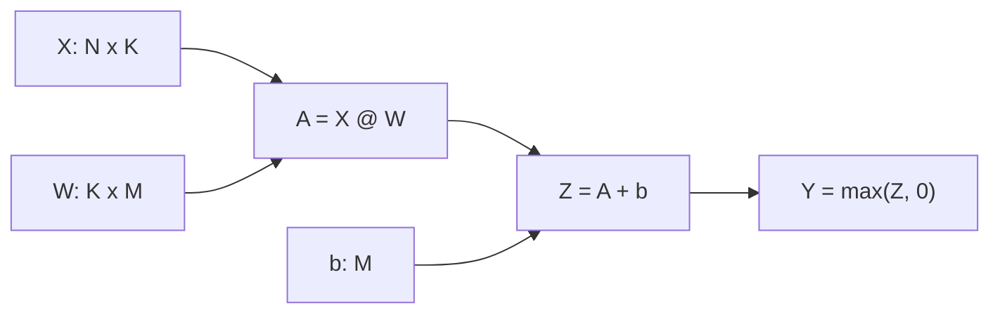

이 그림은 **계산 의미의 그래프**다. 실제 구현은 다음 중 하나일 수 있다.

- 행렬곱, 덧셈, ReLU를 각각 실행한다.
- 행렬곱을 실행한 뒤, 덧셈과 ReLU를 합친 커널을 실행한다.
- 가능한 구현에서는 행렬곱의 후처리인 epilogue에 편향과 ReLU를 포함한다.
- 큰 행렬곱 자체가 여러 실행 단위로 나뉘거나, 라이브러리 내부에서 여러 커널을 호출한다.

따라서 **연산 개수, 그래프 노드 개수, 커널 개수, 기계 명령 개수는 서로 다른 수치**다.

### 2.4 shape, dtype, layout, device의 차이

| 속성 | 질문 | 예 |
|---|---|---|
| shape | 축마다 원소가 몇 개인가? | `[128, 256]` |
| dtype | 원소를 어떤 숫자 형식으로 표현하는가? | `float32`, `bfloat16` |
| layout·stride | 논리적 원소가 메모리에 어떻게 배치되는가? | 행 우선, 전치 view, 장치별 타일 배치 |
| device | 실제 데이터가 어느 장치에 있는가? | CPU, GPU 0, TPU 장치 |

shape가 같아도 dtype이나 layout이 다르면 다른 코드가 필요할 수 있다. 똑같은 수식이라고 해서 언제나 같은 실행 계획을 쓰는 것은 아니다.

---

## 3. 모델에서 연산으로: Transformer를 펼쳐 보기

### 3.1 모델은 연산의 조합이다

Transformer의 `Attention`, `MLP`, `LayerNorm` 같은 이름은 모델 수준의 구성 요소다. 컴파일러와 하드웨어 관점에서는 그 안을 더 작은 연산으로 볼 수 있다.

| 모델 구성 요소 | 주요 연산 | 대표적인 텐서 관계 |
|---|---|---|
| Q·K·V projection | 행렬곱, reshape | 입력 특징을 head별 특징으로 변환 |
| Attention score | 행렬곱, scaling, mask | `Q @ Kᵀ` |
| Attention probability | reduction, exp, 나눗셈 | softmax |
| Attention output | 행렬곱 | `P @ V` |
| MLP | 행렬곱, activation, 경우에 따라 gating | 차원 확장 후 축소 |
| Normalization | 평균 또는 제곱 평균, reduction, scaling | LayerNorm, RMSNorm |
| Residual connection | 원소별 덧셈 | `x + sublayer(x)` |

이것은 모델을 이해하기 위한 분해다. 실제 최적화된 attention이 거대한 score 행렬을 전부 저장한다는 의미는 아니다. 예를 들어 FlashAttention 계열은 계산 순서와 메모리 사용을 바꿔 큰 중간값의 물리적 생성을 피할 수 있다. [Scaling Book 4장](https://jax-ml.github.io/scaling-book/transformers)의 Transformer Accounting과 Flash Attention 부록을 함께 보면 이 차이를 이해하기 좋다.

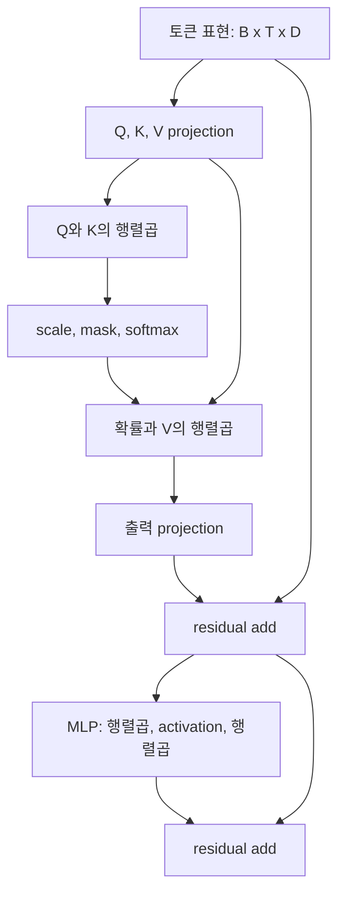

위 도식에서는 normalization 위치, multi-head의 세부 reshape, 일부 gating을 생략했다. 모델마다 pre-norm·post-norm, activation, bias 유무가 다르다.

### 3.2 공통 예제가 Transformer와 연결되는 지점

`ReLU(XW + b)`는 단순한 선형 변환과 비선형 함수의 조합이다. 이는 MLP를 이해하는 가장 작은 예제로 볼 수 있다.

다만 실제 최신 Transformer가 반드시 ReLU와 bias를 사용하지는 않는다. GELU, SiLU, SwiGLU와 같은 변형을 사용하거나 bias를 생략할 수 있다. 이번 주에는 실제 모델의 모든 변형보다 다음 구조를 이해하는 것이 중요하다.

> 큰 텐서에 선형 연산을 적용하고, 원소별 연산이나 reduction을 섞으며, 그 결과를 다음 계층에 전달한다.

### 3.3 이 단계의 핵심 용어 3개

- **Tensor:** shape와 dtype을 가진 다차원 배열.
- **Operator:** matmul, add, reduction처럼 텐서에 적용되는 연산.
- **Broadcasting:** shape가 다른 입력을 호환되는 축 규칙에 따라 계산하는 방식.

### 3.4 입출력과 연결 질문

- 입력: 모델 정의, 입력 텐서, 가중치.
- 출력: 연산들과 데이터 의존 관계.
- 앞 단계: 데이터 전처리와 모델 설계.
- 뒤 단계: 계산 그래프 포착과 IR 생성.
- 토론 질문: **“모델 블록의 이름을 제거하고 나면 어떤 연산과 텐서가 남을까?”**

---

## 4. 연산에서 그래프·IR로

### 4.1 Python 코드를 그대로 최적화하기 어려운 이유

Python 프로그램에는 텐서 연산뿐 아니라 반복문, 조건문, 객체 접근, 출력, 파일 입출력 등 여러 동작이 섞일 수 있다.

컴파일러가 가속기 계산을 최적화하려면 다음 정보를 구분해야 한다.

- 가속기에서 실행할 계산은 무엇인가?
- 어떤 연산의 출력이 다음 연산의 입력인가?
- shape와 dtype은 무엇인가?
- 제어 흐름은 정적인가, 입력 데이터에 따라 달라지는가?
- 외부 부작용이나 순서를 지켜야 하는 연산이 있는가?

그래프와 IR은 이 정보를 분석 가능한 형태로 정리하는 수단이다.

### 4.2 그래프와 IR은 같은 말일까?

밀접하게 관련되지만 완전히 같은 말은 아니다.

- **계산 그래프**는 연산을 노드로, 데이터 의존 관계를 연결선으로 보는 표현이다.
- **IR, Intermediate Representation**은 컴파일러가 사용하는 중간 표현 전체를 가리키는 더 넓은 개념이다.
- IR은 그래프처럼 보일 수도 있고, 명령 목록·기본 블록·중첩 영역으로 표현될 수도 있다.
- 높은 수준의 IR은 텐서 연산을 유지하고, 낮은 수준의 IR은 반복문·주소·load/store 같은 세부 동작을 드러낼 수 있다.

### 4.3 같은 계산의 개념적 IR

다음은 이해를 위한 **의사 IR**이다. 실제 StableHLO 문법이나 특정 프레임워크의 출력이 아니다.

```text
%a = matmul %x, %w
     : tensor<NxKxf32>, tensor<KxMxf32> -> tensor<NxMxf32>

%bias = broadcast %b
        : tensor<Mxf32> -> tensor<NxMxf32>

%z = add %a, %bias
     : tensor<NxMxf32>

%y = maximum %z, 0
     : tensor<NxMxf32>

return %y
```

여기서 `%a`, `%z` 같은 이름은 중간값을 나타낸다. 이름을 붙였다는 이유만으로 각각 별도의 HBM 버퍼가 반드시 존재하는 것은 아니다.

### 4.4 tracing, graph capture, lowering

| 용어 | 의미 | 주의점 |
|---|---|---|
| Tracing | 입력의 특성 등을 사용해 프로그램의 계산을 추적 | 모든 Python 동작을 무조건 지원하지는 않음 |
| Graph capture | 연산과 의존 관계를 그래프로 포착 | 프레임워크마다 포착 방법이 다름 |
| Lowering | 더 구체적이거나 다른 목적의 표현으로 변환 | 한 번이 아니라 여러 단계에서 일어남 |
| Specialization | shape·dtype·정적 값 등에 맞춘 프로그램 생성 | 조건이 달라지면 재컴파일할 수 있음 |
| Graph break | 컴파일 구간이 끊어지는 지점 | 정확성 문제와 동일하지 않지만 최적화 범위를 줄일 수 있음 |

### 4.5 서로 다른 이름의 위치

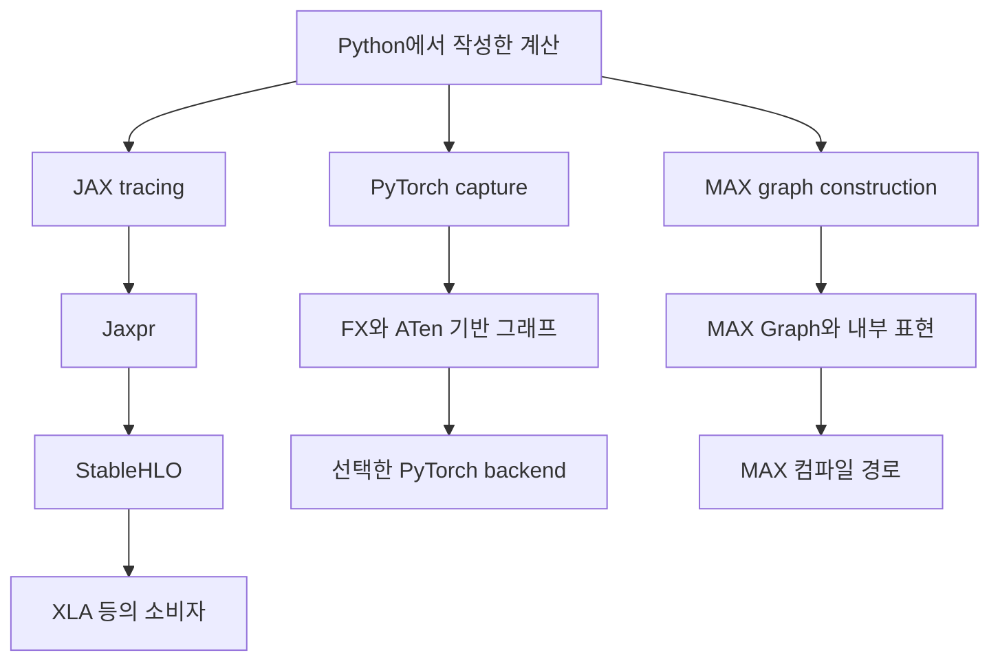

세 경로는 **동일한 목적의 계층이 있어도 표현 형식과 API가 다르다**. MAX Graph가 자동으로 StableHLO가 되거나, FX가 기본적으로 XLA로 전달된다고 생각하면 안 된다.

### 4.6 MLIR을 정확히 이해하기

MLIR은 단일 모델 파일 형식이나 완성된 AI 실행 프레임워크가 아니다. 여러 수준의 IR과 변환을 구축할 수 있는 **컴파일러 인프라**다.

- **Dialect**는 특정 연산·타입·규칙을 정의한 IR의 어휘 체계라고 볼 수 있다.
- StableHLO는 MLIR 기반 dialect다.
- XLA의 내부 HLO는 StableHLO와 관련이 있지만, 그 자체는 MLIR 기반 표현이 아니다.
- Mojo가 MLIR을 기반으로 한다고 해서 모든 Mojo 프로그램이 StableHLO나 XLA를 반드시 거치는 것은 아니다.

OpenXLA 공식 용어 문서는 StableHLO와 내부 HLO를 명확하게 구분한다.<citation refs="7TgxYoaClKzN_LljK4Tn2">StableHLO ... is a standardized MLIR dialect ... HLO ... is not based on MLIR</citation>

### 4.7 이 단계의 핵심 용어 3개

- **IR:** 컴파일러가 분석·변환하는 중간 표현.
- **Tracing:** 계산을 추적해 프로그램 표현을 만드는 과정.
- **Lowering:** 더 구체적인 실행 표현으로 변환하는 과정.

토론 질문: **“IR을 출력하면 이미 GPU가 실행할 기계어를 본 것일까?”**  
답은 보통 아니다. 지금 출력한 표현이 어느 계층인지 먼저 확인해야 한다.

---

## 5. IR에서 실행 코드로: 컴파일러의 결정

### 5.1 컴파일러는 단순 번역기 이상이다

컴파일러는 연산 이름을 일대일로 기계 명령에 바꾸는 것만 하지 않는다. 같은 계산 의미를 유지하면서 더 효율적인 실행 방법을 찾는다.

대표적인 결정은 다음과 같다.

| 결정 | 질문 | 공통 예제에서의 의미 |
|---|---|---|
| 불필요한 계산 제거 | 쓰이지 않는 값이 있는가? | 사용하지 않는 중간 결과 제거 |
| 상수 처리 | 미리 계산할 수 있는가? | 고정된 값의 계산을 실행 시점에서 제외 |
| Fusion | 여러 연산을 묶을 수 있는가? | bias add와 ReLU 결합 |
| Layout | 데이터를 어떻게 배치할까? | 행렬곱에 유리한 배치 선택 |
| Tiling | 계산을 어떤 조각으로 나눌까? | 행렬곱의 부분 블록 처리 |
| 커널·라이브러리 선택 | 직접 생성할까, 기존 구현을 호출할까? | 최적화된 GEMM 호출 또는 커널 생성 |
| 버퍼 계획 | 어떤 메모리를 언제 재사용할까? | 중간값의 생존 기간 분석 |
| Target lowering | 이 장치의 어떤 기능을 쓸까? | CPU 벡터 연산, GPU 행렬 명령, TPU MXU 경로 |

XLA 공식 아키텍처는 하드웨어 독립 최적화, 대상별 최적화, 라이브러리 호출 선택, 대상별 코드 생성의 단계를 설명한다.<citation refs="TACJZQ6rcD1Rb79wgcGUw">XLA sends the HLO computation to a backend for further HLO-level optimizations ... backends may also pattern-match certain operations or combinations thereof to optimized library calls.</citation>

### 5.2 Fusion이 바꾸는 것

fusion을 적용하지 않은 단순 구현을 생각해보자.


bias add와 ReLU를 결합하면 다음처럼 생각할 수 있다.


가능한 구현에서는 행렬곱의 결과가 연산 장치 가까이에 있는 동안 후처리를 적용하고 최종 `Y`만 저장할 수도 있다.

하지만 주의할 점이 있다.

- fusion은 무조건 적용되는 규칙이 아니라 컴파일러·커널 구현의 선택이다.
- 너무 큰 fusion은 레지스터 사용량이나 코드 복잡도를 높여 불리할 수도 있다.
- 그래프 수준 fusion과 GPU의 FMA 명령은 같은 뜻이 아니다.
- “중간값이 없다”는 말은 수학적 값이 사라진다는 뜻이 아니라, 큰 중간 버퍼를 별도로 저장하지 않을 수 있다는 뜻이다.

### 5.3 Tiling은 이번 주에 어디까지 이해하면 될까?

큰 행렬 전체가 가장 빠른 메모리에 한 번에 들어가지 않으므로, 일부 조각을 가져와 계산하고 재사용하는 전략이 필요하다. 이때 계산 단위를 타일로 나눈다.

이번 주에는 **“타일 크기는 연산 장치의 처리 단위와 메모리 용량·접근 패턴을 연결하는 선택”** 정도만 이해하면 충분하다. 특정 블록 크기를 고르고 성능을 튜닝하는 작업은 다음 단계다.

### 5.4 코드 생성과 라이브러리 호출의 공존

최종 실행 프로그램은 모두 직접 생성한 커널일 수도 있지만, 그렇지 않을 수도 있다.

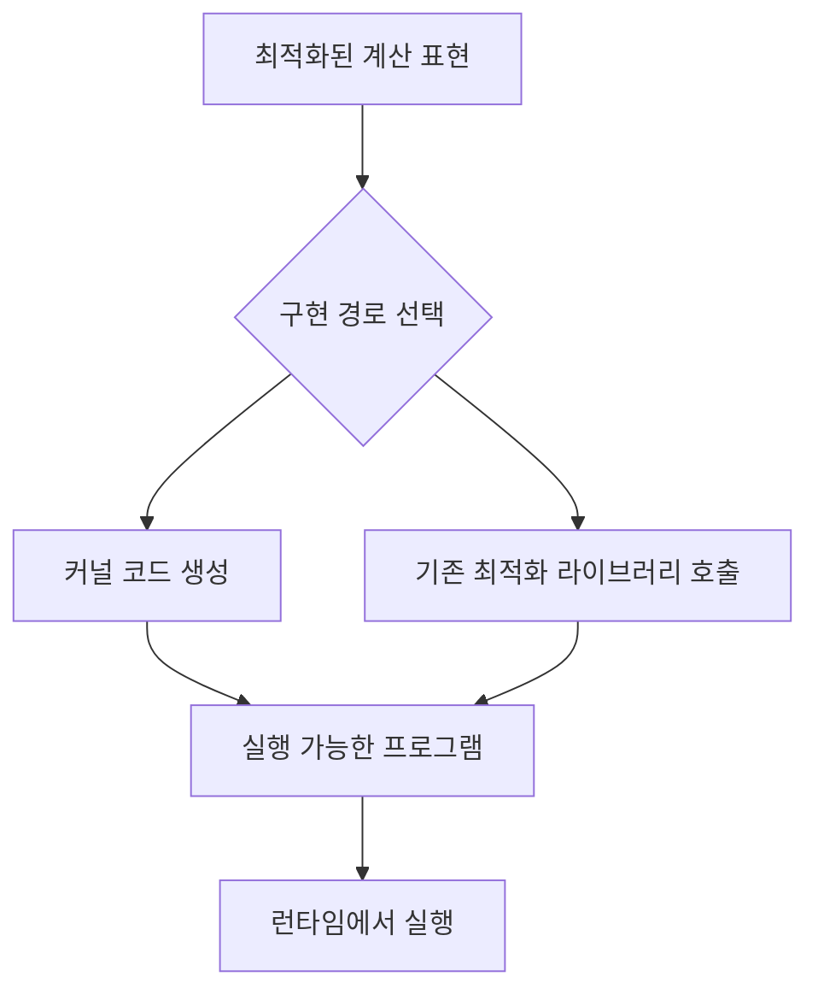

예를 들어 matmul은 라이브러리에 맡기고, 작은 원소별 후처리는 생성한 커널로 처리하는 조합이 가능하다. 정확한 경로는 shape, dtype, backend, 라이브러리 버전, 설정 등에 따라 달라진다.

### 5.5 이 단계의 핵심 용어 3개

- **Fusion:** 여러 연산을 묶어 실행 경계를 줄이는 최적화.
- **Layout:** 논리적 텐서 원소를 물리적 저장 위치에 대응시키는 방식.
- **Code generation:** 대상 장치가 실행할 코드나 호출 경로를 생성하는 과정.

토론 질문: **“수학적으로 같은 결과를 낸다면, 컴파일러가 자유롭게 바꿔도 되는 것은 어디까지일까?”**

실수의 수학적 등식과 부동소수점 연산의 비트 단위 결과는 완전히 같지 않다. 연산 재배치나 낮은 정밀도 사용이 결과에 미칠 영향도 별도로 고려해야 한다.

---

## 6. 실행 요청에서 커널 실행으로: 런타임과 비동기성

### 6.1 런타임은 무엇을 하는가?

런타임은 준비된 실행 프로그램을 실제 데이터와 장치에 연결한다.

- 실행에 필요한 버퍼를 준비한다.
- 필요한 경우 host와 device 사이에서 데이터를 전송한다.
- 실행 순서와 의존 관계를 관리한다.
- 장치에 커널 또는 실행 프로그램을 제출한다.
- 완료 이벤트와 동기화를 처리한다.
- 결과를 다음 연산이나 사용자 코드에 전달한다.

컴파일러가 모든 버퍼의 실제 주소를 영구히 결정하고 런타임이 아무 일도 하지 않는 것도 아니며, 런타임이 실행할 때마다 계산 최적화를 처음부터 수행하는 것도 아니다. 두 계층의 책임은 구현에 따라 협력적으로 나뉜다.

### 6.2 Host와 device

- **Host:** 대체로 Python 프로그램과 제어 코드를 실행하는 CPU 측.
- **Device:** GPU·TPU 등의 계산 장치.
- **Host-to-device transfer:** 입력 등을 장치가 사용할 메모리로 옮기는 과정.
- **Device-to-host transfer:** 결과를 CPU에서 읽기 위해 가져오는 과정.

이미 장치에 있는 가중치는 다음 요청에서 재사용할 수 있다. 매번 모든 데이터를 CPU에서 다시 복사한다고 가정하면 실제 실행을 오해하게 된다. 통합 메모리와 공유 메모리 구조에서는 물리적인 전송 방식도 달라질 수 있다.

### 6.3 Python 함수 반환과 계산 완료는 다르다

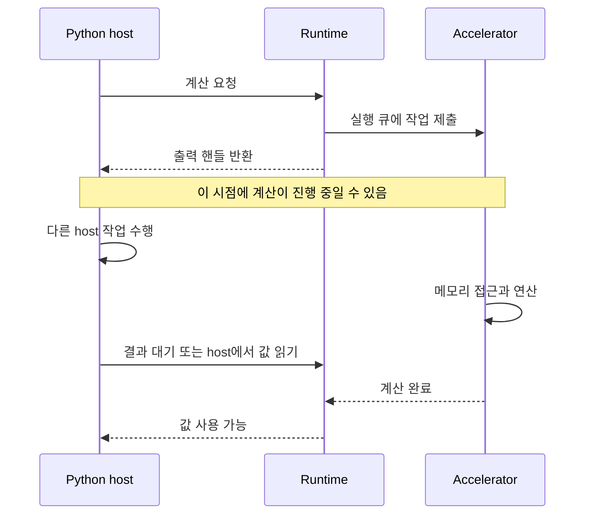

JAX 공식 문서는 `jax.Array`가 아직 완료되지 않은 계산의 결과를 나타낼 수 있다고 설명한다. shape나 dtype을 확인하는 것과 실제 값을 CPU에서 읽는 것은 다르다.<citation refs="DHmjEvk28BD3qAHH1aX3w">JAX returns a jax.Array value, which is a future ... We can inspect the shape or type ... without waiting for the computation ... to complete.</citation>

### 6.4 비동기가 유용한 이유

Python이 매 연산의 완료를 기다리면 장치가 다음 작업을 기다리며 쉬는 시간이 생길 수 있다. 비동기 제출은 host가 다음 작업을 미리 준비하고 제출하도록 돕는다.

다만 **비동기 제출이 곧 모든 작업의 동시 실행을 보장하는 것은 아니다.**

- 데이터 의존 관계가 있으면 순서를 지켜야 한다.
- 같은 실행 큐의 작업이 직렬로 처리될 수 있다.
- 여러 큐를 사용해도 장치 자원이 부족하면 겹쳐 실행되지 않을 수 있다.

### 6.5 시간을 잴 때 생기는 착시

아래는 잘못 해석하기 쉬운 측정이다.

```python
# 개념 설명용: fn이 비동기로 실행된다면 계산 완료 시간과 다를 수 있다.
start = time.perf_counter()
y = fn(x)
elapsed = time.perf_counter() - start
```

여기서 측정한 값은 다음 요소의 일부만 포함할 수 있다.

- Python 함수 호출 비용
- 런타임의 작업 제출 비용
- 첫 호출의 tracing·컴파일 비용
- 실제 장치 계산 중 일부 또는 거의 없음

따라서 성능 측정에서는 무엇을 재는지 먼저 정해야 한다.

| 측정 대상 | 포함되는 것 |
|---|---|
| 첫 호출 지연 | 초기화, tracing, compile, 첫 실행 등이 섞일 수 있음 |
| 반복 실행의 end-to-end 지연 | host 호출과 실행 완료까지 대기 |
| 여러 요청의 평균 처리 시간 | 큐 제출과 처리량 특성이 함께 반영 |
| 장치 이벤트 기반 시간 | 장치 실행 타임라인의 특정 구간 |
| 데이터 전송 포함 지연 | 입력·출력 전송과 계산 |

이 문서의 타이밍 예제는 학습용이다. 숫자를 제품 비교 자료로 사용하면 안 된다.

### 6.6 이 단계의 핵심 용어 3개

- **Dispatch:** 장치에 실행 작업을 제출하는 것.
- **Buffer:** 실제 데이터가 저장되는 메모리 영역 또는 그 핸들.
- **Synchronization:** 필요한 계산이나 데이터 이동이 끝날 때까지 기다리는 것.

토론 질문: **“결과의 shape를 출력할 때와 전체 값을 출력할 때 실행 시간이 왜 달라질까?”**

---

## 7. 커널에서 칩 내부로: GPU와 TPU

### 7.1 커널은 수학 연산 그 자체가 아니다

GPU 커널은 여러 스레드나 프로그램 인스턴스가 협력해 수행하도록 작성·컴파일된 장치 코드다.

- 그래프의 하나의 연산이 여러 커널로 구현될 수 있다.
- 여러 그래프 연산이 하나의 커널에 포함될 수 있다.
- 한 커널은 수많은 스레드와 기계 명령을 포함할 수 있다.
- GPU 커널의 실행 모델을 TPU에 완전히 동일하게 적용하면 안 된다.

이 문서에서는 공통적인 흐름을 설명할 때 `장치 실행 프로그램`이라는 더 넓은 표현도 함께 사용한다.

### 7.2 NVIDIA GPU의 큰 그림

NVIDIA GPU를 예로 들면, 여러 SM이 있으며 각 SM에는 스케줄링과 일반 산술 연산, 행렬 연산, 가까운 저장 공간을 위한 자원이 있다.

| 구성 요소 | 큰 역할 | 공통 예제와의 연결 |
|---|---|---|
| SM | 스레드 블록을 실행하는 주요 계산 단위 | 커널 작업을 분담 |
| Tensor Core | 특정 형식의 행렬 연산 가속 | 조건이 맞는 `X @ W` |
| 일반 산술 연산 장치 | 원소별 산술·비교 등 | bias add, ReLU |
| Register | 연산에 가까운 저장 공간 | 부분 결과, 인덱스, 누산값 등 |
| Shared memory | 블록이 협력해 사용할 수 있는 빠른 저장 공간 | 입력 조각의 재사용 등 |
| L1·L2 cache | 메모리 접근을 완충 | 자주 사용하는 데이터 |
| HBM 또는 장치 메모리 | 큰 텐서 저장 | 입력, 가중치, 출력 |

모든 matmul이 무조건 Tensor Core를 사용하지는 않는다. GPU 세대, dtype, shape, 라이브러리·컴파일러 선택 등에 따라 달라진다. 또한 모든 GPU가 HBM을 사용하는 것은 아니다.

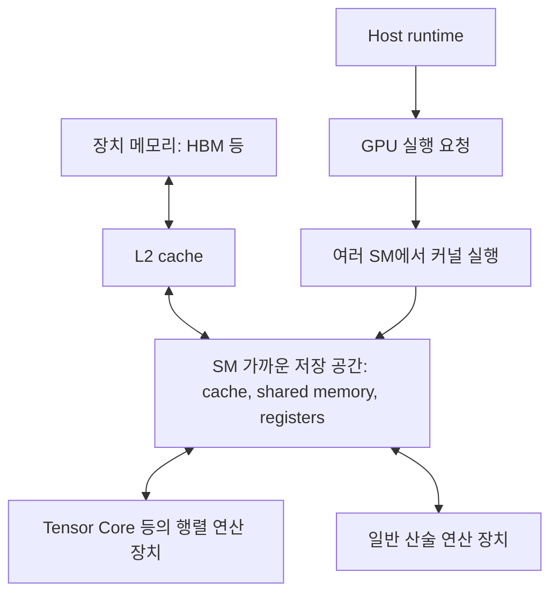

이 그림은 주요 구성 요소의 관계를 단순화한 것이다. 모든 데이터가 반드시 동일한 순서로 모든 저장 공간을 통과한다는 뜻은 아니다. GPU 세대별 전용 데이터 경로와 추가 메모리도 있을 수 있다.

Scaling Book 12장은 NVIDIA GPU의 SM·Tensor Core와 메모리 계층을 설명한다.<citation refs="_jqAtpc11pBwOfZ9BpCW9">CUDA cores are responsible for ReLUs, pointwise vector operations, and reductions ... Beyond the compute units, GPUs have a hierarchy of memories</citation>

### 7.3 TPU의 큰 그림

TPU는 큰 행렬 연산에 특화된 가속기로 이해하면 좋다. 구체적인 구조와 수치는 세대별로 다르므로 여기서는 역할에 집중한다.

| 구성 요소 | 큰 역할 | 공통 예제와의 연결 |
|---|---|---|
| MXU | 행렬곱 처리 | `X @ W` |
| VPU | 벡터·원소별 연산 등 | bias add, ReLU |
| VMEM | 연산 장치 가까이의 on-chip scratchpad | 계산에 필요한 데이터 조각 |
| HBM | 큰 텐서 저장 | 가중치, activation, 출력 |

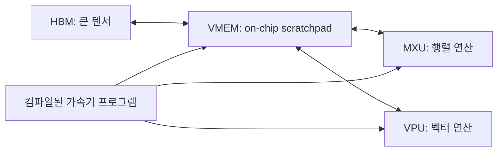

Scaling Book 2장은 MXU, VPU, VMEM의 역할을 구분하며 VPU에서 ReLU와 원소별 덧셈 등을 수행한다고 설명한다.<citation refs="ajv5k8_bXQH0GD5In9_sU">The VPU ... performs general mathematical operations like ReLU activations or pointwise addition ... VMEM ... is an on-chip scratchpad</citation>

### 7.4 이름이 비슷해도 단위는 다를 수 있다

GPU의 **Tensor Core**와 TPU 문서의 **TensorCore**는 같은 크기의 구성 요소를 가리키는 이름이 아니다.

- NVIDIA Tensor Core는 SM 안의 행렬 연산 장치라는 맥락에서 쓰인다.
- TPU TensorCore는 MXU·VPU·VMEM 등을 포함하는 더 큰 계산 단위의 이름으로 쓰인다.

이름보다 **어떤 기능을 포함하는 단위인지** 확인해야 한다.

### 7.5 “실리콘까지”의 의미

이 문서의 도착점은 다음 질문에 답하는 것이다.

1. 어떤 장치가 곱셈·덧셈·비교를 수행하는가?
2. 입력과 가중치는 어디에 있는가?
3. 중간값은 어디에 머무르는가?
4. 어떤 데이터 이동을 줄일 수 있는가?
5. 실행 순서와 병렬성은 누가 결정하는가?

트랜지스터 설계나 반도체 공정까지 알아야 이 흐름을 이해할 수 있는 것은 아니다.

---

## 8. PyTorch 경로와 예제

### 8.1 기본 경로

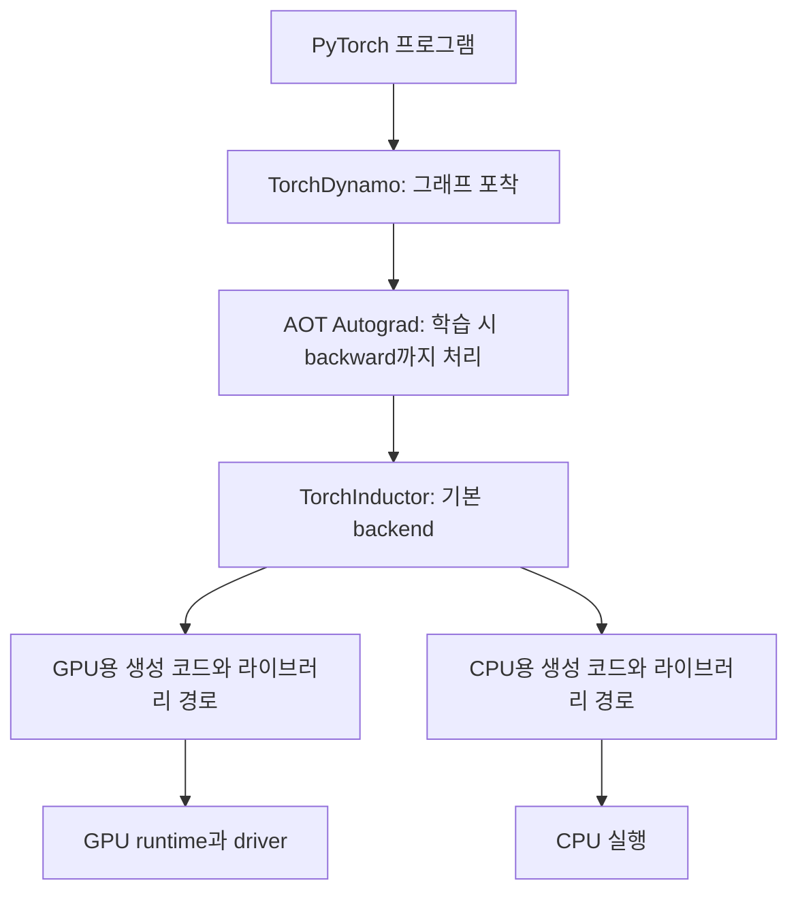

실제 내부에는 decomposition, 함수화, 다양한 IR과 최적화가 더 있다. 위 그림은 역할을 구분하기 위한 단순화다.

PyTorch 공식 문서에서 `torch.compile`의 기본 backend는 Inductor이며, 주요 GPU 경로에서 Triton을 핵심 구성 요소로 사용한다고 설명한다.<citation refs="9IjZE8l494TPQg3dE0eUD">TorchInductor is the default torch.compile deep learning compiler ... For NVIDIA, AMD and Intel GPUs, it leverages OpenAI Triton as the key building block.</citation>

> **중요:** `torch.compile`을 사용했다고 자동으로 OpenXLA를 사용하는 것은 아니다. PyTorch/XLA는 별도의 통합 경로이며, backend 선택을 구분해야 한다.

### 8.2 eager와 compile의 출력·gradient 비교

다음은 CPU에서도 실행할 수 있도록 구성한 완결형 예제다. 다만 `torch.compile`이 지원하는 Python·PyTorch 조합과 필요한 컴파일 환경이 있어야 한다.

```python
# 파일 예시: 02_pytorch_compile.py
import torch

print("PyTorch version:", torch.__version__)
torch.manual_seed(0)
device = "cpu"  # 지원되는 GPU 환경에서는 "cuda"로 변경할 수 있다.

N, K, M = 32, 16, 8
x0 = torch.randn(N, K, device=device)
w0 = torch.randn(K, M, device=device)
b0 = torch.randn(M, device=device)


def forward(x, w, b):
    return torch.relu(x @ w + b)


def run_with_backward(fn):
    # 같은 입력을 복사하되, 서로 다른 autograd graph를 만든다.
    x = x0.detach().clone().requires_grad_(True)
    w = w0.detach().clone().requires_grad_(True)
    b = b0.detach().clone().requires_grad_(True)

    y = fn(x, w, b)
    loss = y.square().mean()
    loss.backward()

    assert x.grad is not None
    assert w.grad is not None
    assert b.grad is not None
    return (
        y.detach(), loss.detach(),
        x.grad.detach(), w.grad.detach(), b.grad.detach(),
    )


eager_result = run_with_backward(forward)
compiled_forward = torch.compile(forward, backend="inductor")
compiled_result = run_with_backward(compiled_forward)

for name, expected, actual in zip(
    ["Y", "loss", "dX", "dW", "db"],
    eager_result,
    compiled_result,
):
    torch.testing.assert_close(actual, expected, rtol=1e-4, atol=1e-5)
    print(name, "OK", tuple(actual.shape))
```

이 예제에서는 다음 점에 주목한다.

- forward 함수는 그대로 두고 실행 경로를 변경했다.
- 출력뿐 아니라 역전파 결과도 비교한다.
- `loss = y.square().mean()`은 gradient를 관찰하기 위해 추가한 예제 목적 함수다.
- 첫 실행에는 tracing·컴파일 비용이 포함될 수 있다.
- 이 작은 입력에서 compile이 eager보다 빠르다고 가정하지 않는다.
- AOT Autograd의 `AOT`를 독립 실행 파일로 미리 배포한다는 의미와 혼동하지 않는다. 여기서는 forward·backward 그래프를 미리 포착·분리하는 역할에 주목한다.

### 8.3 FX·ATen 수준의 그래프 보기

다음은 앞 예제의 변수와 클래스를 이어서 사용하는 코드다.

```python
class ReluMatmul(torch.nn.Module):
    def forward(self, x, w, b):
        return torch.relu(x @ w + b)

exported = torch.export.export(ReluMatmul(), (x0, w0, b0))
print(exported.graph_module.graph)
```

관찰할 항목:

- 입력 placeholder가 무엇인가?
- matmul, add, ReLU가 어떤 ATen 연산 이름으로 표현되는가?
- 출력 노드는 무엇을 반환하는가?

이 그래프는 **최종 GPU 커널 목록이나 어셈블리가 아니다.** 또한 `torch.export`로 본 그래프와 `torch.compile` 내부의 모든 중간 그래프가 문자 단위로 동일하다고 가정하면 안 된다.

### 8.4 GPU timing의 최소 예제

아래는 앞 예제를 GPU에서 실행한 경우에만 사용할 추가 코드다. CPU 모드에서는 일부러 오류를 낸다.

```python
import time

if device != "cuda":
    raise RuntimeError("이 timing 예제는 앞 코드의 device='cuda'가 필요합니다.")

# 추론 측정이므로 gradient tracking을 끈다.
with torch.no_grad():
    for _ in range(10):
        compiled_forward(x0, w0, b0)
    torch.cuda.synchronize()

    iterations = 100
    start = time.perf_counter()
    for _ in range(iterations):
        result = compiled_forward(x0, w0, b0)
    torch.cuda.synchronize()

    elapsed_ms = (time.perf_counter() - start) * 1000 / iterations
    print("반복 실행 평균 wall-clock 시간(ms):", elapsed_ms)
```

이것은 여러 실행을 제출한 뒤 완료까지 기다리는 평균 wall-clock 측정이다. 순수한 단일 GPU 커널 시간과 같지 않다. `no_grad` 등 실행 조건이 달라지면 새로운 컴파일이 발생할 수 있으므로, 측정과 같은 조건으로 워밍업한다.

---

## 9. JAX·OpenXLA 경로와 예제

### 9.1 OpenXLA, XLA, StableHLO, PJRT의 관계

| 이름 | 무엇인가? | 비유 |
|---|---|---|
| OpenXLA | ML 컴파일·실행 연계를 위한 오픈 기술 생태계 | 여러 부품을 포함한 생태계 |
| StableHLO | 프레임워크와 컴파일러 사이의 이식 가능한 연산 표현 | 계산 내용을 전달하는 공통 어휘 |
| XLA | 계산을 최적화하고 대상 장치의 코드로 변환하는 컴파일러 | 실행 방법을 만드는 엔진 |
| PJRT | 프레임워크와 장치 플러그인·런타임 사이에서 컴파일·버퍼·실행을 다루는 공통 API | 장치 구현과의 접점 |

**PJRT를 단순히 “XLA 다음에 붙는 커널 실행기”로만 이해하면 좁다.** 장치 열거, 버퍼 관리, 컴파일 요청, executable 실행 같은 역할을 연결한다. 실제 JAX 구현에는 추가 런타임 추상화가 들어갈 수 있으며, 아래 도식은 그 세부 계층을 생략했다.

공식 PJRT 문서는 client, device, buffer, compiler, loaded executable을 구분한다.<citation refs="bfjKZvU0vX3AFgy2Ssqav">Clients manage all communication between the device and framework ... PjRtClient::Compile ... take an input module and return a PjRtLoadedExecutable.</citation>

### 9.2 컴파일 경로와 실행 경로를 나눠 보기

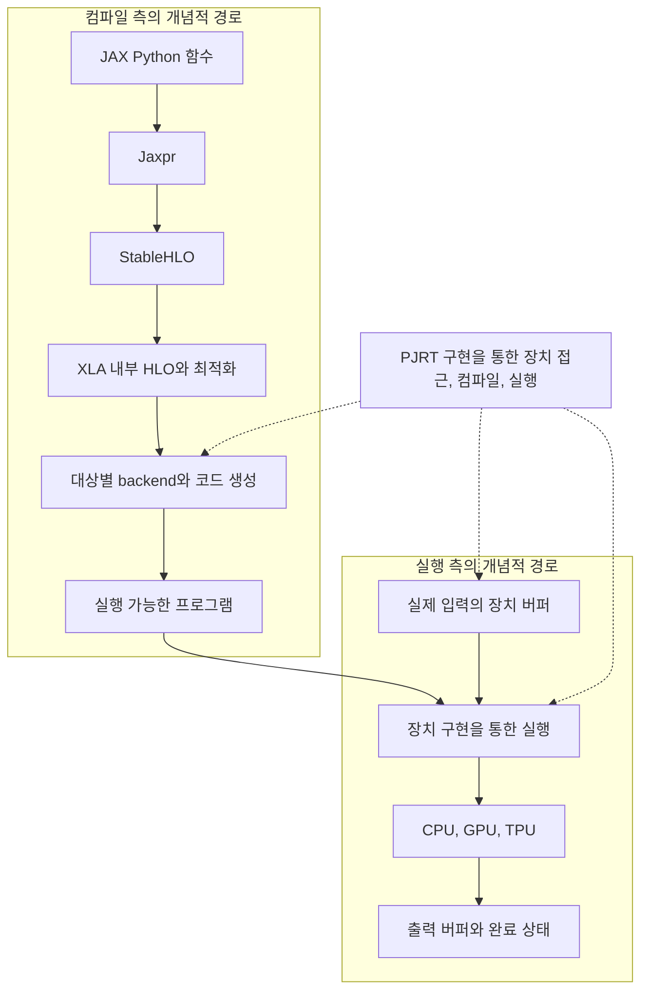

StableHLO는 최종 기계어가 아니다. JAX는 자신이 포착한 계산을 StableHLO로 내리고, XLA는 이를 내부 HLO 등으로 처리한 뒤 하드웨어에 맞는 실행 경로로 변환한다.

### 9.3 같은 계산을 JAX로 실행하고 IR 보기

```python
# 파일 예시: 03_jax_ir.py
import numpy as np
import jax
import jax.numpy as jnp

print("JAX version:", jax.__version__)
print("Available devices:", jax.devices())

x_np = np.array([[1.0, -2.0, 3.0], [0.0, 1.0, -1.0]], dtype=np.float32)
w_np = np.array([[1.0, 2.0], [0.0, -1.0], [-1.0, 1.0]], dtype=np.float32)
b_np = np.array([0.5, -1.0], dtype=np.float32)

x, w, b = (jnp.asarray(v) for v in (x_np, w_np, b_np))


def forward(x, w, b):
    return jax.nn.relu(x @ w + b)


# 1. JAX primitive 수준의 표현
print("=== Jaxpr ===")
print(jax.make_jaxpr(forward)(x, w, b))

# 2. 해당 shape와 dtype에 대한 lowering
lowered = jax.jit(forward).lower(x, w, b)

# 3. StableHLO 표현
print("=== StableHLO ===")
print(lowered.compiler_ir(dialect="stablehlo"))

# 4. 대상 장치 실행 코드로 컴파일
compiled = lowered.compile()

# 5. 실행과 완료 대기
y = compiled(x, w, b)
y.block_until_ready()

# 6. CPU에서 결과를 읽어 기준값과 비교
expected = np.maximum(x_np @ w_np + b_np, 0.0)
np.testing.assert_allclose(np.asarray(y), expected, rtol=1e-5, atol=1e-6)
print("Y =", y)

# 7. backend가 제공하는 컴파일 이후 텍스트
# 출력 형식과 제공 여부는 backend·버전에 따라 달라질 수 있다.
print("=== Compiled program text ===")
print(compiled.as_text())
```

#### 각 출력은 무엇을 보여줄까?

| 출력 | 관찰하는 수준 | 이것만으로 알 수 없는 것 |
|---|---|---|
| `make_jaxpr` | JAX primitive와 계산 관계 | 최종 커널 개수·기계 명령 |
| `compiler_ir("stablehlo")` | StableHLO 기반 표현 | 최종 메모리 접근 전체 |
| `compiled.as_text()` | backend가 제공하는 컴파일 후 표현 | 실제 실행 시간·병목의 전체 모습 |
| profiler trace | 실제 실행 중 관측된 이벤트와 시간 | 모든 하드웨어 내부 상태 |

JAX의 IR 출력 API는 디버깅·검사용이다. 버전과 backend에 따라 연산 이름, 출력 형식, 가용성이 달라질 수 있다. 실제 코드를 실행하기 전에는 위 출력이 정확히 어떤 문자열이 될지 단정하지 않는다.

### 9.4 기대할 수 있는 계산 구조

다음은 실제 출력이 아닌 **개념적 StableHLO 수준 분해**다.

```text
X와 W의 dot_general 또는 대응되는 행렬 연산
    ↓
b의 broadcast
    ↓
add
    ↓
0과의 maximum 또는 ReLU에 대응되는 표현
```

`jax.nn.relu`가 추가 호출·함수 경계를 포함한 형태로 보일 수 있으며, 이후 최적화가 이를 다시 바꿀 수 있다. 특정 IR 노드 이름만 보고 최종 실행 형태를 단정하면 안 된다.

### 9.5 gradient도 같은 스택을 거친다

```python
# 앞 JAX 예제에 이어서 실행하는 코드

def loss_fn(x, w, b):
    return jnp.mean(forward(x, w, b) ** 2)

value_and_grads = jax.jit(
    jax.value_and_grad(loss_fn, argnums=(0, 1, 2))
)

result = value_and_grads(x, w, b)
# loss 하나만이 아니라 반환된 전체 pytree의 완료를 기다린다.
result = jax.block_until_ready(result)
loss_value, (dx, dw, db) = result

print("loss:", loss_value)
print("gradient shapes:", dx.shape, dw.shape, db.shape)
```

순전파만 연산 그래프로 바뀌는 것이 아니다. 자동 미분이 만드는 gradient 계산에도 행렬곱, 원소별 연산, reduction이 있으며, 이 계산도 컴파일과 실행의 대상이 된다.

### 9.6 JAX에서 동기화를 포함해 시간 재기

다음은 앞의 `compiled`, `x`, `w`, `b`를 사용하는 추가 예제다.

```python
import time

# 입력 준비의 비동기 작업까지 먼저 끝낸다.
jax.block_until_ready((x, w, b))

for _ in range(10):
    compiled(x, w, b).block_until_ready()

# 각 호출의 결과를 기다린다.
# host 호출과 대기 비용을 포함하는 단순 latency 관찰이다.
iterations = 100
start = time.perf_counter()
for _ in range(iterations):
    compiled(x, w, b).block_until_ready()

ms = (time.perf_counter() - start) * 1000 / iterations
print("호출별 완료 대기를 포함한 평균(ms):", ms)
```

이 예제는 이해하기 쉬운 작은 입력을 사용하므로 host overhead 비중이 클 수 있다. 성능 실험을 하려면 더 큰 shape, 동일한 입력 준비 조건, 충분한 반복, 장치 상태 등을 함께 고려해야 한다.

### 9.7 TPU에서는 그 다음에 무엇이 일어날까?

Scaling Book 9장의 TPU 설명에서는 HLO 이후 더 낮은 수준의 LLO를 거쳐, 메모리 간 복사와 systolic array 사용 등을 표현하고, 최종적으로 TPU가 실행할 코드로 내려간다고 설명한다.<citation refs="w75pC5G9dvZZu9oyLy2ro">The XLA compiler first lowers it to LLO ... scheduling copies between memories, pushing arrays onto the systolic array ... compiled to machine code</citation>


LLO는 이 TPU 설명의 경로이지, 모든 GPU·CPU backend가 반드시 사용하는 공통 IR이 아니다.

---

## 10. Modular MAX·Mojo 경로와 예제

### 10.1 먼저 비교 단위를 맞추자

**Mojo는 프로그래밍 언어이고, OpenXLA는 여러 컴파일러·실행 연계 기술을 포함하는 생태계다.** 따라서 둘을 완전히 같은 종류의 제품처럼 비교하면 혼동하기 쉽다.

Modular 쪽의 전체 흐름을 보려면 다음을 함께 놓고 보는 것이 좋다.

- **MAX:** 모델 그래프, 컴파일, 실행, 추론 시스템을 위한 구성 요소.
- **Mojo:** CPU·GPU 코드를 작성할 수 있는 언어. 특히 연산과 커널 구현에 사용할 수 있다.
- **MAX의 GPU API와 커널 라이브러리:** Mojo로 장치를 제어하고 계산을 구현하는 데 사용하는 도구.

Mojo는 커널 언어로만 한정되지 않는다. 반대로, Python처럼 보인다는 이유만으로 기존의 임의의 Python 코드 전체가 그대로 고성능 GPU 프로그램이 되는 것도 아니다.

### 10.2 MAX 그래프에서 Mojo 커널까지

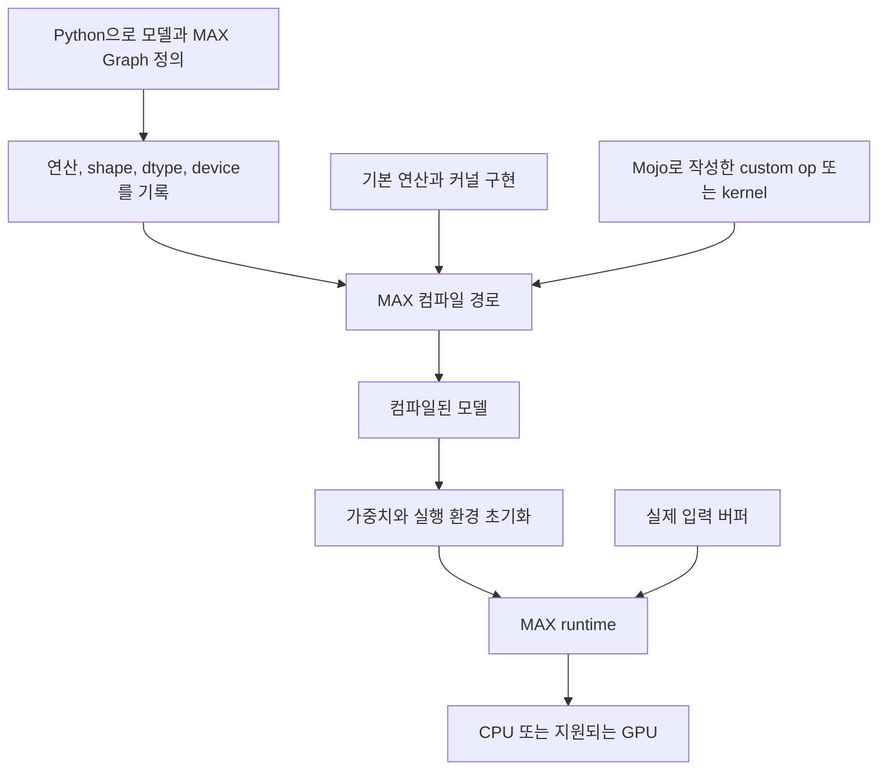

MAX의 `Graph` 구성은 계산을 기록하는 단계다. `Module`이나 그래프를 정의하는 Python 코드가 실행되었다고 해서 해당 텐서의 수치 계산이 이미 끝난 것은 아니다.

공식 문서는 MAX module 호출이 계산을 실행하는 대신 그래프에 기록하며, 실행 전 그래프 컴파일이 필요하다고 설명한다.<citation refs="fWVAWNoxEBFCHk11KlzVM">calling a MAX module records the computation into a graph that must be compiled before it can execute.</citation>

### 10.3 MAX Graph로 전체 수식 실행하기

이 절의 MAX·Mojo 연결 예제는 **추론의 forward 실행**을 다룬다. 뒤의 custom ReLU에도 별도의 backward·autograd 규칙을 정의하지 않는다. PyTorch·JAX의 gradient 예제와 지원 범위를 동일하게 보면 안 된다.

이 예제는 가장 단순한 관찰을 위해 CPU를 기본값으로 둔다. 지원되는 GPU와 MAX 환경이 준비되어 있다면 `Accelerator()`를 선택하도록 바꿀 수 있다.

여기서는 `W`와 `b`를 별도 weight registry 대신 **일반 입력 버퍼**로 전달한다. 계산 흐름을 보여주기 위한 선택이며, 실제 서비스에서 매 요청마다 가중치를 CPU에서 복사하라는 의미는 아니다.

```python
# 파일 예시: 04_max_graph.py
# 필요 환경: 호환되는 MAX Python 패키지, numpy
import numpy as np
from max.driver import CPU, Buffer
from max.dtype import DType
from max.engine import InferenceSession
from max.graph import DeviceRef, Graph, TensorType, ops

N, K, M = 2, 3, 2
device = CPU()
device_ref = DeviceRef.from_device(device)

input_types = [
    TensorType(DType.float32, [N, K], device=device_ref),
    TensorType(DType.float32, [K, M], device=device_ref),
    TensorType(DType.float32, [M], device=device_ref),
]

# 1. 그래프를 기록한다. 여기서는 실제 입력의 숫자를 계산하지 않는다.
with Graph("relu_matmul", input_types=input_types) as graph:
    x, w, b = [value.tensor for value in graph.inputs]
    a = ops.matmul(x, w)
    z = a + b
    y = ops.relu(z)
    graph.output(y)

# 2. 컴파일과 실행 초기화를 분리한다.
session = InferenceSession(devices=[device])
compiled = session.compile(graph)
model = session.init(compiled)

# 3. 실제 데이터를 준비한다.
x_np = np.array([[1.0, -2.0, 3.0], [0.0, 1.0, -1.0]], dtype=np.float32)
w_np = np.array([[1.0, 2.0], [0.0, -1.0], [-1.0, 1.0]], dtype=np.float32)
b_np = np.array([0.5, -1.0], dtype=np.float32)

inputs = [Buffer.from_numpy(v).to(device) for v in (x_np, w_np, b_np)]

# 4. 실행하고 CPU에서 결과를 읽는다.
result = model.execute(*inputs)[0]
assert isinstance(result, Buffer)
actual = result.to(CPU()).to_numpy()
expected = np.maximum(x_np @ w_np + b_np, 0.0)

np.testing.assert_allclose(actual, expected, rtol=1e-4, atol=1e-5)
print("MAX Y =", actual)
```

`compile()`은 컴파일된 artifact를 만들고, `init()`은 실행 가능한 모델로 초기화한다. 문서에는 이 둘을 함께 처리하는 `load()` 경로도 있다. 이 노트는 **컴파일과 실행 준비를 구분하기 위해** 둘을 나눠 썼다.<citation refs="0GgtRn1NeNbP6YziAlikM">compile ... Compiles a model without binding weights or device memory. ... init ... Initializes a compiled model with weights for execution.</citation>

### 10.4 Mojo custom op를 MAX 그래프에 연결하기

이번에는 행렬곱과 편향 덧셈은 기본 연산을 쓰고, **ReLU만 Mojo custom op로 바꿔본다.**

이 선택은 속도를 높이려는 목적이 아니다. 다음 연결을 확인하기 위한 예제다.

> Python 그래프의 연산 이름과 입력·출력 명세가 Mojo 구현의 등록 이름과 함수 시그니처에 대응한다.

#### 파일 구조

```text
max_relu_custom/
├── run_custom_relu.py
└── kernels/
    └── __init__.mojo
```

`kernels`를 Mojo 패키지로 만들고, 예제의 등록 코드를 `__init__.mojo` 안에 직접 둔다. 별도 파일로 분리할 때는 해당 버전의 패키지 규칙에 따라 가져오도록 구성한다.

#### Mojo: ReLU custom op

아래 코드는 공식 `add_one` 예제의 등록·`foreach` 구조를 ReLU로 바꾼 학습용 구현이다. **유한한 float32 입력을 전제로 한다.** NaN 전파, signed zero, 다른 dtype의 완전한 호환성까지 보장하는 범용 activation 구현이 아니다.

```mojo
# 파일: kernels/__init__.mojo
import extensibility

from extensibility import InputTensor, OutputTensor, foreach
from max.gpu.host import DeviceContext
from std.utils.coord import Coord


@extensibility.register("study_relu")
struct StudyRelu:
    @staticmethod
    def execute[
        target: StaticString,
    ](
        output: OutputTensor,
        x: InputTensor[dtype=output.dtype, rank=output.rank, ...],
        ctx: DeviceContext,
    ) raises:
        @__parameter
        @inline(.always)
        def elementwise_relu[width: Int](idx: Coord) -> SIMD[x.dtype, width]:
            var value = x.load[width](idx)
            var zero = SIMD[x.dtype, width](0)
            return (value > zero).select(value, zero)

        foreach[elementwise_relu, target=target](output, ctx)
```

주목할 점:

- `study_relu`는 Python 그래프에서 사용할 등록 이름이다.
- `target`은 CPU·GPU 등 대상에 대한 컴파일 시점 매개변수다.
- `InputTensor`와 `OutputTensor`는 그래프와 연결되는 텐서 명세다.
- `foreach`가 원소별 계산을 해당 장치에 맞게 분배한다.
- `width`는 이 원소별 계산의 벡터 폭에 관련된 컴파일 시점 매개변수다.
- 비교 결과의 `select`는 각 위치에서 양수 값을 유지하거나 0을 선택한다.
- 출력 shape를 Python에서 명시하므로 이 예제에는 별도 shape function을 넣지 않는다.

`foreach` 기반 장치 추상화와 직접 장치별 커널을 작성하는 방식은 모두 공식 custom op 문서에서 다룬다.<citation refs="6AZiWCzFap46teuHcicf-">The custom op API supports both approaches: foreach() for elementwise operations ... and device-specific kernels when you need direct control over thread layout and memory access patterns.</citation>

#### Python: 기본 연산과 custom op 연결

```python
# 파일: run_custom_relu.py
from pathlib import Path
import numpy as np

from max.driver import CPU, Buffer
from max.dtype import DType
from max.engine import InferenceSession
from max.graph import DeviceRef, Graph, TensorType, ops

N, K, M = 2, 3, 2
device = CPU()
device_ref = DeviceRef.from_device(device)
custom_dir = Path(__file__).parent / "kernels"

input_types = [
    TensorType(DType.float32, [N, K], device=device_ref),
    TensorType(DType.float32, [K, M], device=device_ref),
    TensorType(DType.float32, [M], device=device_ref),
]

with Graph(
    "matmul_bias_custom_relu",
    input_types=input_types,
    custom_extensions=[custom_dir],
) as graph:
    x, w, b = [value.tensor for value in graph.inputs]
    z = ops.matmul(x, w) + b

    # Mojo에서 등록한 이름과 같은 문자열을 전달한다.
    y = ops.custom(
        name="study_relu",
        device=device_ref,
        values=[z],
        out_types=[TensorType(DType.float32, [N, M], device=device_ref)],
    )[0].tensor
    graph.output(y)

session = InferenceSession(devices=[device])
compiled = session.compile(graph)
model = session.init(compiled)

x_np = np.array([[1.0, -2.0, 3.0], [0.0, 1.0, -1.0]], dtype=np.float32)
w_np = np.array([[1.0, 2.0], [0.0, -1.0], [-1.0, 1.0]], dtype=np.float32)
b_np = np.array([0.5, -1.0], dtype=np.float32)

buffers = [Buffer.from_numpy(v).to(device) for v in (x_np, w_np, b_np)]
result = model.execute(*buffers)[0]
assert isinstance(result, Buffer)
actual = result.to(CPU()).to_numpy()
expected = np.maximum(x_np @ w_np + b_np, 0.0)

np.testing.assert_allclose(actual, expected, rtol=1e-4, atol=1e-5)
print("Custom Mojo ReLU result:", actual)
```

실행 예시는 다음과 같다. 이미 호환되는 MAX·Mojo 환경이 준비되어 있다는 전제다.

```text
python run_custom_relu.py
```

Pixi로 구성한 환경이라면 `pixi run python run_custom_relu.py`처럼 해당 환경의 실행 방법을 사용한다.

#### 이 예제가 증명하지 않는 것

- 기본 MAX ReLU보다 빠르다는 사실.
- matmul, bias add, ReLU가 하나의 GPU 커널로 합쳐졌다는 사실.
- 사용자 custom op 경계가 항상 최적화에 유리하다는 사실.
- 모든 dtype과 특수 부동소수점 값에서 기본 연산과 완전히 같은 의미라는 사실.

custom op는 표현력과 제어를 제공하지만, 컴파일러가 연산 내부를 얼마나 이해하고 최적화할 수 있는지는 API·구현에 따라 달라진다.

### 10.5 독립 Mojo 프로그램으로 GPU 커널 실행하기

이번 예제는 MAX Graph에 연산을 등록하지 않는다. **Mojo 프로그램 자체가 메모리를 준비하고 GPU 커널을 제출한다.**

API가 `max.gpu` 패키지에 있다는 사실과, MAX 그래프의 custom op로 등록한다는 것은 서로 다른 이야기다.

공통 수식 중 `A = X @ W`는 이미 계산되어 있다고 두고, **`Y = ReLU(A + b)` 부분만 커널로 구현**한다. 행렬곱까지 직접 최적화하면 이번 주의 범위를 크게 넘기기 때문이다.

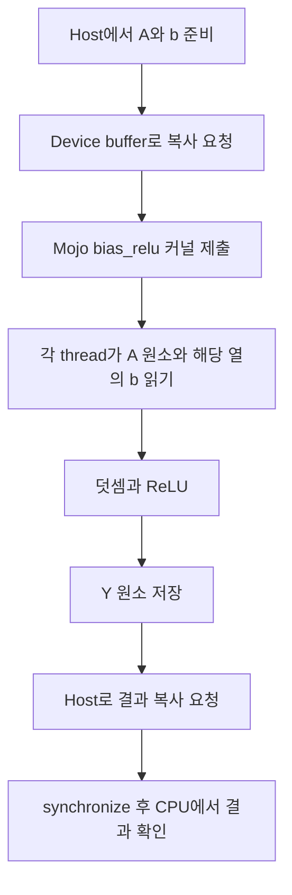

#### 완결형 Mojo 예제

공식 GPU vector addition 튜토리얼의 `DeviceContext`, `TileTensor`, buffer, launch 패턴을 바탕으로 구성했다. 지원되는 GPU 개발 환경과 그 API를 포함하는 MAX 패키지가 필요하다. 이 예제 역시 유한한 float32 입력을 대상으로 한다.

```mojo
# 파일 예시: 05_mojo_bias_relu.mojo
from std.math import ceildiv
from std.sys import has_accelerator

from max.gpu import block_dim, block_idx, thread_idx
from max.gpu.host import DeviceContext
from layout import TileTensor
from layout.tile_layout import row_major

comptime float_dtype = DType.float32
comptime N = 32
comptime M = 64
comptime element_count = N * M
comptime matrix_layout = row_major[element_count]()
comptime bias_layout = row_major[M]()
comptime block_size = 256
comptime num_blocks = ceildiv(element_count, block_size)


def bias_relu(
    a: TileTensor[float_dtype, type_of(matrix_layout), MutAnyOrigin],
    bias: TileTensor[float_dtype, type_of(bias_layout), MutAnyOrigin],
    y: TileTensor[float_dtype, type_of(matrix_layout), MutAnyOrigin],
):
    # A와 Y는 row-major 행렬을 1차원으로 펼친 view다.
    var tid = Int(block_idx.x * block_dim.x + thread_idx.x)
    if tid < element_count:
        var col = tid % M
        var value = a[tid] + bias[col]
        if value > Float32(0):
            y[tid] = value
        else:
            y[tid] = Float32(0)


def main() raises:
    comptime if not has_accelerator():
        print("No compatible GPU found")
    else:
        var ctx = DeviceContext()

        # 1. Host buffer 생성도 enqueue되므로 CPU에서 쓰기 전에 대기한다.
        var a_host = ctx.enqueue_create_host_buffer[float_dtype](element_count)
        var b_host = ctx.enqueue_create_host_buffer[float_dtype](M)
        ctx.synchronize()

        # matmul 결과를 대신하는 유한한 예제 입력이다.
        for i in range(element_count):
            a_host[i] = Float32(Float64(i % 17) - 8.0)
        for col in range(M):
            b_host[col] = Float32(Float64(col % 5) - 2.0)

        # 2. Device global memory를 준비한다.
        var a_device = ctx.enqueue_create_buffer[float_dtype](element_count)
        var b_device = ctx.enqueue_create_buffer[float_dtype](M)
        var y_device = ctx.enqueue_create_buffer[float_dtype](element_count)

        # 3. 같은 context에 입력 복사를 제출한다.
        ctx.enqueue_copy(dst_buf=a_device, src_buf=a_host)
        ctx.enqueue_copy(dst_buf=b_device, src_buf=b_host)

        # 4. 버퍼를 layout이 있는 view로 감싼다.
        var a_tensor = TileTensor(a_device, matrix_layout)
        var b_tensor = TileTensor(b_device, bias_layout)
        var y_tensor = TileTensor(y_device, matrix_layout)

        # 5. 커널을 제출한다. 여기서 CPU가 곧바로 결과를 읽지는 않는다.
        ctx.enqueue_function[bias_relu](
            a_tensor,
            b_tensor,
            y_tensor,
            grid_dim=num_blocks,
            block_dim=block_size,
        )

        # 6. 커널 뒤에 결과 복사를 제출한다.
        var y_host = ctx.enqueue_create_host_buffer[float_dtype](element_count)
        ctx.enqueue_copy(dst_buf=y_host, src_buf=y_device)
        ctx.synchronize()

        # 7. 유한한 정수 범위의 float32 값이므로 이 예제에서는 정확 비교한다.
        for i in range(element_count):
            var expected = a_host[i] + b_host[i % M]
            if expected < Float32(0):
                expected = Float32(0)
            if y_host[i] != expected:
                raise Error("bias_relu result mismatch")

        print("bias_relu check passed")
        print("Y:", y_host)
```

호환되는 환경 안에서의 실행 예시:

```text
mojo 05_mojo_bias_relu.mojo
```

버전 주의: 확인한 GPU 입문 튜토리얼과 `TileTensor` API 예제 사이에 `row_major`의 import 표기가 달라, 위 코드는 API 문서의 명시적 경로인 `layout.tile_layout`을 사용했다. `TileTensor` 선언의 `mut`는 추론되는 매개변수이며, 위의 dtype·layout·origin 순서는 공식 튜토리얼과 API 내부 타입 예시를 따른다. 설치한 MAX의 예제와 함께 확인한다.

#### 코드와 실행 계층의 대응

| 코드 | 담당하는 계층 |
|---|---|
| `comptime N`, `comptime M` | 컴파일 시 알려진 상수 |
| `row_major[...]()` | 논리적 원소와 메모리 인덱스의 대응 |
| `TileTensor(...)` | 버퍼를 해석하는 텐서 view |
| `enqueue_create_buffer` | 장치 저장 공간 준비 |
| `enqueue_copy` | 데이터 이동 요청 |
| `enqueue_function[bias_relu]` | 커널 컴파일·실행 제출 경로 |
| `block_idx`, `thread_idx` | thread가 맡을 작업 구분 |
| `a[tid]`, `bias[col]` | 입력 읽기 |
| `y[tid] = ...` | 결과 저장 |
| `ctx.synchronize()` | host가 완료를 기다림 |

이 예제의 `bias`는 길이 `M`인 벡터 그대로다. `tid % M`으로 열을 찾아 모든 행에 같은 편향을 적용한다. 이것이 broadcast의 구체적인 구현 예다.

공식 Mojo GPU 튜토리얼은 같은 `DeviceContext`의 작업이 제출 순서를 따르며, `synchronize()`가 완료를 기다리는 역할임을 설명한다.<citation refs="nMRGYlJwT7U8ifNX8YTCL">Operations within a stream execute in the order they are issued. ... synchronize ... blocks until the device completes all operations in its queue.</citation>

#### 여기서 반드시 피해야 할 오해

- `TileTensor`라는 이름을 썼다고 최적의 matmul tiling을 구현한 것은 아니다.
- thread가 2,048개라고 GPU 물리 코어가 2,048개 필요한 것은 아니다. thread는 하드웨어가 스케줄링하는 논리적 작업 단위다.
- block 크기 256은 이 예제의 선택일 뿐 모든 GPU에서 최적이라는 의미가 아니다.
- `synchronize()`는 계산을 처음 시작시키는 명령이 아니다. 이미 제출된 작업이 완료될 때까지 기다리는 역할이다.
- device buffer를 일반 CPU 배열처럼 즉시 읽어서는 안 된다. CPU가 접근할 수 있는 결과와 적절한 완료 대기가 필요하다.
- `has_accelerator()`의 컴파일 시점 분기는 지원되는 GPU 개발 경로를 선택하는 예제 패턴이지, 모든 배포 환경의 런타임 오류를 제거한다는 보장은 아니다.

### 10.6 Mojo와 MLIR의 관계

Mojo는 MLIR 기반 컴파일러 인프라를 활용한다.<citation refs="XWottOcX6Ix-VFrkjvQJC">It's the first programming language built from the ground-up using MLIR</citation> 이것이 주는 핵심 관점은 **높은 수준의 언어 구조부터 낮은 수준의 장치 실행까지 여러 단계의 표현과 변환을 사용할 수 있다**는 것이다.

다음 도식은 개념도이며 정확한 내부 pass 목록을 뜻하지 않는다.


**MLIR을 쓴다는 공통점만으로 Mojo와 XLA가 같은 compiler stack이거나 자동으로 서로 연결된다고 판단하면 안 된다.** 실제 연결에는 지원하는 IR, 연산, ABI, runtime API와 라이브러리 규약이 필요하다.

---

## 11. Triton으로 커널 경계를 직접 보기

### 11.1 왜 Triton 예제도 볼까?

공통 읽기 자료의 Triton vector addition은 **“Python에서 커널을 호출하는 코드”와 “장치에서 실행할 계산 코드”의 경계**를 보기 좋다.

여기서도 matmul은 PyTorch에 맡기고, 그 결과 `A`에 bias와 ReLU를 적용하는 작은 커널만 작성한다.

이렇게 하면 전체 계산은 다음과 같다.

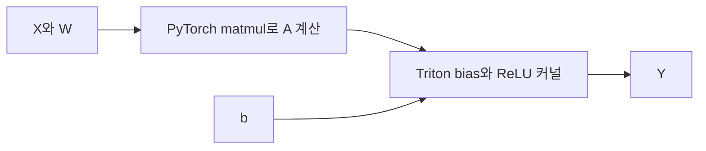

### 11.2 완결형 Triton 예제

지원되는 PyTorch·Triton GPU 환경이 필요하다. CPU fallback은 제공하지 않는다. 예제는 연속된 row-major `float32` 텐서와 유한한 입력을 사용하며, **추론용 forward만 구현**한다. 임의의 PyTorch autograd backward가 자동으로 만들어진다고 가정하지 않는다.

```python
# 파일 예시: 06_triton_bias_relu.py
import torch
import triton
import triton.language as tl


@triton.jit
def bias_relu_kernel(
    a_ptr,
    b_ptr,
    y_ptr,
    n_elements,
    M: tl.constexpr,
    BLOCK_SIZE: tl.constexpr,
):
    pid = tl.program_id(axis=0)
    offsets = pid * BLOCK_SIZE + tl.arange(0, BLOCK_SIZE)
    mask = offsets < n_elements

    cols = offsets % M
    a = tl.load(a_ptr + offsets, mask=mask, other=0.0)
    b = tl.load(b_ptr + cols, mask=mask, other=0.0)
    y = tl.maximum(a + b, 0.0)
    tl.store(y_ptr + offsets, y, mask=mask)


def bias_relu(a: torch.Tensor, b: torch.Tensor) -> torch.Tensor:
    if a.device.type != "cuda" or b.device != a.device:
        raise ValueError("이 예제는 같은 CUDA 계열 장치의 입력이 필요합니다.")
    if a.dtype != torch.float32 or b.dtype != torch.float32:
        raise ValueError("이 예제는 float32만 다룹니다.")
    if a.ndim != 2 or b.ndim != 1 or a.shape[1] != b.shape[0]:
        raise ValueError("입력 shape는 A[N, M], b[M]이어야 합니다.")
    if not a.is_contiguous() or not b.is_contiguous():
        raise ValueError("이 예제는 contiguous 입력만 다룹니다.")
    if a.requires_grad or b.requires_grad:
        raise ValueError("이 예제는 autograd를 구현하지 않은 추론용 코드입니다.")

    y = torch.empty_like(a)
    n_elements = a.numel()
    if n_elements == 0:
        return y

    grid = lambda meta: (triton.cdiv(n_elements, meta["BLOCK_SIZE"]),)
    bias_relu_kernel[grid](
        a, b, y,
        n_elements,
        M=a.shape[1],
        BLOCK_SIZE=256,
    )
    return y


if __name__ == "__main__":
    if not torch.cuda.is_available():
        raise RuntimeError("지원되는 GPU와 PyTorch·Triton 환경이 필요합니다.")

    torch.manual_seed(0)
    N, K, M = 33, 16, 65  # 끝부분 mask가 필요한 크기
    x = torch.randn(N, K, device="cuda", dtype=torch.float32)
    w = torch.randn(K, M, device="cuda", dtype=torch.float32)
    b = torch.randn(M, device="cuda", dtype=torch.float32)

    with torch.no_grad():
        a = x @ w
        expected = torch.relu(a + b)
        actual = bias_relu(a, b)
        torch.cuda.synchronize()
        torch.testing.assert_close(actual, expected, rtol=1e-4, atol=1e-5)
        print("Triton bias + ReLU check passed")
```

### 11.3 Mojo thread 모델과 Triton program 모델을 구분하자

| 항목 | 앞의 Mojo 예제 | 앞의 Triton 예제 |
|---|---|---|
| 작업을 구분하는 값 | `block_idx`, `thread_idx` | `program_id` |
| 코드에서 다루는 기본 단위 | thread별 원소 | program별 원소 블록 |
| 인덱스 생성 | thread ID 계산 | `tl.arange`로 여러 offset 생성 |
| 경계 검사 | `if tid < ...` | mask를 load/store에 적용 |
| 장치 실행 제출 | `enqueue_function` | `kernel[grid](...)` |

**Triton의 `BLOCK_SIZE=256`을 CUDA thread 256개와 일대일로 같은 뜻이라고 보면 안 된다.** 이 값은 여기서 program이 다루는 원소 블록 크기이며, 실제 thread·warp 배치는 컴파일러와 설정의 영향을 받는다.

Triton 공식 vector addition 예제 역시 `program_id`, offset, mask, launch grid, 비동기 반환을 분리해서 보여준다.<citation refs="51b-eFn08lWAsOsKi97ic">The SPMD launch grid denotes the number of kernel instances that run in parallel. ... the kernel is still running asynchronously at this point.</citation>

### 11.4 여기서 fusion이라고 말할 수 있는 범위

이 커널에는 bias add와 ReLU가 함께 들어 있다. 따라서 **이 후처리 코드에서는 두 계산을 하나의 커널로 구현했다**고 말할 수 있다.

하지만 행렬곱 `x @ w`는 별도로 실행했다. 따라서 **전체 `ReLU(XW + b)`가 하나의 커널이라고 말하면 틀리다.** 또한 작은 후처리를 직접 구현했다는 사실만으로 기존 프레임워크보다 빠르다고 말할 수 없다.

---

## 12. 세 스택을 같은 기준으로 비교하기

### 12.1 전체 비교표

| 관점 | PyTorch 기본 compile 경로 | JAX·OpenXLA 경로 | Modular MAX·Mojo 경로 |
|---|---|---|---|
| 모델 작성 | PyTorch Tensor·Module | JAX 함수·배열 연산 | MAX Python Module·Graph 등 |
| 계산 포착 | Dynamo 등을 통한 capture | tracing과 Jaxpr | symbolic graph construction |
| 대표적인 높은 수준 표현 | FX·ATen 기반 그래프 | Jaxpr, StableHLO, HLO | MAX Graph와 내부 표현 |
| 컴파일 주체 | 기본 backend는 Inductor | XLA | MAX 컴파일 경로, Mojo compiler |
| 직접 커널 작성 예 | Triton 등 | Pallas 등 | Mojo |
| 장치 실행 연계 | PyTorch runtime과 장치별 경로 | PJRT 등 장치 API·구현 | MAX runtime, DeviceContext 등 |
| 이번 문서의 학습 예 | compile과 eager·gradient 비교 | IR 출력과 명시 compile | Graph 실행, custom op, 독립 GPU kernel |

이 표는 대표 경로를 비교한 것이다. 각 프레임워크의 모든 backend와 연동 방식을 망라한 제품 호환성 표는 아니다.

### 12.2 공통으로 해결하는 문제

1. 계산의 의미를 표현한다.
2. shape·dtype·데이터 의존 관계를 파악한다.
3. 하드웨어에 맞게 실행 방법을 정한다.
4. 메모리와 실행 순서를 관리한다.
5. 실제 장치에서 계산하고 결과를 돌려준다.

### 12.3 다른 것은 어디일까?

- 사용자가 계산을 표현하는 방식.
- 컴파일러가 보는 IR과 최적화 체계.
- 지원하는 하드웨어와 backend 구현.
- 수동 커널의 프로그래밍 모델.
- 실행·메모리 API.
- 학습·추론·배포에서 중점적으로 제공하는 기능.
- 자동화와 사용자의 직접 제어 사이의 경계.

### 12.4 무엇을 기준으로 선택할까?

이 문서의 정보만으로 “어느 것이 제일 빠르다”는 순위를 만들 수는 없다. 선택하려면 다음 질문이 먼저 필요하다.

| 질문 | 왜 중요한가? |
|---|---|
| 학습인가, 추론인가? | gradient, optimizer, serving 기능의 요구가 다름 |
| 어느 CPU·GPU·TPU를 사용하는가? | 실제 지원 backend와 driver가 필요 |
| 기존 모델·라이브러리는 무엇인가? | 모델 변환과 통합 비용이 생김 |
| 커널을 직접 수정해야 하는가? | 표현력과 디버깅 도구가 중요 |
| 입력 shape가 자주 바뀌는가? | compile cache와 specialization 정책의 영향 |
| 병목이 연산인가, 메모리인가, host인가? | 바꿔야 할 계층이 다름 |
| 배포·운영 요구가 무엇인가? | 모델 실행 외에도 batching·routing 등이 필요 |

### 12.5 언어 이식성과 성능 이식성은 다르다

같은 코드를 여러 장치용으로 컴파일할 수 있는 것과, 모든 장치에서 최적의 성능이 나오는 것은 다른 주장이다.

- 장치마다 빠른 dtype이 다르다.
- 연산 장치의 단위와 메모리 용량이 다르다.
- 같은 block·tile 크기가 모두에게 유리하지 않다.
- 라이브러리 지원 수준과 컴파일러 최적화도 다르다.

따라서 “하드웨어 독립적”이라는 표현을 볼 때는 **소스 호환성, 실행 지원, 수치 의미, 성능 특성 중 무엇을 뜻하는지** 구분해야 한다.

---

## 13. 작게 해볼 수 있는 관찰 실험

코드를 반드시 실행할 필요는 없다. 실행한다면 설치·환경 구성에 너무 많은 시간을 쓰기보다, 한 계층에서 관찰할 수 있는 사실을 명확히 정하는 것이 좋다.

### 실험 A. shape를 따라가기

- 대상: NumPy 또는 PyTorch 기본 예제.
- 변경: `N`, `K`, `M`을 각각 바꿔본다.
- 관찰: 어느 축이 행렬곱에서 사라지고 어느 축이 출력에 남는가?
- 설명할 것: `K`는 contracting dimension이며 `N`, `M`은 출력에 남는다.
- 주의: shape 오류를 GPU 성능 문제로 해석하지 않는다.

### 실험 B. broadcast와 실제 복사를 구분하기

- 대상: `A[N, M] + b[M]`.
- 관찰: 코드에 `b`를 `N`번 복사하는 반복문이 없어도 계산이 된다.
- 연결: Mojo·Triton 예제의 `col = index % M`을 살펴본다.
- 결론: 논리적 확장은 반드시 거대한 물리적 복사를 뜻하지 않는다.
- 주의: 특정 컴파일러가 실제로 어떤 버퍼를 만들었는지는 IR·프로파일·메모리 도구로 확인해야 한다.

### 실험 C. 소스와 IR 비교하기

- 대상: JAX `make_jaxpr`와 StableHLO 출력.
- 관찰: matmul, broadcast, add, activation에 해당하는 부분을 찾는다.
- 기록: 소스 코드 줄과 IR의 연산을 연결한다.
- 질문: 하나의 소스 연산이 왜 여러 노드로 보이는가?
- 주의: 보여주는 것이 높은 수준의 IR인지, 최적화 이후 결과인지 명시한다.

### 실험 D. 첫 호출과 반복 호출 비교하기

- 대상: `torch.compile` 또는 `jax.jit`.
- 관찰: 첫 실행과 워밍업 이후의 시간이 왜 다른가?
- 기록: 컴파일, 메모리 초기화, 실제 계산이 섞일 가능성.
- 주의: 첫 호출이 느리다고 steady-state 성능까지 나쁘다고 결론 내리지 않는다.

### 실험 E. 동기화 유무 비교하기

- 대상: JAX 또는 GPU 예제.
- 변경: 완료 대기를 빼고 시간을 잰 경우와 넣은 경우를 비교한다.
- 관찰: 측정 구간이 무엇을 포함하는지 설명한다.
- 결론: 짧은 숫자가 항상 더 빠른 계산을 뜻하는 것은 아니다.
- 주의: 출력 전체를 `print`하는 행위가 자체적으로 동기화·전송을 유발할 수 있다.

### 실험 F. custom op를 연결해 보기

- 대상: MAX 기본 ReLU와 Mojo custom ReLU.
- 관찰: 등록 이름, 입력 dtype·shape, 출력 명세가 어디서 연결되는가?
- 확인: 두 구현의 숫자 결과가 같은가?
- 질문: custom op를 넣으면 최적화가 더 쉬워질까, 더 어려워질까?
- 주의: 성능 우열을 결론 내리기 위한 실험이 아니다.

### 실험 G. 커널의 경계 검사 보기

- 대상: Triton `N=33, M=65` 예제.
- 관찰: 원소 수가 block 크기로 나누어떨어지지 않아도 왜 안전한가?
- 연결: `mask`와 Mojo의 `if tid < element_count`.
- 주의: 경계 검사를 제거하고 out-of-bounds 접근을 일부러 실행하지 않는다.

### 추천 최소 실습 순서

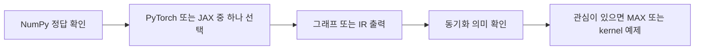

---

## 14. 자주 생기는 오해와 문제 찾기

### 14.1 자주 생기는 오해

| 오해 | 더 정확한 설명 |
|---|---|
| Python 코드가 GPU에서 직접 실행된다 | host 코드가 실행 요청을 만들고, 장치는 해당 장치용 코드로 계산한다 |
| IR은 곧 기계어다 | IR은 여러 수준이 있으며 많은 IR은 아직 높은 수준의 텐서 의미를 유지한다 |
| 그래프 노드 하나는 커널 하나다 | 분해와 fusion 때문에 대응이 달라질 수 있다 |
| 모든 matmul은 Tensor Core를 쓴다 | dtype·shape·하드웨어·구현 선택에 따라 다르다 |
| ReLU도 행렬 연산 장치에서 처리한다 | 일반 원소별 연산 장치가 담당할 수 있다 |
| 함수가 반환되면 계산이 끝났다 | 비동기 실행에서는 결과 핸들만 먼저 반환될 수 있다 |
| `synchronize`가 있어야 계산을 시작한다 | 보통 이미 제출한 작업의 완료를 기다리는 것이다 |
| GPU의 thread 수가 물리 core 수다 | 논리적 작업이 하드웨어에서 스케줄링된다 |
| compile을 붙이면 항상 빠르다 | compile 비용, 입력 규모, graph break, 구현 선택 등에 따라 다르다 |
| custom kernel은 자동으로 더 빠르다 | 정확성·메모리 패턴·병렬성·통합 overhead를 모두 고려해야 한다 |
| Mojo와 OpenXLA는 같은 계층의 대체재다 | 언어와 컴파일 생태계를 비교하고 있으므로 MAX+Mojo와 전체 스택을 함께 봐야 한다 |
| MLIR을 쓰면 XLA와 자동 호환된다 | 지원 dialect·연산·ABI·runtime 연결이 별도로 필요하다 |
| 동일한 수식이면 비트 단위 결과도 같다 | 부동소수점 순서·정밀도·라이브러리 선택으로 차이가 생길 수 있다 |

### 14.2 문제가 생기면 어느 계층을 볼까?

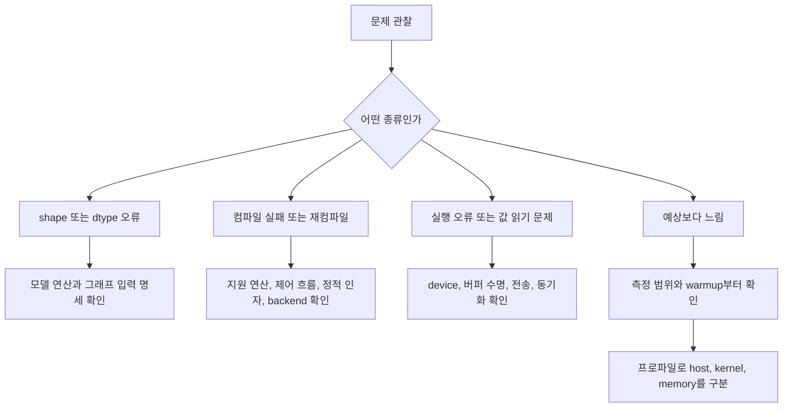

### 14.3 예제별 환경 점검

| 예제 | 필요한 것 | 흔한 확인 사항 |
|---|---|---|
| NumPy | Python, NumPy | 입력 dtype과 shape |
| PyTorch eager | PyTorch | CPU·GPU device 일치 |
| PyTorch compile | 지원 버전과 compiler 환경 | Python 버전 지원, backend 설치 |
| JAX | JAX와 해당 backend | 실제로 선택된 장치, jax·jaxlib 호환 |
| MAX Graph | MAX Python 환경 | Graph API와 compile·init API 버전 |
| MAX custom op | 서로 호환되는 MAX·Mojo | 등록 이름, 패키지 경로, import 경로 |
| 독립 Mojo GPU | Mojo와 MAX GPU API, 지원 GPU 개발 환경 | `max.gpu`, `layout`, driver·toolchain 호환 |
| Triton | 지원 GPU, PyTorch·Triton | contiguous, dtype, backend, autograd 미구현 |

설치 명령은 운영체제와 가속기에 따라 달라진다. 특히 CUDA·ROCm·TPU 패키지를 임의로 섞지 말고 각 공식 설치 문서를 따른다. 이 문서는 사용자 시스템에 패키지를 설치하거나 기존 환경을 변경하지 않았다.

### 14.4 재현성을 위해 남기면 좋은 정보

```text
실행 날짜:
운영체제:
CPU:
가속기 이름:
가속기 driver:
Python 버전:
프레임워크와 compiler 버전:
사용한 backend:
입력 shape:
입력 dtype:
layout·contiguous 여부:
첫 호출 포함 여부:
동기화 방법:
입출력 전송 포함 여부:
실행한 코드와 변경 사항:
```

실험 환경을 기록하지 않으면 다른 사람의 결과와 숫자만 비교하기 쉽다.

---

## 15. 스터디 발표와 토론 가이드

### 15.1 각자 선택할 수 있는 다섯 구간

| 구간 | 발표의 중심 질문 | 권장 결과물 |
|---|---|---|
| 모델 → 연산 | Transformer를 펼치면 무엇이 남는가? | 주요 연산과 shape 표 |
| 연산 → 그래프·IR | Python 계산을 어떤 표현으로 기록하는가? | 소스와 그래프 연결 그림 |
| IR → 실행 코드 | compiler가 무엇을 결정하는가? | fusion·layout·backend 설명 |
| 실행 요청 → 커널 | 누가 데이터를 준비하고 완료를 기다리는가? | sequence diagram |
| 커널 → 칩 내부 | 어디서 계산하고 어디서 데이터를 가져오는가? | 연산 장치와 메모리 그림 |

### 15.2 발표용 Markdown 템플릿

아래 블록은 자신의 자료에 복사해서 채우는 템플릿이다.

````markdown
# 내가 선택한 구간

## 1. 이 단계의 역할
- 한 문장 설명:
- 앞 단계에서 받는 것:
- 다음 단계에 넘기는 것:

## 2. 공통 예제
`Y = ReLU(X @ W + b)`

- X의 shape:
- W의 shape:
- b의 shape:
- 이 단계에서 달라지는 표현 또는 실행 방식:

## 3. 핵심 용어 3개
1. 용어:
2. 용어:
3. 용어:

## 4. 연결 그림


## 5. 코드 또는 관찰
- 실제 실행했는가:
- 실행 환경:
- 소스 코드·IR·프로파일 중 무엇을 보았는가:
- 확인한 사실:
- 아직 확인하지 못한 것:

## 6. 토론 질문
- 질문 1:
- 질문 2:

## 7. 참고 자료
- 공식 문서 링크:
````

### 15.3 토론 질문 모음

#### 모델·연산 관점

1. `XW + b`에서 `b`가 broadcast된다는 것은 실제 복사와 어떻게 다른가?
2. Transformer의 높은 수준 블록 이름을 없애면 어떤 연산이 남는가?
3. attention의 논리적 중간 행렬을 실제 메모리에 모두 만들어야 할까?

#### 그래프·IR 관점

4. 같은 Python 코드라도 입력 shape가 달라지면 다른 프로그램이 필요한 이유는 무엇인가?
5. Jaxpr, StableHLO, HLO, LLVM IR은 왜 하나로 통일하지 않을까?
6. 데이터에 의존하는 Python 조건문을 그래프로 옮길 때 어떤 문제가 생길까?

#### 컴파일러 관점

7. fusion은 왜 중간 메모리 접근을 줄일 수 있을까?
8. fusion을 많이 하면 항상 좋아질까?
9. compiler가 생성한 커널과 이미 최적화된 라이브러리 중 무엇을 선택해야 할까?
10. 어떤 최적화가 수치 정확도에 영향을 줄 수 있을까?

#### 런타임 관점

11. 결과의 shape는 알지만 실제 값은 아직 준비되지 않았다는 것이 어떻게 가능한가?
12. 두 개의 비동기 요청은 반드시 동시에 실행될까?
13. host에서 값을 출력하는 행위가 왜 전체 실행 흐름에 영향을 줄까?

#### 하드웨어·도구 관점

14. 같은 행렬곱이라도 GPU와 TPU에서 데이터 이동 방식이 왜 다를까?
15. Mojo custom op를 MAX에 연결할 때 compiler가 알아야 하는 정보는 무엇인가?
16. Triton program 하나와 GPU thread 하나는 어떻게 다른가?
17. OpenXLA와 MAX+Mojo를 비교할 때 어떤 층위를 맞춰야 공정할까?

### 15.4 5분 발표 구성 예시

1. **30초:** 내가 맡은 구간과 큰 그림의 위치.
2. **1분:** 입력·출력과 핵심 용어 3개.
3. **1분 30초:** 공통 수식을 해당 구간으로 설명.
4. **1분:** 그림 또는 코드에서 중요한 부분 2개.
5. **1분:** 확인한 사실과 아직 남은 질문.

발표의 목적은 코드 양이나 용어 수를 늘리는 것이 아니라, 다른 사람이 자신의 구간과 연결할 수 있게 만드는 것이다.

---

## 16. 용어 사전과 최종 요약

### 16.1 용어 사전

| 용어 | 이번 주에 필요한 뜻 |
|---|---|
| Tensor | shape와 dtype을 가진 다차원 배열 |
| Shape | 축별 원소 수 |
| Dtype | 원소의 숫자 표현 형식 |
| Broadcasting | 축 호환 규칙에 따라 작은 입력을 확장해 사용하는 계산 의미 |
| Operator | 텐서에 적용하는 계산 |
| Graph | 연산과 의존 관계를 나타내는 구조 |
| IR | compiler가 사용하는 중간 표현 |
| Tracing | 프로그램의 계산을 추적해 표현을 만드는 과정 |
| Lowering | 더 구체적인 표현으로 변환하는 과정 |
| Backend | 대상 장치에 맞는 최적화·코드 생성 등을 담당하는 구현 |
| Specialization | 입력 특성이나 정적 값에 맞춘 프로그램 생성 |
| Fusion | 여러 계산을 묶어 실행 경계와 중간 접근을 줄이는 최적화 |
| Layout | 논리적 원소와 물리적 저장 위치의 대응 |
| Tiling | 큰 계산을 재사용 가능한 조각으로 나누는 방식 |
| JIT | 실행 과정에서 필요한 코드를 컴파일하는 방식 |
| AOT | 실행 이전에 컴파일·준비하는 방식. 문맥에 따라 범위가 다름 |
| Kernel | 장치에서 실행하는 계산 코드의 단위 |
| Runtime | 실제 데이터와 장치에 프로그램 실행을 연결하는 계층 |
| Dispatch | 실행 작업을 제출하는 것 |
| Buffer | 실제 데이터를 저장하는 메모리 영역 또는 그 핸들 |
| Stream·Queue | 실행 작업과 순서를 관리하는 단위 |
| Synchronization | 필요한 작업의 완료를 기다리거나 순서를 맞추는 것 |
| HBM | 큰 대역폭을 제공하는 메모리 기술. 연산 장치 자체는 아님 |
| Register | 연산 장치 가까운 작은 저장 공간 |
| Shared memory | GPU thread block 등이 협력에 사용하는 빠른 저장 공간 |
| SM | NVIDIA GPU의 주요 병렬 실행 단위 |
| Tensor Core | NVIDIA GPU의 특정 행렬 연산 가속 장치 |
| MXU | TPU의 행렬 연산 장치 |
| VPU | TPU의 벡터 연산 장치 |
| VMEM | TPU의 on-chip vector memory·scratchpad |
| MLIR | 여러 수준의 IR과 변환을 구성하는 compiler 인프라 |
| StableHLO | ML framework·compiler 사이의 이식 가능한 연산 표현 |
| HLO | XLA의 내부 높은 수준 계산 표현 |
| XLA | ML 계산을 최적화하고 장치용 코드로 변환하는 compiler |
| PJRT | 장치·버퍼·컴파일·실행을 연결하는 공통 API |
| Mojo | CPU·GPU 코드 작성에 사용할 수 있는 프로그래밍 언어 |
| MAX | Modular의 모델 graph·compile·runtime·추론 관련 기술 스택 |

### 16.2 전체를 다시 한 장에 놓기

```mermaid
flowchart TB
    M["공통 수식: Y = ReLU(XW + b)"]
    M --> P["PyTorch"]
    M --> J["JAX"]
    M --> X["MAX Graph"]
    P --> PI["Dynamo, AOT Autograd, Inductor"]
    J --> JI["Jaxpr, StableHLO, XLA"]
    X --> XI["MAX compiler와 연산 구현"]
    MK["Mojo custom op와 kernel"] --> XI
    PI --> R["각 스택의 runtime과 장치 인터페이스"]
    JI --> R
    XI --> R
    R --> D["지원되는 CPU, GPU, TPU 등의 장치"]
    D --> MEM["메모리에서 데이터 이동"]
    MEM --> CALC["연산 장치에서 실제 계산"]
    CALC --> O["출력 Y와 완료 상태"]
```

이 그림의 아래쪽 장치 목록은 전체 스택을 합쳐 표현한 것이다. **각 스택이 모든 종류의 장치를 같은 수준으로 지원한다는 뜻은 아니다.**

### 16.3 마지막으로 기억할 여섯 문장

1. **모델은 무엇을 계산할지 표현한다.**
2. **그래프와 IR은 그 계산을 분석하고 변환할 수 있게 만든다.**
3. **컴파일러는 하드웨어에 맞는 실행 방법을 준비한다.**
4. **런타임은 실제 데이터와 실행 요청, 완료를 관리한다.**
5. **칩에서는 연산뿐 아니라 데이터 이동도 일어난다.**
6. **OpenXLA와 MAX+Mojo는 이 연결을 구성하는 서로 다른 기술 스택이며, Mojo 자체는 그중 코드를 작성하는 언어다.**

> 이번 주의 목표는 모든 내부 구현을 외우는 것이 아니다. 앞으로 만날 fusion, tiling, memory bandwidth, profiling, distributed execution이 이 전체 과정의 어디에 놓이는지 설명할 수 있으면 된다.

---

## 17. 공식 자료와 추가 읽기

문서의 개념 설명과 API 확인에 사용한 자료다. 웹 문서와 `main` 브랜치의 예제는 이후 변경될 수 있다. 실제 실습 때에는 설치 버전과 문서 버전을 함께 확인한다.

### 17.1 먼저 읽을 공통 자료

1. [Scaling Book 9장: How to Profile TPU Code](https://jax-ml.github.io/scaling-book/profiling)  
   먼저 읽을 부분: **A Thousand-Foot View of the TPU Software Stack**. JAX → StableHLO·HLO → TPU 실행 코드의 큰 흐름.
2. [PyTorch: torch.compiler](https://docs.pytorch.org/docs/stable/torch.compiler.html)  
   먼저 읽을 부분: Dynamo, AOT Autograd, Inductor의 역할.

### 17.2 모델과 하드웨어

3. [Scaling Book 4장: Transformers](https://jax-ml.github.io/scaling-book/transformers)  
   Counting Dots, Transformer Accounting, 필요하면 Flash Attention 부록.
4. [Scaling Book 2장: TPUs](https://jax-ml.github.io/scaling-book/tpus)  
   What Is a TPU?의 MXU·VPU·VMEM·HBM.
5. [Scaling Book 12장: GPUs](https://jax-ml.github.io/scaling-book/gpus)  
   What Is a GPU?와 Memory. NVIDIA GPU 기준임에 유의.

### 17.3 OpenXLA와 JAX

6. [XLA architecture](https://openxla.org/xla/architecture)
7. [XLA terminology](https://openxla.org/xla/terminology)
8. [StableHLO](https://openxla.org/stablehlo)
9. [PJRT C++ Device API overview](https://openxla.org/xla/pjrt/cpp_api_overview)
10. [JAX asynchronous dispatch](https://docs.jax.dev/en/latest/async_dispatch.html)
11. [JAX ahead-of-time lowering and compilation](https://docs.jax.dev/en/latest/aot.html)
12. [JAX stages](https://docs.jax.dev/en/latest/jax.stages.html)
13. [jax.make_jaxpr](https://docs.jax.dev/en/latest/_autosummary/jax.make_jaxpr.html)
14. [JAX benchmarking](https://docs.jax.dev/en/latest/benchmarking.html)

### 17.4 PyTorch와 Triton

15. [torch.compile API](https://docs.pytorch.org/docs/stable/generated/torch.compile.html)
16. [torch.export](https://docs.pytorch.org/docs/stable/user_guide/torch_compiler/export.html)
17. [torch.cuda.synchronize](https://docs.pytorch.org/docs/stable/generated/torch.cuda.synchronize.html)
18. [torch.cuda.Event](https://docs.pytorch.org/docs/stable/generated/torch.cuda.Event.html)
19. [Triton Vector Addition tutorial](https://triton-lang.org/main/getting-started/tutorials/01-vector-add.html)

### 17.5 Modular MAX와 Mojo

20. [Mojo Manual](https://mojolang.org/docs/manual/)
21. [MAX: Build a model graph with Module](https://max.modular.com/develop/modules/)
22. [MAX Graph API](https://max.modular.com/api/python/generated/max.graph.Graph/)
23. [MAX graph operations](https://max.modular.com/api/python/graph.ops/)
24. [MAX InferenceSession API](https://max.modular.com/api/python/generated/max.engine.InferenceSession/)
25. [MAX: Build custom ops for GPUs](https://max.modular.com/develop/build-custom-ops/)
26. [Mojo GPU introduction tutorial](https://max.modular.com/gpu/intro-tutorial/)
27. [DeviceContext API](https://max.modular.com/api/mojo/max/gpu/host/device_context/DeviceContext/)
28. [DeviceBuffer API](https://max.modular.com/api/mojo/max/gpu/host/device_context/DeviceBuffer/)
29. [Mojo SIMD API](https://mojolang.org/docs/std/simd/SIMD/)
30. [공식 custom op Mojo 예제](https://github.com/modular/modular/tree/main/max/examples/custom_ops/kernels/add_one.mojo)
31. [공식 custom op Python 예제](https://github.com/modular/modular/blob/main/max/examples/custom_ops/addition.py)
32. [공식 독립 Mojo GPU 예제](https://github.com/modular/modular/blob/main/max/examples/gpu-intro/vector_addition.mojo)
33. [TileTensor API](https://max.modular.com/api/mojo/layout/tile_tensor/TileTensor/)

### 17.6 읽기 우선순위

- **전체 흐름이 목표라면:** 1 → 2 → 6.
- **IR이 궁금하다면:** 7 → 8 → 11 → JAX 예제.
- **비동기 실행이 궁금하다면:** 10 → 19 → 26.
- **칩 내부가 궁금하다면:** 4 또는 5.
- **Modular 연결이 궁금하다면:** 21 → 25 → 26.
- **코드 실행 시간이 부족하다면:** 도식과 코드의 입력·출력, `compile`, `execute`, `synchronize` 위치만 찾아도 충분하다.

