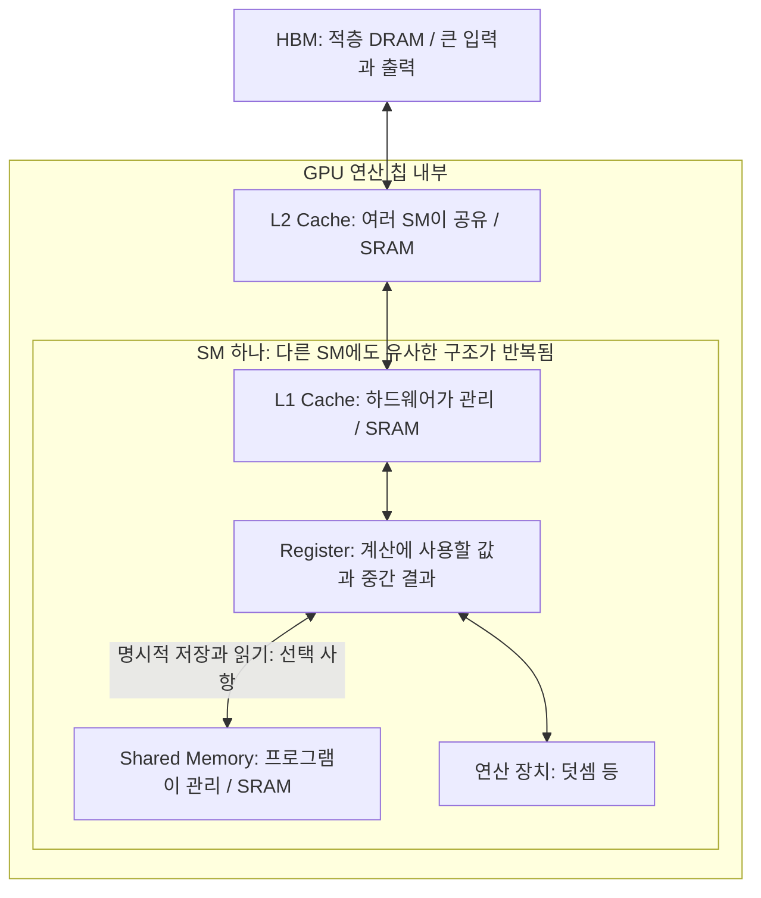

# 3주차 통합 교재: 커널의 시간은 어디에서 소비되는가

학습 안내와 01~07번 교재를 읽는 순서대로 모은 통합본이다. 개념 설명, 수식, 코드, 그림, 연습 문제와 풀이를 함께 읽을 수 있다.

## 목차

- [학습 안내](#guide)
- [① FLOPs와 FLOPs/s: 계산의 양과 계산하는 속도](#chapter-1)
- [② 메모리 용량과 대역폭: 들어가는 양과 옮기는 속도](#chapter-2)
- [③ HBM·DRAM·SRAM: 왜 큰 메모리와 작은 메모리가 함께 필요한가](#chapter-3)
- [④ Compute Time과 Memory Time: 두 시간을 따로 계산하기](#chapter-4)
- [⑤ Compute-bound와 Memory-bound: 무엇이 실행시간을 제한하는가](#chapter-5)
- [⑥ Vector Add: 읽기·계산·쓰기를 시간으로 바꾸기](#chapter-6)
- [⑦ MatMul: 행렬곱의 계산량과 이동량을 손으로 세기](#chapter-7)

---

<a id="guide"></a>

## 학습 안내

> **한 줄 답.** 커널의 계산량과 읽고 쓰는 데이터량을 각각 시간으로 바꾸면, 어떤 자원이 실행시간을 제한하는지 추정할 수 있다.

2주차에는 모델에서 실리콘까지의 흐름을 살펴봤다. 이번에는 커널 하나를 골라 **계산하는 시간과 데이터를 옮기는 시간**을 나누어 본다. 중심 질문은 “같은 연산인데 왜 어떤 커널은 빠르고 어떤 커널은 느린가?”다.

이번 주에는 하나의 가속기 안에서 일어나는 메모리 이동에 집중한다. 입력은 이미 가속기의 메모리에 있다고 가정하며, GPU 간 통신이나 CPU에서 GPU로 보내는 시간은 계산하지 않는다. Arithmetic Intensity(산술 강도), Roofline 그래프, Tiling(타일링)은 이 계산을 바탕으로 **4주차**에 다룬다.

<a id="guide-1"></a>

### 1. 학습 목표와 읽는 순서

이번 주를 마치면 다음 세 가지를 설명할 수 있어야 한다.

- 해야 할 계산량과 하드웨어의 연산 성능, 메모리 용량과 대역폭을 구분한다.
- 간단한 커널의 이상적인 실행시간을 가정과 단위까지 붙여 추정한다.
- 연산 시간과 메모리 시간을 비교해 어떤 조건에서 Memory-bound인지 설명한다.

| 순서 | 교재 | 중심 질문 |
|---|---|---|
| ① | [FLOPs와 FLOPs/s](#chapter-1) | 계산의 양과 초당 처리량은 어떻게 다른가? |
| ② | [메모리 용량과 대역폭](#chapter-2) | 16 GB와 1 TB/s는 무엇을 뜻하는가? |
| ③ | [HBM·DRAM·SRAM과 메모리 계층](#chapter-3) | 왜 모든 데이터를 연산 장치 가까이에 둘 수 없는가? |
| ④ | [Compute Time과 Memory Time](#chapter-4) | 두 시간을 왜 더하지 않고 큰 값으로 추정하는가? |
| ⑤ | [Compute-bound와 Memory-bound](#chapter-5) | 어떤 자원을 늘려야 빨라지는가? |
| ⑥ | [Vector Add 손계산과 풀이](#chapter-6) | 읽기·덧셈·쓰기를 실제 숫자와 코드로 연결할 수 있는가? |
| ⑦ | [MatMul 손계산과 풀이](#chapter-7) | 행렬곱의 계산량과 입력 재사용 가정은 병목 판정에 어떤 영향을 주는가? |

이전 주차 → [2주차: 모델 → 연산](../week2/01-model-to-ops.md)

<a id="guide-2"></a>

### 2. 공통으로 읽을 자료

| 자료 | 이번 주에 읽을 범위 | 읽으며 확인할 질문 |
|---|---|---|
| [Scaling Book 1장: All About Rooflines](https://jax-ml.github.io/scaling-book/roofline/) | 첫 절 **Where Does the Time Go?**의 시간 공식과 Compute-bound / Communication-bound 설명까지 | 계산량과 이동량을 어떻게 시간으로 바꾸는가? |
| [MLC: GPU Acceleration](https://mlc.ai/chapter_gpu_acceleration/part1.html) | **GPU Architecture**의 구조 그림과 첫 Vector Add 코드 | `C[i] = A[i] + B[i]`에서 무엇을 읽고, 계산하고, 쓰는가? |
| [Scaling Book 12장: How to Think About GPUs](https://jax-ml.github.io/scaling-book/gpus/#memory) | **Memory**의 HBM, L2, L1/Shared Memory, Register 역할 | 데이터가 연산 장치에 도착하기까지 어떤 저장 공간을 이용하는가? |

MLC의 뒤쪽 루프 분할·스케줄 변환은 이번 주 필수 범위가 아니며 코드를 실행할 필요도 없다. 메모리 계층은 하드웨어별 용량 수치를 외우기보다 위치와 역할을 따라 읽는다.

**링크 확인 상태:** MLC 원문은 문서 작성 시 사용한 웹 도구에서 접근되지 않아 본문과 절 위치를 확인하지 못했다. 위 주소와 아래 Memory Spaces 주소는 읽기 안내로 남기며, 확인된 자료로 표시하지 않는다. 접근이 되지 않으면 GPU 구조는 Scaling Book 12장, 읽기·계산·쓰기는 Triton 튜토리얼을 함께 본다.

<a id="guide-3"></a>

### 3. 주제별 보조 자료

| 자료 | 읽을 범위 | 어떤 질문에 도움이 되는가? |
|---|---|---|
| [NVIDIA: GPU Performance Background](https://docs.nvidia.com/deeplearning/performance/dl-performance-gpu-background/index.html) | **GPU Architecture Fundamentals**, **Understanding Performance** | 메모리 용량과 대역폭을 어떻게 구분하고 두 시간 중 병목을 어떻게 찾는가? |
| [MLC: Memory Spaces](https://mlc.ai/chapter_gpu_acceleration/part1.html#memory-spaces) | 첫 설명과 표, 링크 확인 상태는 위와 같음 | GPU의 저장 공간은 누가 사용하고 어떻게 관리하는가? |
| [Scaling Book 2장: How to Think About TPUs](https://jax-ml.github.io/scaling-book/tpus/) | **What Is a TPU?**의 HBM·VMEM 설명, 선택 읽기 | GPU의 메모리 계층과 TPU의 HBM·VMEM을 어떻게 비교할 수 있는가? |
| [NVIDIA: Memory-Limited Layers](https://docs.nvidia.com/deeplearning/performance/dl-performance-memory-limited/index.html) | **Memory-Limited Layers**, **Activations** | 계산량이 적은 원소별 연산도 왜 오래 걸릴 수 있는가? |
| [Triton: Vector Addition](https://triton-lang.org/main/getting-started/tutorials/01-vector-add.html) | `add_kernel`의 `tl.load`, 덧셈, `tl.store` | 손으로 센 입력 읽기와 출력 쓰기가 코드의 어느 부분인가? |
| [Micron: Introduction to Memory (PDF)](https://www.micron.com/content/dam/micron/educatorhub/intro-to-memory/micron-intro-to-memory-presentation.pdf) | SRAM·DRAM의 속도·집적도 비교표, 선택 읽기 | 왜 빠른 SRAM으로 모든 메모리를 대체하지 않는가? |

<a id="guide-4"></a>

### 4. 함께 사용할 시간 모델

$$
t_{\mathrm{compute}} = \frac{\text{총 FLOPs}}{\text{연산 성능 (FLOPs/s)}}
$$

$$
t_{\mathrm{memory}} = \frac{\text{읽고 쓴 총 Byte}}{\text{메모리 대역폭 (Byte/s)}}
$$

$$
t_{\mathrm{estimated}} \approx \max(t_{\mathrm{compute}}, t_{\mathrm{memory}})
$$

연산과 데이터 이동을 충분히 겹치고 주어진 성능을 활용한다고 가정한다. 최대 성능을 넣은 값은 **최소 실행시간의 기준**이며 실제 측정값과 같다는 뜻이 아니다. 이번 주의 Memory-bound는 메모리 **대역폭**이 시간을 제한하는 경우를 뜻한다. 자세한 가정과 한계는 [④ 시간 모델](#chapter-4)에서 설명한다.

<a id="guide-5"></a>

### 5. 모임 전에 계산해 올 문제

길이 `N = 100,000,000`인 FP32 벡터 A와 B를 더해 새 벡터 C에 저장한다. FP32 원소 하나는 4 Byte다. 연습용 가상 하드웨어의 FP32 덧셈 처리 성능은 `20 × 10¹² FLOPs/s`, HBM 대역폭은 `1 × 10¹² Byte/s`다. **실제 제품의 사양이나 측정값이 아니다.**

입력은 HBM에서 한 번씩 읽고 결과는 한 번 쓴다. 캐시 재사용과 추가 데이터 이동은 없으며 A·B·C를 저장할 공간은 충분하다. 이 교재에서 `1 GB = 10⁹ Byte`, `1 TB = 10¹² Byte`다.

풀이를 보기 전에 다음을 계산한다.

1. A와 B를 읽는 데이터 크기와 C를 쓰는 데이터 크기
2. 필요한 덧셈 횟수와 총 FLOPs
3. 연산 시간과 메모리 시간
4. 두 시간 중 더 큰 값과, 그 값으로 설명할 수 있는 병목
5. 연산 성능·대역폭·용량을 각각 늘렸을 때의 변화

계산을 마친 뒤 [⑥ 단계별 풀이](#chapter-6)와 비교한다.

추가 연습으로 [⑦ MatMul 손계산](#chapter-7)에서 1,000×1,000 FP32 행렬곱의
연산량·HBM 이동량·두 시간을 구하고, 입력 재사용과 행렬 모양에 따라 병목이 어떻게 달라지는지 비교한다.

<a id="guide-6"></a>

### 6. 모임에서 함께 확인할 질문

- 계산량이 작아도 느릴 수 있는 이유를 입력 읽기와 결과 쓰기로 설명할 수 있는가?
- 연산 성능만 두 배로 높이면 Vector Add가 두 배 빨라지는가? 대역폭만 두 배라면 어떠한가?
- “메모리에 들어간다”와 “메모리에서 빨리 옮긴다”를 서로 다른 계산으로 보여줄 수 있는가?
- 예상 실행시간을 말할 때 입력 위치, 이동 횟수, 성능 활용과 중첩 가정을 함께 말할 수 있는가?

추가로 좋은 자료를 찾았다면 링크만 공유하지 않고, **어떤 질문에 도움이 되는지와 읽을 범위**를 함께 적는다.

<a id="guide-7"></a>

### 7. 애니메이션 설명 영상

> 통합본 작성 시점에 아래 초보자용 영상과 60초 미리보기 MP4는 작업 폴더에 없다. 해당 링크는 원문의 경로를 보존한 것이며, 대본과 제작 안내는 열어 볼 수 있다.

[초보자용 새 영상](./video/week3-beginner.ko.mp4)은 요리사·재료 창고·운반 비유로
계산과 데이터 이동을 설명한다. 새 대본과 26개 새 장면, 기존 여성 목소리 SunHi로
제작했으며, 10분·1080p·30fps의 한국어 음성·자막 영상이다.
[60초 미리보기](./video/week3-beginner-preview.ko.mp4),
[새 대본](./video/beginner/script.ko.md),
[제작 안내](./video/beginner/README.md)에서 확인할 수 있다.

[기존 2D 영상](./video/intuition/week3-intuition.ko.mp4)은 별도로 유지한다.
모든 ZIP 파일과 ElevenLabs 관련 코드·음성·캐시·백업·로그는 요청에 따라 삭제했다.
ElevenLabs·Blender 버전 영상과 해당 영상 클립도 삭제했다.
Blender 원본·백업·전용 코드·렌더 캐시·로그도 삭제했다.
MP4는 `week3/video/`의 로컬 산출물이며 Git에는 포함하지 않는다.

---

<a id="chapter-1"></a>

## ① FLOPs와 FLOPs/s: 계산의 양과 계산하는 속도

> **한 줄 답.** FLOPs는 해야 할 부동소수점 연산의 수이고, FLOPs/s는 1초에 처리할 수 있는 연산의 수다. 계산량을 처리 성능으로 나누면 시간이 된다.


<a id="chapter-1-1"></a>

### 1. 해야 할 일과 처리하는 속도

FLOP (Floating-Point Operation)은 부동소수점 연산 한 번을 뜻한다. FLOPs (Floating-Point Operations)는 연산의 총량을 나타내며, FLOPs/s는 초당 연산 처리량을 나타낸다. 이 교재에서는 두 단위를 구분해 표기한다.

용어: 부동소수점은 실수를 유한한 비트로 근사해 표현하는 방식이다. 여기서는 덧셈 한 번을 1 FLOP으로 센다.

| 구분 | 질문 | 단위 | 예시 |
|---|---|---|---|
| 연산량 | 총 몇 번 계산하는가? | FLOPs | 덧셈 1억 번 = `10⁸ FLOPs` |
| 연산 성능 | 1초에 몇 번 처리하는가? | FLOPs/s | 초당 `20 × 10¹²`번 처리 |
| 연산 시간 | 계산에 얼마가 걸리는가? | s | 연산량 ÷ 연산 성능 |

같은 일을 처리할 때 계산량은 그대로여도 하드웨어의 처리 성능에 따라 시간이 달라진다. 반대로 같은 하드웨어에서 처리할 일이 두 배라면, 같은 성능을 유지한다는 가정 아래 연산 시간도 두 배다.

간단한 예시: 덧셈 1,000회를 초당 100회 처리한다면 `1,000 ÷ 100 = 10초`가 필요하다. 연산 횟수 자체가 초 단위의 시간은 아니다.

<a id="chapter-1-2"></a>

### 2. Vector Add의 FLOPs 세기

Vector Add는 같은 위치의 두 원소를 더해 결과 벡터에 저장하는 연산이다.

```python
# 연산을 세기 위한 의사 코드다. Python 루프 실행시간을 예측하는 예제가 아니다.
for i in range(N):
    C[i] = A[i] + B[i]
```

각 `i`에서 부동소수점 덧셈이 한 번 있으므로 길이가 N이면 총 연산량은 `N FLOPs`다. A와 B를 읽는 작업, C를 쓰는 작업은 부동소수점 덧셈이 아니므로 FLOPs에 넣지 않고 별도의 데이터 이동량으로 센다.

간단한 예시: `A = [1, 2, 3]`, `B = [4, 5, 6]`을 더하면 `C = [5, 7, 9]`가 된다. 덧셈은 세 번이므로 3 FLOPs다. 두 입력이 있다고 해서 6 FLOPs가 되는 것은 아니다.

실제 커널에는 주소 계산이나 범위 검사도 있지만 이 손계산 모델에서는 부동소수점 덧셈만 센다. 제외한 작업이 실제 실행시간까지 사라진다는 뜻은 아니다.

<a id="chapter-1-3"></a>

### 3. 단위가 시간이 되는 이유

연산량을 F, 연산 성능을 P라고 하면 다음과 같다.

$$
t_{\mathrm{compute}} = \frac{F}{P},\qquad
\frac{\mathrm{FLOPs}}{\mathrm{FLOPs}/\mathrm{s}} = \mathrm{s}
$$

예를 들어 `10⁸ FLOPs`를 `20 × 10¹² FLOPs/s`로 처리하면 다음 시간이 나온다.

$$
\frac{10^8}{20 \times 10^{12}}
= 5 \times 10^{-6}\ \mathrm{s}
= 5\ \mu\mathrm{s}
$$

용어: μs(마이크로초)는 백만분의 1초다. `1 ms = 1,000 μs`, `1 s = 1,000 ms`다.

이 값은 **계산 자체에 필요한 이상적인 시간**이다. 입력을 읽고 결과를 쓰는 시간이 더 길다면 커널 전체가 5 μs에 끝나는 것은 아니다. 이 구분은 [Scaling Book의 Where Does the Time Go?](https://jax-ml.github.io/scaling-book/roofline/)의 시간 모델을 따른다.

<a id="chapter-1-4"></a>

### 4. 연산 성능은 연산 종류에 맞춰 고른다

FP32 (32-bit Floating Point)는 여기서 사용하는 32비트 부동소수점 형식이다. 원소 하나를 저장하는 데 4 Byte가 필요하다.

용어: FP32의 `32`는 원소의 비트 수다. 원소 크기와 FLOPs는 서로 다른 개념이므로 FP32 덧셈 한 번을 32 FLOPs로 세지 않는다.

이번 연습의 `20 × 10¹² FLOPs/s`는 **FP32 덧셈의 처리 성능으로 주어진 가상 값**이다. 실제 제품을 분석할 때는 자료형과 연산 종류에 맞는 성능을 선택해야 한다. 다른 정밀도의 행렬곱 처리 성능을 FP32 Vector Add에 그대로 대입하면 안 된다. GPU에는 서로 다른 종류의 연산 장치가 있다. [NVIDIA GPU Architecture Fundamentals](https://docs.nvidia.com/deeplearning/performance/dl-performance-gpu-background/index.html)

<a id="chapter-1-5"></a>

### 5. 확인 질문

- 길이가 `2N`인 Vector Add에는 몇 FLOPs가 필요한가?
- 덧셈 처리 성능을 두 배로 높이면 연산 시간은 어떻게 바뀌는가?
- 이 결과만으로 커널 전체가 두 배 빨라진다고 말할 수 있는가?

마지막 질문에 답하려면 다음 문서에서 메모리 이동량도 세어야 한다.

---

<a id="chapter-2"></a>

## ② 메모리 용량과 대역폭: 들어가는 양과 옮기는 속도

> **한 줄 답.** 용량은 동시에 저장할 수 있는 데이터의 양이고, 대역폭은 초당 옮길 수 있는 데이터의 양이다. 텐서가 들어가는지와 옮기는 데 걸리는 시간은 따로 계산한다.


<a id="chapter-2-1"></a>

### 1. 16 GB와 1 TB/s는 다른 질문에 답한다

| 구분 | 의미 | 단위 | 판단할 내용 |
|---|---|---|---|
| 메모리 용량 | 동시에 저장할 수 있는 양 | Byte | 필요한 텐서가 메모리에 들어가는가? |
| 메모리 대역폭 | 초당 이동할 수 있는 양 | Byte/s | 읽고 쓰는 데 적어도 얼마가 걸리는가? |

용어: 대역폭(bandwidth)은 단위 시간당 전송량이다.

메모리가 16 GB라는 것은 저장 공간의 크기를 말한다. 대역폭이 1 TB/s라는 것은 초당 옮길 수 있는 양을 말하며, 저장 공간이 1 TB라는 뜻이 아니다. GPU의 메모리와 연산 장치 구성은 [NVIDIA GPU Architecture Fundamentals](https://docs.nvidia.com/deeplearning/performance/dl-performance-gpu-background/index.html)에서 함께 확인할 수 있다.

이 교재에서는 `1 Byte = 8 bit`, `1 GB = 10⁹ Byte`, `1 TB = 10¹² Byte`를 사용한다. 이진 단위인 GiB·TiB와 섞지 않는다. FP32 원소 하나는 `32 ÷ 8 = 4 Byte`다.

<a id="chapter-2-2"></a>

### 2. 텐서가 들어가는지 계산하기

텐서 하나의 저장 크기는 다음과 같다.

$$
\text{저장 크기} = \text{원소 수} \times \text{원소당 Byte}
$$

간단한 예시: FP32 원소가 100만 개인 벡터 하나는 `10⁶ × 4 = 4 × 10⁶ Byte`, 즉 4 MB다. 같은 크기의 A·B·C를 동시에 유지하면 12 MB가 필요하다.

길이가 `N = 100,000,000`이면 벡터 하나는 0.4 GB이고 세 벡터는 총 1.2 GB다. 다른 메모리 사용량을 제외하면 16 GB에 들어간다. 실제 프로그램에서는 런타임, 다른 텐서, 임시 버퍼도 공간을 사용하므로 **전체 용량이 아니라 사용 가능한 공간**과 비교해야 한다.

이번 문제는 결과를 새 벡터 C에 저장한다. 입력을 덮어쓰는 연산으로 바꾸어 필요한 용량을 줄이지 않는다.

<a id="chapter-2-3"></a>

### 3. 옮기는 데 걸리는 시간 계산하기

입력을 한 번씩 읽고 결과를 한 번 쓴다면 이동량은 다음과 같다.

$$
Q = \underbrace{4N + 4N}_{\text{A와 B 읽기}}
+ \underbrace{4N}_{\text{C 쓰기}} = 12N\ \mathrm{Byte}
$$

$$
t_{\mathrm{memory}} = \frac{Q}{B},\qquad
\frac{\mathrm{Byte}}{\mathrm{Byte}/\mathrm{s}} = \mathrm{s}
$$

여기서 B는 대역폭이다. 주어진 대역폭을 읽기와 쓰기를 합친 이동량에 적용한다. 읽기와 쓰기에 각각 전체 대역폭을 배정한 뒤 더 짧은 시간을 선택하지 않는다.

간단한 예시: 총 12 MB를 `1 × 10¹² Byte/s`로 이동하면 `12 × 10⁶ ÷ 10¹² = 12 μs`다. 실제로 이 대역폭을 활용할 수 있다는 가정이 붙는다.

<a id="chapter-2-4"></a>

### 4. 저장 크기와 이동량이 같아 보이는 이유

이번 문제에서는 A·B·C를 동시에 보관하는 데 12N Byte가 필요하고, 읽기·쓰기도 총 12N Byte다. 하지만 이는 세 벡터의 각 원소를 한 번씩 이동한다는 조건 때문에 숫자가 같은 것이다.

간단한 예시: 같은 버퍼를 이용해 덧셈을 두 번 실행하고, 매번 HBM에서 입력을 다시 읽고 출력을 쓴다고 하자. 필요한 저장 공간은 여전히 12N Byte지만 두 실행의 총 이동량은 24N Byte다. 메모리 용량을 두 번 확보할 필요는 없다.

따라서 용량이 충분해도 데이터 이동량이 늘어나면 메모리 시간은 느려진다. 용량만 16 GB에서 32 GB로 늘리고 대역폭과 이동량을 유지한다면, 이번 모델의 메모리 시간은 바뀌지 않는다.

<a id="chapter-2-5"></a>

### 5. 확인 질문

- 0.4 GB짜리 입력 두 개와 같은 크기의 새 출력 하나에는 얼마의 공간이 필요한가?
- 입력만 세고 출력을 빼면 총 이동량과 예상 시간이 얼마나 작아지는가?
- 저장 공간을 늘리는 것과 대역폭을 늘리는 것이 각각 어떤 문제를 해결하는가?

---

<a id="chapter-3"></a>

## ③ HBM·DRAM·SRAM: 왜 큰 메모리와 작은 메모리가 함께 필요한가

> **한 줄 답.** 많은 데이터를 담는 메모리와 연산 장치 가까이에서 빠르게 공급하는 저장 공간은 역할이 다르다. GPU는 이들을 계층으로 연결해 사용한다.


<a id="chapter-3-1"></a>

### 1. HBM은 DRAM의 한 종류다

DRAM (Dynamic Random-Access Memory)은 많은 데이터를 비교적 높은 밀도로 저장하는 메모리 기술이다. HBM (High Bandwidth Memory)은 DRAM을 적층하고 넓은 연결을 사용해 높은 대역폭을 제공하는 메모리다. **HBM과 DRAM은 서로 배타적인 두 종류가 아니다.** [Micron의 HBM2E 설명](https://www.micron.com/about/blog/applications/data-center/hbm2e-fastest-memory-modern-data-center)

용어: DRAM은 저장한 값을 유지하기 위한 주기적인 갱신이 필요하다. HBM은 이 DRAM 기술을 사용하는 메모리의 한 종류다.

SRAM (Static Random-Access Memory)은 전원이 공급되는 동안 DRAM과 같은 주기적 갱신 없이 값을 유지한다. 빠른 접근에 적합하지만 같은 용량을 구현하는 데 일반적으로 더 큰 면적이 필요하다. GPU의 캐시와 Shared Memory는 SRAM 기반으로 구현된다.

용어: SRAM은 저장한 값을 유지하기 위한 주기적인 갱신이 필요하지 않다.

많은 모델 데이터는 HBM에 저장하고, 당장 사용할 일부는 칩 내부의 작은 저장 공간에 둔다. 모든 데이터를 SRAM으로 바꾸면 같은 용량을 위한 면적과 비용 부담이 커진다. 물리적으로 가까이 둔다는 것만으로 무제한의 용량과 전송량을 얻을 수는 없다. DRAM·SRAM의 속도와 집적도 차이는 [Micron 메모리 입문 자료의 비교표](https://www.micron.com/content/dam/micron/educatorhub/intro-to-memory/micron-intro-to-memory-presentation.pdf)에서도 확인할 수 있다.

<a id="chapter-3-2"></a>

### 2. GPU 위치와 역할로 계층 읽기

GPU (Graphics Processing Unit)의 연산 장치들은 여러 SM (Streaming Multiprocessor)에 나뉘어 있다. HBM과 L2는 여러 SM이 이용하며, L1·Shared Memory·레지스터 파일은 SM 쪽에 있다.

용어: SM은 스레드를 실행하는 연산 장치와 가까운 저장 공간을 묶은 GPU 내부의 실행 단위다.


*GPU 내부의 연산 장치와 메모리 계층 개요.*

| 저장 공간 | 위치·범위 | 역할과 관리 방식 |
|---|---|---|
| HBM | GPU 연산 다이 밖, 같은 패키지의 메모리 스택 | 입력·출력·가중치 등 큰 데이터를 저장한다. 모든 GPU가 HBM을 사용하는 것은 아니다. |
| L2 Cache | GPU 칩 내부, 여러 SM이 공유 | 하드웨어가 데이터 사본을 관리해 메인 메모리 접근을 줄인다. |
| L1 Cache | SM 내부 | 해당 SM에서 접근하는 데이터를 하드웨어가 캐시한다. |
| Shared Memory | SM 내부, 일반적인 사용에서는 스레드 블록이 공유 | 프로그램이 명시적으로 저장·읽기와 필요한 동기화를 관리한다. |
| Register | SM 내부의 레지스터 파일 | 스레드가 계산에 사용하는 값과 중간 결과를 보관한다. |

용어: 캐시(cache)는 다시 사용할 가능성이 있는 데이터의 사본을 보관하는 공간이다. Shared Memory는 프로그래머가 직접 관리하는 작업 공간으로, 자동 캐시와 사용 방식이 다르다.

일부 GPU에서는 L1과 Shared Memory가 같은 물리적 저장 자원을 나누어 사용한다. 그래도 **캐시와 명시적 작업 공간의 역할은 구분**해야 한다. 계층의 위치와 역할은 [Scaling Book 12장의 Memory](https://jax-ml.github.io/scaling-book/gpus/#memory)를 참고한다.


*Blackwell GPU의 SM 구조 예시. 세부 구성은 GPU 아키텍처 세대마다 다르다.*

<a id="chapter-3-3"></a>

### 3. 데이터가 연산 장치까지 오는 길

다음은 일반적인 전역 메모리 접근과, 프로그램이 선택적으로 사용하는 Shared Memory를 구분한 개념도다. 특정 GPU의 모든 전송 경로나 명령을 나타내지는 않는다.



간단한 예시: Vector Add는 A·B의 값을 읽어 레지스터에서 덧셈하고 결과를 C에 쓴다. 이 연산을 위해 Shared Memory를 반드시 경유할 필요는 없다. 실제 경로에서는 캐시 적중이나 우회 정책에 따라 접근하는 계층이 달라질 수 있다.

<a id="chapter-3-4"></a>

### 4. 작은 저장 공간에 모두 둘 수 없는 이유

공통 예제의 A·B·C는 총 1.2 GB다. 이 전체를 각 SM의 작은 저장 공간에 모두 넣는 대신, 커널은 일부 원소를 읽어 계산하고 결과를 저장하는 작업을 반복할 수 있다.

작은 메모리는 용량이 제한되지만 가까운 곳에서 값을 반복 사용하기에 유리하다. 큰 메모리는 전체 데이터를 담는 역할을 맡는다. 이처럼 서로 다른 장점을 함께 이용하는 것이 계층의 이유다. 데이터를 나누어 재사용하는 구체적인 Tiling 방법은 4주차에 다룬다.

<a id="chapter-3-5"></a>

### 5. TPU의 HBM과 VMEM

TPU (Tensor Processing Unit)에도 큰 데이터를 보관하는 HBM과 TensorCore 가까이에 있는 VMEM (Vector Memory)이 있다. VMEM은 용량은 HBM보다 작지만 연산 장치에 높은 대역폭으로 데이터를 공급하는 온칩 작업 공간이다. 예를 들어 Scaling Book은 TPU v5e의 VMEM 용량을 128 MiB로 든다. 세대별 용량은 다르다.


*TPU 칩에서 TensorCore와 HBM이 배치된 모습.*

예를 들어 `C = A * B` 원소별 곱셈에서는 A와 B가 HBM에 있어도 VPU가 HBM을 직접 읽어 계산하는 것이 아니다. 컴파일러가 데이터 이동과 계산 순서를 정해 A와 B의 일부 덩어리를 VMEM으로 옮기고, 계산에 필요한 값을 벡터 레지스터(VREG)에 가져온 뒤 VPU가 곱한다. 결과는 VMEM에 모아 두었다가 HBM에 기록한다. 전체 배열을 한 번에 VMEM에 올릴 필요 없이, 덩어리별로 읽고 계산하고 내보낸다.


*데이터를 HBM에서 VMEM으로 옮겨 VPU에서 계산하고, 결과를 다시 내보내는 흐름.*

행렬곱에서는 A와 B의 타일을 VMEM에 가져와 MXU에서 곱한다. 예를 들어 B 타일을 여러 A 타일과 곱하는 동안 VMEM에 둔 B를 재사용하면 HBM에서 같은 데이터를 다시 가져오는 횟수를 줄일 수 있다. 다음 타일을 계산 중인 타일과 함께 미리 옮겨오도록 전송과 연산을 겹치면, HBM 전송이 끝날 때까지 MXU가 기다리는 시간도 줄일 수 있다.

따라서 VMEM은 GPU의 자동 캐시와 다르다. 캐시는 하드웨어가 접근을 관찰해 데이터 사본을 자동으로 보관하지만, VMEM에 어떤 데이터를 언제 가져와 재사용할지는 컴파일러가 계산 일정에 맞춰 관리한다. [Scaling Book 2장: What Is a TPU?](https://jax-ml.github.io/scaling-book/tpus/)

<a id="chapter-3-6"></a>

### 6. 확인 질문

- “HBM 대신 DRAM을 쓴다”는 표현이 왜 부정확할 수 있는가?
- L1 Cache와 Shared Memory는 무엇이 비슷하고 누가 관리한다는 점에서 다른가?
- TPU의 VMEM은 누가 관리하나?


---

<a id="chapter-4"></a>

## ④ Compute Time과 Memory Time: 두 시간을 따로 계산하기

> **한 줄 답.** 계산량과 이동량을 각각 처리 성능으로 나눈다. 연산과 이동을 충분히 겹칠 수 있다면 두 시간 중 큰 값이 이상적인 실행시간의 기준이다.


<a id="chapter-4-1"></a>

### 1. 먼저 계산량과 이동량을 정한다

시간을 계산하기 전에 작업과 데이터의 범위를 정해야 한다. 이번 주에는 하나의 가속기에서 실행하는 커널만 보며, 입력은 이미 HBM에 있다.

| 기호 | 의미 | 단위 |
|---|---|---|
| F | 커널의 총 부동소수점 연산량 | FLOPs |
| P | 해당 자료형·연산에 맞는 처리 성능 | FLOPs/s |
| Q | HBM에서 읽고 HBM에 쓴 총 데이터량 | Byte |
| B | 이 이동에 적용할 HBM 대역폭 | Byte/s |

여기서 HBM (High Bandwidth Memory)은 입력과 출력을 보관하는 가속기의 메인 메모리다. 실제 캐시 재사용이 있다면 HBM 이동량은 달라질 수 있지만 이번 문제에서는 없다고 가정한다.

간단한 예시: FP32 Vector Add의 원소 하나는 덧셈 1회와 입력 8 Byte 읽기, 출력 4 Byte 쓰기가 필요하다. 따라서 길이 N이면 `F = N`, `Q = 12N`이다. 결과를 쓰는 것도 메모리 작업이다.

<a id="chapter-4-2"></a>

### 2. 각각의 시간을 구한다

$$
t_{\mathrm{compute}} = \frac{F}{P}
$$

$$
t_{\mathrm{memory}} = \frac{Q}{B}
$$

이 식들은 작업량을 처리 속도로 나눈 것이다. 큰 데이터량을 옮기는 데 필요한 전송 시간을 추정하며, 개별 메모리 요청의 응답 지연을 직접 계산하는 식은 아니다. [Scaling Book: Where Does the Time Go?](https://jax-ml.github.io/scaling-book/roofline/)

간단한 예시: 어떤 커널의 연산 시간이 2 ms이고 메모리 시간이 5 ms라면, 각각의 자원이 해야 할 일을 처리하는 데 이 시간이 필요하다. 실행시간을 정하려면 두 작업이 얼마나 겹치는지도 생각해야 한다.

<a id="chapter-4-3"></a>

### 3. 왜 두 시간을 더하지 않는가

한 원소의 덧셈은 그 원소를 읽은 뒤에야 할 수 있다. 하지만 다른 원소나 다른 스레드의 데이터 이동은 이미 읽어 둔 값의 계산과 겹칠 수 있다. 충분한 작업이 있으면 이런 중첩으로 연산 장치와 메모리 연결을 동시에 활용할 수 있다.

두 자원의 작업을 충분히 겹치고, 각각 주어진 처리 성능을 활용한다고 가정하면 다음과 같이 추정한다.

$$
t_{\mathrm{estimated}} \approx \max(t_{\mathrm{compute}}, t_{\mathrm{memory}})
$$

간단한 예시: 위의 2 ms와 5 ms를 충분히 겹치면 기준값은 5 ms다. 반대로 두 작업이 전혀 겹치지 않는 단순한 모델에서는 합계인 7 ms가 된다. 이번 주에는 전자의 모델을 사용한다. [NVIDIA: Understanding Performance](https://docs.nvidia.com/deeplearning/performance/dl-performance-gpu-background/index.html)

`max`를 쓴다고 입력이 오기 전에 계산하거나 계산 전에 결과를 저장한다는 뜻은 아니다. 서로 다른 작업의 진행을 겹치는 것이며, 실제 시작·마무리 구간까지 완벽하게 겹친다는 보장은 없다.

<a id="chapter-4-4"></a>

### 4. 최대 성능을 넣으면 하한의 기준이 된다

최대 처리 성능을 넣었다면 다음 값은 가정한 작업량을 처리하는 데 필요한 최소 시간의 기준이다.

$$
t_{\mathrm{lower\ bound}}
= \max\left(\frac{F}{P_{\mathrm{peak}}},\frac{Q}{B_{\mathrm{peak}}}\right)
$$

용어: 하한(lower bound)은 해당 조건에서 이보다 작기 어렵다고 보는 기준이다. 실제 측정이 그 값과 같다는 뜻은 아니다.

실제 커널에서는 다음 이유로 시간이 더 걸릴 수 있다.

- 작업이 작아 실행 준비 비용이 상대적으로 크거나 하드웨어를 충분히 채우지 못한다.
- 메모리 접근 방식 때문에 주어진 대역폭을 충분히 활용하지 못한다.
- 명령 간 의존성과 동기화로 연산과 이동이 기대만큼 겹치지 않는다.
- 주소 계산 등 단순 모델에 넣지 않은 작업이 있다.

특히 작업량이 작으면 대역폭보다 지연이나 실행 오버헤드의 영향이 클 수 있다. 두 시간 모델이 모든 실행 상황을 설명하는 것은 아니다. GPU 성능의 제한 요인으로 대역폭뿐 아니라 지연도 함께 살펴보는 이유다. [NVIDIA GPU Performance Background](https://docs.nvidia.com/deeplearning/performance/dl-performance-gpu-background/index.html)

반대로 측정값이 이 기준보다 작아 보인다면 입력이 캐시에 남았는지, 실제 HBM 이동량이 가정과 같은지, 가속기의 작업 완료까지 측정했는지 확인한다. **가정이 다른 측정을 같은 하한과 바로 비교하지 않는다.**

<a id="chapter-4-5"></a>

### 5. 이번 계산에 포함하는 것과 제외하는 것

| 항목 | 이번 모델의 처리 |
|---|---|
| A와 B를 HBM에서 읽기 | 포함, 각각 한 번 |
| 원소별 FP32 덧셈 | 포함, 원소당 한 번 |
| C를 HBM에 쓰기 | 포함, 한 번 |
| CPU ↔ GPU 또는 GPU ↔ GPU 전송 | 제외, 입력이 이미 해당 가속기에 있음 |
| 출력 메모리 할당·컴파일·커널 실행 준비 | 제외, 커널의 연산과 이동에 집중 |
| 캐시 재사용·추가 버퍼·추가 읽기/쓰기 | 없다고 가정 |

실측 실험은 이번 교재의 과제가 아니다. 이 구분은 지금 계산한 값이 무엇의 시간인지 명확히 하기 위한 것이다.

<a id="chapter-4-6"></a>

### 6. 확인 질문

- 출력 쓰기를 빼면 Q와 시간 추정에 어떤 오류가 생기는가?
- `max`를 쓰기 위해 어떤 중첩과 성능 활용 가정을 했는가?
- 하드웨어 최대 성능으로 구한 값이 실제 실행시간보다 작을 수 있는 이유는 무엇인가?

---

<a id="chapter-5"></a>

## ⑤ Compute-bound와 Memory-bound: 무엇이 실행시간을 제한하는가

> **한 줄 답.** 두 시간 중 연산 시간이 크면 연산 성능이, 메모리 시간이 크면 메모리 대역폭이 병목이다. 더 작은 시간을 줄여도 전체 예상 시간은 그대로일 수 있다.


<a id="chapter-5-1"></a>

### 1. 더 큰 시간을 근거로 말한다

이번 주의 병목 판정은 다음 모델 안에서 이루어진다.

$$
t_{\mathrm{estimated}} \approx \max(t_{\mathrm{compute}}, t_{\mathrm{memory}})
$$

| 비교 | 판정 | 시간을 제한하는 자원 |
|---|---|---|
| 연산 시간 > 메모리 시간 | Compute-bound | 연산 처리 성능 |
| 메모리 시간 > 연산 시간 | Memory-bound | 메모리 대역폭 |

용어: 병목(bottleneck)은 전체 작업의 진행 속도를 제한하는 부분이다. Compute-bound는 연산에, 여기서 Memory-bound는 메모리 대역폭에 성능이 제한된다는 뜻이다.

Scaling Book의 Communication-bound는 데이터 이동이 제한 요인인 경우를 가리키며 가속기 사이의 통신도 다룬다. 이번 주에는 그중 **한 가속기 안에서 HBM 데이터를 옮기는 경우**에 집중한다. [Scaling Book: All About Rooflines](https://jax-ml.github.io/scaling-book/roofline/)

<a id="chapter-5-2"></a>

### 2. 연산 성능만 두 배로 늘리면

연산 성능을 두 배로 늘리되 계산량, 데이터 이동량, 대역폭은 그대로 둔다면 연산 시간만 절반이 된다.

$$
t' \approx \max\left(\frac{t_{\mathrm{compute}}}{2},\ t_{\mathrm{memory}}\right)
$$

간단한 예시: 연산 시간 1 ms, 메모리 시간 4 ms인 커널을 생각하자. 연산 시간이 0.5 ms가 되어도 큰 값은 여전히 4 ms다. 따라서 이 모델에서는 전체 속도 향상이 없다.

반대로 연산 시간 8 ms, 메모리 시간 1 ms라면 연산 시간을 4 ms로 줄였을 때 전체 기준도 8 ms에서 4 ms로 줄어든다. 어느 자원이 효과적인지는 두 시간을 비교해야 알 수 있다.

<a id="chapter-5-3"></a>

### 3. 메모리 대역폭만 두 배로 늘리면

대역폭을 두 배로 늘리되 다른 조건은 유지하면 메모리 시간만 절반이 된다.

$$
t' \approx \max\left(t_{\mathrm{compute}},\ \frac{t_{\mathrm{memory}}}{2}\right)
$$

간단한 예시: 연산 시간 1 ms, 메모리 시간 4 ms는 이제 `max(1, 2) = 2 ms`가 된다. 전체 예상 시간도 절반이다.

하지만 연산 시간 3 ms, 메모리 시간 4 ms라면 개선 후에는 `max(3, 2) = 3 ms`다. 메모리 시간이 절반이어도 전체 시간이 항상 절반이 되는 것은 아니다. 개선 과정에서 병목이 다른 자원으로 바뀔 수 있다.

<a id="chapter-5-4"></a>

### 4. 메모리 용량만 늘리면

메모리 용량은 위 두 시간 식의 분모에 들어가지 않는다. 이미 A·B·C가 들어가고 추가 이동도 없다면 용량을 늘려도 계산량, 이동량, 처리 성능이 같으므로 이 모델의 시간은 같다.

용량이 부족해 실행할 수 없거나 다른 메모리로 데이터를 내보내야 하는 경우라면 용량 증설이 실행 가능성과 성능에 영향을 줄 수 있다. 다만 이는 이번 문제의 “공간은 충분하고 추가 이동은 없다”는 조건 밖이다.

<a id="chapter-5-5"></a>

### 5. 계산이 적은데도 느릴 수 있다

Vector Add는 각 위치에서 덧셈 한 번만 하지만 두 입력을 읽고 결과를 써야 한다. 입력이 크면 총 이동량도 커진다. 따라서 덧셈 횟수만 보아 실행시간이 짧다고 판단할 수 없다.

같은 형태의 문제는 원소별 활성화(activation) 연산에서도 볼 수 있다. 입력과 출력의 이동에 비해 계산이 적으면 메모리 대역폭이 중요한 제한 요인이 된다. 다만 아주 작은 입력에서는 대역폭을 충분히 쓰지 못하고 지연이나 실행 준비 비용으로 실행 시간이 더 걸릴 수 있다. [NVIDIA: Memory-Limited Layers / Activations](https://docs.nvidia.com/deeplearning/performance/dl-performance-memory-limited/index.html)

<a id="chapter-5-6"></a>

### 6. 확인 질문

- 연산 시간 2 ms, 메모리 시간 6 ms인 커널은 어느 쪽이 병목인가?
- 연산 성능만 두 배라면 전체 기준은 얼마인가? 대역폭만 두 배라면 얼마인가?
- 메모리 시간이 1 ms까지 줄어들었다면 그다음에는 무엇이 병목인가?

답은 차례로 Memory-bound, 6 ms, 3 ms, Compute-bound다. 마지막 조건의 전체 기준은 연산 시간인 2 ms다.

---

<a id="chapter-6"></a>

## ⑥ Vector Add: 읽기·계산·쓰기를 시간으로 바꾸기

> **한 줄 답.** 주어진 조건에서 덧셈은 1억 FLOPs이고 HBM 이동량은 1.2 GB다. 연산 시간 5 μs보다 메모리 시간 1.2 ms가 커서 메모리 대역폭이 병목이다.


<a id="chapter-6-1"></a>

### 1. 문제와 가정

길이 N인 두 벡터를 더해 새 벡터 C에 저장한다.

$$
C[i] = A[i] + B[i],\qquad 0 \le i < N
$$

| 항목 | 값 |
|---|---|
| N | `100,000,000 = 10⁸` |
| 자료형 | FP32 (32-bit Floating Point), 원소당 4 Byte |
| FP32 덧셈 처리 성능 P | `20 × 10¹² FLOPs/s` |
| HBM 대역폭 B | `1 × 10¹² Byte/s` |

성능 수치는 **연습용 가상 하드웨어의 값**이며 실제 제품 사양이나 측정값이 아니다. 다음 가정을 유지한다.

- A와 B는 이미 HBM (High Bandwidth Memory)에 있다.
- A·B·C를 동시에 저장할 공간이 충분하며 결과는 새 C에 쓴다.
- 각 입력은 HBM에서 한 번 읽고 출력은 한 번 쓴다. 캐시 재사용과 추가 데이터 이동은 없다.
- 연산과 이동을 충분히 겹치고 주어진 처리 성능을 활용한다.
- `1 GB = 10⁹ Byte`, `1 TB = 10¹² Byte`를 사용한다.

원래 연습 질문은 [학습 안내](#guide-5)에 있다. 아래는 풀이와 비교를 위한 문서다.

<a id="chapter-6-2"></a>

### 2. 읽는 양과 쓰는 양

벡터 하나의 크기는 `N × 4 Byte`다.

$$
10^8 \times 4 = 4 \times 10^8\ \mathrm{Byte} = 0.4\ \mathrm{GB}
$$

| 작업 | 계산 | 이동량 |
|---|---|---:|
| A 읽기 | `N × 4 Byte` | 0.4 GB |
| B 읽기 | `N × 4 Byte` | 0.4 GB |
| 입력 읽기 합계 | `2 × N × 4 Byte` | **0.8 GB** |
| C 쓰기 | `N × 4 Byte` | **0.4 GB** |
| 읽기·쓰기 합계 | `3 × N × 4 Byte` | **1.2 GB** |

$$
Q = 12N = 1.2 \times 10^9\ \mathrm{Byte}
$$

C를 쓰는 것을 빠뜨리면 0.8 GB만 세게 된다. 출력도 HBM에 저장해야 하므로 총량은 1.2 GB다.

세 벡터를 동시에 보관하는 데 필요한 저장 공간도 이번에는 1.2 GB다. 하지만 저장 공간과 이동량은 뜻이 다르며, 반복 실행해도 버퍼를 재사용한다면 저장 공간은 그대로일 수 있다. [② 용량과 대역폭](#chapter-2)

<a id="chapter-6-3"></a>

### 3. 덧셈 횟수와 총 FLOPs

각 위치에서 덧셈이 한 번 있으므로 덧셈 횟수는 N이다. 덧셈 한 번을 1 FLOP으로 세면 다음과 같다.

$$
F = N \times 1 = 10^8\ \mathrm{FLOPs}
$$

입력 두 개는 읽기량에 반영한다. 덧셈은 한 번이므로 연산량을 `2N`으로 세지 않는다. FP32의 4 Byte는 저장 크기이며, 연산량에 다시 곱하지 않는다.

<a id="chapter-6-4"></a>

### 4. 두 가지 시간을 각각 계산한다

#### 연산 시간

$$
t_{\mathrm{compute}} = \frac{10^8}{20 \times 10^{12}}
= 5 \times 10^{-6}\ \mathrm{s}
= 5\ \mu\mathrm{s}
= 0.005\ \mathrm{ms}
$$

#### 메모리 시간

$$
t_{\mathrm{memory}} = \frac{1.2 \times 10^9}{1 \times 10^{12}}
= 1.2 \times 10^{-3}\ \mathrm{s}
= 1.2\ \mathrm{ms}
$$

읽기만 보면 0.8 ms이고 쓰기는 0.4 ms다. 주어진 대역폭을 전체 읽기·쓰기량에 적용하므로 합계가 1.2 ms다. 서로 다른 대역폭을 가진 독립 채널로 가정하지 않는다.

#### 예상 실행시간과 병목

$$
t_{\mathrm{estimated}} \approx \max(0.005,\ 1.2)\ \mathrm{ms}
= 1.2\ \mathrm{ms}
$$

메모리 시간은 연산 시간의 `1.2 ÷ 0.005 = 240배`다. 따라서 이 조건의 Vector Add는 **Memory-bound**다. 이 판정은 메모리 용량 부족이 아니라 HBM 대역폭으로 설명한다.

주어진 성능을 최대 성능으로 보면 1.2 ms는 최소 실행시간의 기준이다. 실행 준비, 대역폭 활용, 연산과 이동의 중첩이 이상적이지 않으면 실제 시간은 더 길어질 수 있다. [④ 시간 모델과 한계](#chapter-4)

<a id="chapter-6-5"></a>

### 5. 무엇을 늘리면 빨라지는가

각 행은 기본 조건에서 해당 자원만 바꾼 독립적인 비교다.

| 변경 | 연산 시간 | 메모리 시간 | 전체 예상 시간 | 기본 대비 속도 |
|---|---:|---:|---:|---:|
| 기본 조건 | 5 μs | 1.2 ms | **1.2 ms** | 1배 |
| 연산 성능만 2배 | 2.5 μs | 1.2 ms | **1.2 ms** | 변화 없음 |
| 대역폭만 2배 | 5 μs | 0.6 ms | **0.6 ms** | 2배 |
| 메모리 용량만 증가 | 5 μs | 1.2 ms | **1.2 ms** | 변화 없음 |

연산 성능을 높여도 더 큰 값인 메모리 시간은 그대로다. 대역폭을 두 배로 높이면 메모리 시간이 절반이 되고 여전히 연산 시간보다 크므로 전체 기준도 절반이 된다. 용량은 이미 충분하다는 조건에서 더 늘려도 두 시간 식이 바뀌지 않는다.

이 비교는 하드웨어의 한 특성만 바꾼 사고 실험이다. 실제 제품을 바꾸면 연산 성능·대역폭·용량 등이 함께 바뀔 수 있으므로 그때는 새 조건으로 다시 계산한다.

<a id="chapter-6-6"></a>

### 6. Triton 코드와 손계산 연결하기

[Triton Vector Addition](https://triton-lang.org/main/getting-started/tutorials/01-vector-add.html)의 `add_kernel`에서 핵심 작업은 다음과 같다. 아래는 읽기 위한 발췌이며, 단독으로 실행하는 전체 프로그램이 아니다.

```python
x = tl.load(x_ptr + offsets, mask=mask)
y = tl.load(y_ptr + offsets, mask=mask)
output = x + y
tl.store(output_ptr + offsets, output, mask=mask)
```

| 코드 | 손계산에서 대응하는 작업 |
|---|---|
| 첫 `tl.load` | A의 유효 원소를 읽는다: 전체 `4N Byte` |
| 둘째 `tl.load` | B의 유효 원소를 읽는다: 전체 `4N Byte` |
| `x + y` | 유효 원소당 덧셈 한 번: 전체 `N FLOPs` |
| `tl.store` | C에 결과를 쓴다: 전체 `4N Byte` |

용어: `offsets`는 이번 프로그램 인스턴스가 처리할 원소의 위치들이다. `mask`는 위치가 N보다 작은 유효 원소인지 검사해 마지막 구간의 범위 밖 메모리 접근을 막는다.

`tl.load` 한 줄은 원소 하나만 읽는다는 뜻이 아니다. 한 인스턴스가 여러 위치를 다루며 모든 인스턴스의 유효 원소를 합쳐 N개를 센다. 이 모델은 범위 밖 위치의 처리나 주소 계산 등 부가 명령을 따로 세지 않는다.

실제 `tl.load`가 항상 HBM까지 접근하는지는 캐시 상태 등에 달려 있다. 여기서는 문제의 가정에 따라 읽기량을 HBM 이동량으로 연결한다. 코드를 실행하거나 스케줄을 바꿀 필요는 없다.

<a id="chapter-6-7"></a>

### 7. 스스로 설명해 보기

- 입력만 세었다면 시간은 0.8 ms로 과소 추정된다. 빠진 작업은 무엇인가?
- 메모리 용량이 충분하다는 사실만으로 이 커널이 빠르다고 할 수 없는 이유는 무엇인가?
- N이 두 배가 되면 계산량과 이동량은 어떻게 바뀌는가?

마지막 질문의 답: 같은 가정과 처리 성능이 유지되면 연산 시간은 10 μs, 메모리 시간은 2.4 ms가 된다. 전체 기준도 2.4 ms이고 병목은 여전히 메모리 대역폭이다.

이번 주에는 이렇게 두 시간을 직접 비교하는 데 익숙해진다. 이 계산을 그래프로 표현하고 데이터 재사용과 연결하는 Arithmetic Intensity·Roofline·Tiling은 4주차의 주제다.

---

<a id="chapter-7"></a>

## ⑦ MatMul: 행렬곱의 계산량과 이동량을 손으로 세기

> **한 줄 답.** FP32 행렬곱 `C = AB`의 연산량은 통상 `2MNK FLOPs`로 센다. 입력을 HBM에서 한 번씩 읽고 출력을 한 번 쓰는 이상적인 이동량은 `4(MK + KN + MN) Byte`다. 아래 가상 조건의 1,000×1,000 행렬곱은 연산 시간 0.1 ms, 메모리 시간 0.012 ms로 계산되어 연산 성능이 병목이다.


<a id="chapter-7-1"></a>

### 1. 문제와 가정

두 행렬 A와 B를 곱해 새 행렬 C에 저장한다. 같은 위치끼리 곱하는 원소별 곱셈과 구분한다.

$$
A \in \mathbb{R}^{M\times K},\qquad
B \in \mathbb{R}^{K\times N},\qquad
C = AB \in \mathbb{R}^{M\times N}
$$

$$
C[i,j] = \sum_{k=0}^{K-1} A[i,k]B[k,j]
$$

| 항목 | 값 |
|---|---|
| M: A와 C의 행 수 | 1,000 |
| N: B와 C의 열 수 | 1,000 |
| K: 내적의 길이 | 1,000 |
| 입력·누산·출력 자료형 | FP32, 저장 원소당 4 Byte |
| FP32 행렬곱 처리 성능 P | `20 × 10¹² FLOPs/s` |
| HBM 대역폭 BW | `1 × 10¹² Byte/s` |

행렬 이름 B와 혼동하지 않도록 **대역폭은 BW**로 표기한다. 앞 문서의 대역폭 기호 B와 같은 뜻이다.

성능 수치는 **연습용 가상 값**이며 실제 제품 사양이나 측정값이 아니다. P는 이 문제의 FP32 행렬곱에 맞는 성능으로 별도 지정했다. Vector Add 예제와 숫자가 같아도 실제 하드웨어의 덧셈 성능과 행렬곱 성능이 같다는 뜻은 아니다.

- A와 B는 이미 HBM에 있고, 이전 실행의 데이터가 칩 내부 캐시에 남아 있지 않다.
- A·B·C를 동시에 보관할 용량이 충분하다.
- 연산은 `C = AB`다. 기존 C 읽기, bias 덧셈, 활성화, 추가 작업 버퍼는 제외한다.
- 먼저 **입력을 한 번 가져온 뒤 칩 내부에서 충분히 재사용하는 이상적인 경우**를 계산한다. 누산 중간값도 칩 내부에 두고 최종 C만 HBM에 한 번 쓴다.
- 연산과 이동을 충분히 겹치고 주어진 성능을 활용한다고 가정한다.
- `1 MB = 10⁶ Byte`, `1 GB = 10⁹ Byte`, `1 TB = 10¹² Byte`를 사용한다.

입력을 한 번만 읽는 것은 이동량의 낙관적인 기준이다. 칩 내부 저장 공간의 제약과 실행 방식 때문에 실제 HBM 읽기가 더 많아질 수 있다. HBM에 행렬이 모두 들어간다는 사실만으로 이 재사용 가정이 성립하지는 않는다.

<a id="chapter-7-2"></a>

### 2. 작은 행렬로 실제 곱셈부터 해 보기

먼저 `M = 2`, `K = 3`, `N = 2`인 예를 계산한다.

$$
A = \begin{bmatrix}1 & 2 & 3 \\ 4 & 5 & 6\end{bmatrix},\qquad
B = \begin{bmatrix}7 & 8 \\ 9 & 10 \\ 11 & 12\end{bmatrix}
$$

A의 행 하나와 B의 열 하나를 골라, 같은 위치의 값을 곱하고 모두 더한다. 아래 인덱스는 0부터 시작한다.

| 출력 원소 | 손계산 | 결과 |
|---|---|---:|
| `C[0,0]` | `1×7 + 2×9 + 3×11` | 58 |
| `C[0,1]` | `1×8 + 2×10 + 3×12` | 64 |
| `C[1,0]` | `4×7 + 5×9 + 6×11` | 139 |
| `C[1,1]` | `4×8 + 5×10 + 6×12` | 154 |

$$
C = \begin{bmatrix}58 & 64 \\ 139 & 154\end{bmatrix}
$$

출력은 `M×N = 4개`이고, 각 출력을 만들 때 길이 K인 내적을 계산한다. 예를 들어 A의 첫 행은 C의 첫 행에 있는 두 출력을 계산할 때 다시 사용된다. 이런 **값의 재사용**이 Vector Add와 다른 점이다.

<a id="chapter-7-3"></a>

### 3. 왜 2MNK FLOPs인가

연산을 세기 위한 의사 코드는 다음과 같다. 실제 GPU 실행 순서나 Python 루프의 실행시간을 나타내는 코드는 아니다.

```python
for i in range(M):
    for j in range(N):
        acc = 0.0
        for k in range(K):
            acc += A[i, k] * B[k, j]
        C[i, j] = acc
```

| 세는 대상 | 횟수 |
|---|---:|
| 출력 원소 | MN |
| 출력 하나당 곱셈 | K |
| 출력 하나당 누산 덧셈 | K |
| 전체 연산량 | **2MNK FLOPs** |

곱셈 한 번과 덧셈 한 번을 각각 1 FLOP으로 센다. 두 연산을 합친 FMA(Fused Multiply-Add) 한 번도 성능을 셀 때는 **2 FLOPs**다. 명령어 한 개와 FLOP 한 개가 항상 같은 것은 아니다. 이 `2MNK` 관례는 [NVIDIA의 행렬곱 연산량 설명](https://docs.nvidia.com/deeplearning/performance/dl-performance-matrix-multiplication/index.html#math-and-memory-bounds)과 같다.

작은 예의 수식을 그대로 세면 출력 하나당 곱셈 3회와 덧셈 2회이므로 총 20 FLOPs다. 첫 곱을 누산기의 초기값으로 삼으면 일반적으로 `MN(2K−1)`이 된다. 위 의사 코드처럼 0에서 시작해 K번 누산하면 24 FLOPs다. **이후 시간 계산에서는 처리 성능 P와 기준을 맞춰 `2MNK` 관례를 사용한다.**

기본 문제의 M, N, K를 넣으면 다음과 같다.

$$
F = 2\times 1000\times 1000\times 1000
= 2\times 10^9\ \mathrm{FLOPs}
$$

FP32의 4 Byte는 저장 크기다. FLOPs에 다시 4를 곱하지 않는다. 주소 계산과 반복 조건 검사 등 부가 명령도 이 연산량에는 넣지 않는다.

<a id="chapter-7-4"></a>

### 4. HBM 읽기·쓰기는 얼마나 필요한가

입력을 한 번씩 읽고 출력을 한 번 쓰는 가정에서 다음과 같이 센다.

| 작업 | 원소 수 | 이동량 계산 | 기본 문제의 이동량 |
|---|---:|---|---:|
| A 읽기 | MK | `4MK Byte` | 4 MB |
| B 읽기 | KN | `4KN Byte` | 4 MB |
| C 쓰기 | MN | `4MN Byte` | 4 MB |
| 합계 | MK + KN + MN | `4(MK + KN + MN) Byte` | **12 MB** |

$$
Q = 4(MK+KN+MN)
= 12\times 10^6\ \mathrm{Byte}
= 0.012\ \mathrm{GB}
$$

<a id="chapter-7-5"></a>

### 5. 연산 시간과 메모리 시간 비교

#### 연산 시간

$$
t_{\mathrm{compute}} = \frac{F}{P}
= \frac{2\times 10^9}{20\times 10^{12}}
= 10^{-4}\ \mathrm{s}
= 0.1\ \mathrm{ms}
= 100\ \mu\mathrm{s}
$$

#### 이상적인 이동량에서의 메모리 시간

$$
t_{\mathrm{memory}} = \frac{Q_{\mathrm{ideal}}}{BW}
= \frac{12\times 10^6}{10^{12}}
= 12\times 10^{-6}\ \mathrm{s}
= 0.012\ \mathrm{ms}
= 12\ \mu\mathrm{s}
$$

#### 예상 실행시간과 병목

$$
t_{\mathrm{estimated}} \approx \max(0.1,\ 0.012)\ \mathrm{ms}
= 0.1\ \mathrm{ms}
$$

연산 시간이 메모리 시간의 약 `100 ÷ 12 = 8.33배`이므로 **이상적인 재사용 가정에서는 Compute-bound**다.

최대 성능 P와 BW를 넣었다면 이 값은 해당 가정의 **이상적인 하한 기준**이다. 실제 측정값과 같다는 뜻은 아니다. [④ 시간 모델과 한계](#chapter-4)

<a id="chapter-7-6"></a>

### 6. 어떤 자원을 늘리면 빨라지는가

다시 입력을 한 번씩 읽는 기본 조건으로 돌아간다. 각 행은 해당 자원만 바꾼 독립적인 비교다.

| 변경 | 연산 시간 | 메모리 시간 | 전체 예상 시간 | 기본 대비 속도 |
|---|---:|---:|---:|---:|
| 기본 조건 | 0.1 ms | 0.012 ms | **0.1 ms** | 1배 |
| 연산 성능만 2배 | 0.05 ms | 0.012 ms | **0.05 ms** | 2배 |
| 대역폭만 2배 | 0.1 ms | 0.006 ms | **0.1 ms** | 변화 없음 |
| 메모리 용량만 증가 | 0.1 ms | 0.012 ms | **0.1 ms** | 변화 없음 |

이 경우에는 연산 성능을 높이는 것이 효과적이다. [Vector Add 예제](#chapter-6-5)에서 대역폭을 높이는 것이 효과적이었던 것과 비교해 보자. 용량 증가 행은 HBM 용량만 늘리고, 이미 충분한 공간과 기존 재사용 가정을 유지하는 경우다.

<a id="chapter-7-7"></a>

### 7. MatMul이면 항상 Compute-bound일까

이번에는 M만 1로 줄이고 `N = K = 1,000`을 유지한다. A는 `1×1,000`, B는 `1,000×1,000`, C는 `1×1,000`이다. 입력을 한 번씩 읽는 가정도 그대로 둔다.

$$
F = 2\times 1\times 1000\times 1000
= 2\times 10^6\ \mathrm{FLOPs}
$$

$$
Q = 4(1000+1{,}000{,}000+1000)
= 4{,}008{,}000\ \mathrm{Byte}
$$

$$
t_{\mathrm{compute}} = 0.1\ \mu\mathrm{s},\qquad
t_{\mathrm{memory}} = 4.008\ \mu\mathrm{s}
$$

따라서 이 모델에서는 `max(0.1, 4.008) = 4.008 μs`이고 **Memory-bound**다. 출력 행 수를 줄이면 계산량은 크게 줄지만, 여전히 B 전체를 읽어야 한다.

같은 최대 성능 P를 활용한다는 이상적인 비교다. 이렇게 작은 작업의 실제 실행시간에는 실행 준비 비용, 지연, 연산 장치 활용률도 크게 작용할 수 있다. **연산 이름만으로 병목을 정하지 않고, 행렬 모양·자료형·이동 가정과 성능을 함께 확인한다.**

<a id="chapter-7-8"></a>

### 8. 스스로 계산해 보기

다음 질문에서는 별도 언급이 없으면 기본 조건과 이상적인 입력 재사용을 유지한다.

1. M, N, K를 모두 2배로 늘리면 F, Q와 두 시간은 어떻게 바뀌는가?
2. 연산 성능만 10배로 늘리면 전체 시간도 10분의 1이 되는가?


| 질문 | 풀이 |
|---|---|
| 세 차원이 모두 2배 | F는 8배인 `16×10⁹ FLOPs`, Q는 4배인 `48 MB`. 연산 0.8 ms, 메모리 0.048 ms이므로 전체 기준은 0.8 ms다. |
| P만 10배 | 연산 0.01 ms, 메모리 0.012 ms. 전체 기준은 0.012 ms로 약 8.33배 빨라지며, 병목이 메모리로 바뀐다. |
