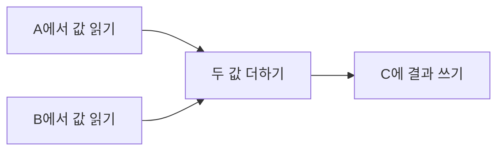
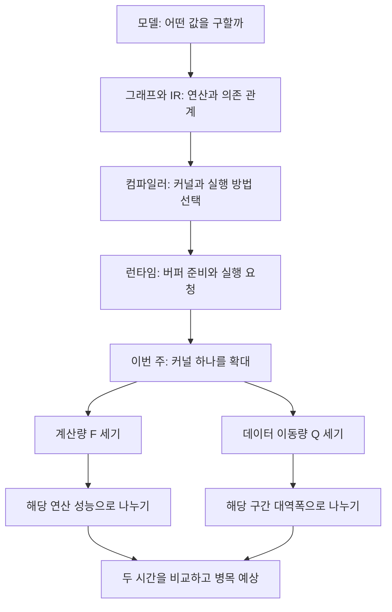
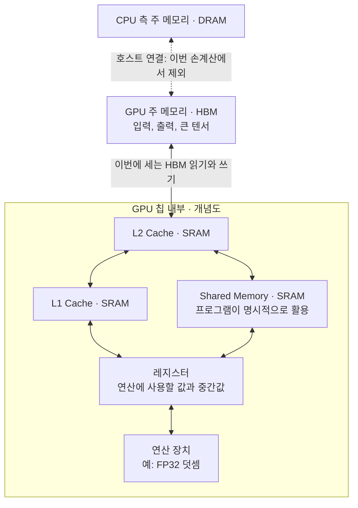
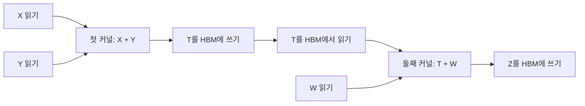
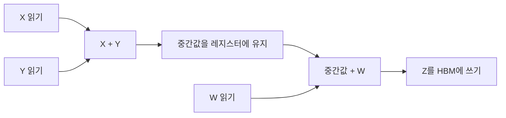
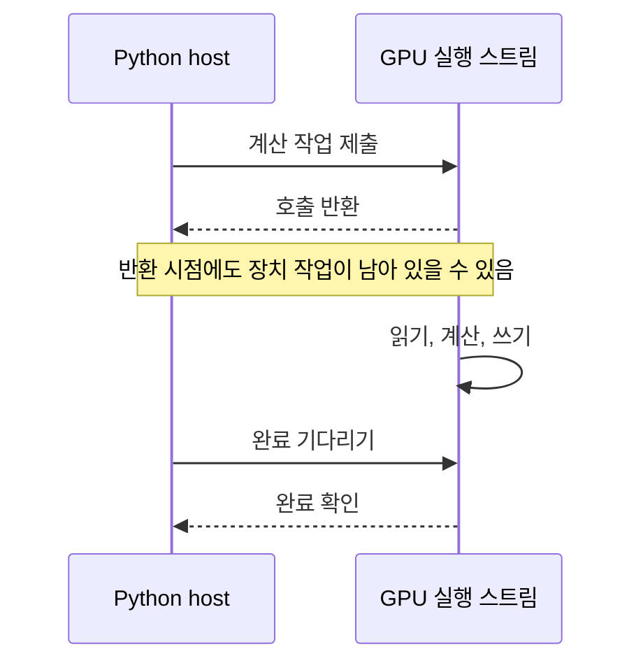
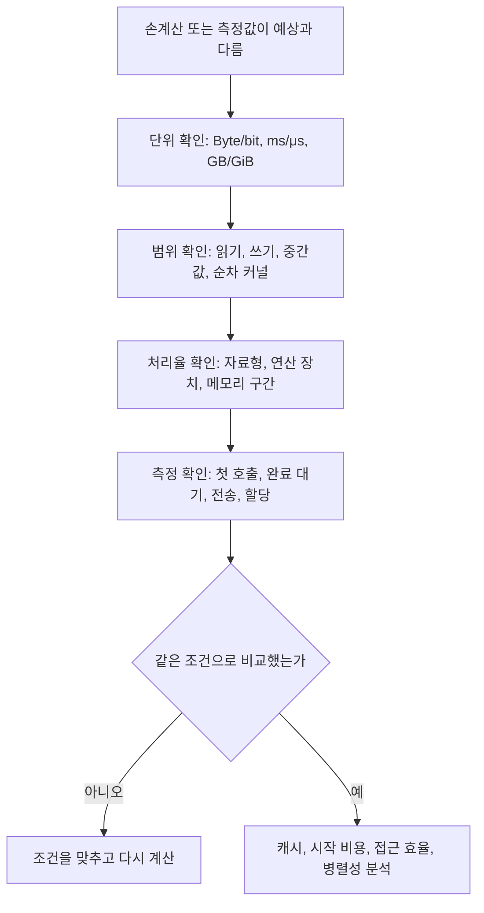
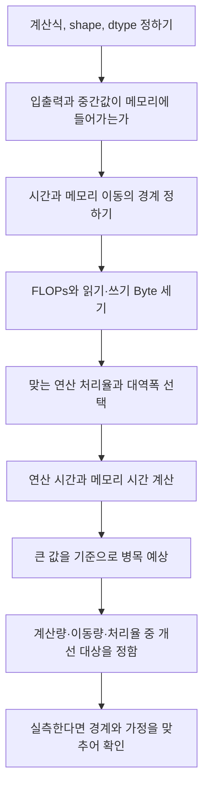

## Vector Add로 이해하는 커널 실행시간 — 연산, 데이터 이동, 메모리 병목

> **핵심 질문**  
> 같은 연산인데 왜 어떤 커널은 빠르고 어떤 커널은 느릴까? 계산하는 시간과 데이터를 옮기는 시간을 어떻게 구분할 수 있을까?

---

## 목차

1. [이번 주에 알아야 할 큰 그림](#1-이번-주에-알아야-할-큰-그림)
2. [공통 예제의 수학과 텐서](#2-공통-예제의-수학과-텐서)
3. [FLOPs와 FLOPs/s — 계산의 양과 속도](#3-flops와-flopss--계산의-양과-속도)
4. [메모리 용량과 대역폭 — 저장과 이동](#4-메모리-용량과-대역폭--저장과-이동)
5. [HBM에서 연산 장치까지 — 메모리 계층](#5-hbm에서-연산-장치까지--메모리-계층)
6. [두 시간을 계산하는 공통 모델](#6-두-시간을-계산하는-공통-모델)
7. [계산 예제 1 — Vector Add의 시간](#7-계산-예제-1--vector-add의-시간)
8. [계산 예제 2 — 커널을 합치면 무엇이 달라질까](#8-계산-예제-2--커널을-합치면-무엇이-달라질까)
9. [병목을 해석하고 개선 방향 고르기](#9-병목을-해석하고-개선-방향-고르기)
10. [코드에서 읽기와 계산과 쓰기 찾기](#10-코드에서-읽기와-계산과-쓰기-찾기)
11. [Python으로 손계산 확인하기](#11-python으로-손계산-확인하기)
12. [선택 실습 — 실제 시간을 관찰하는 방법](#12-선택-실습--실제-시간을-관찰하는-방법)
13. [자주 생기는 오해와 문제 찾기](#13-자주-생기는-오해와-문제-찾기)
14. [연습문제 3개](#14-연습문제-3개)
15. [해답과 해설](#15-해답과-해설)
16. [스터디 발표와 용어 정리](#16-스터디-발표와-용어-정리)
17. [공식 자료와 추가 읽기](#17-공식-자료와-추가-읽기)

---

## 1. 이번 주에 알아야 할 큰 그림

### 1.1 한 문장으로 정리

**커널의 실행시간은 계산량만으로 정해지지 않는다. 계산에 필요한 데이터를 얼마나 읽고 쓰는지도 함께 봐야 한다.**

다음 코드는 벡터 두 개를 더한다.

```python
C = A + B
```

수식으로 보면 덧셈이다. 하지만 장치가 결과를 만들려면 입력을 가져와 더한 뒤 출력 위치에 저장해야 한다. 코드가 짧다는 사실은 이 과정에 걸리는 시간을 알려주지 않는다.

| 관점 | 먼저 물어볼 질문 | 이번 주에 세는 것 |
|---|---|---|
| 계산 | 덧셈이나 곱셈을 몇 번 하는가? | 총 부동소수점 연산량 |
| 데이터 이동 | 어떤 데이터를 몇 번 읽고 쓰는가? | 정한 메모리 구간을 지나는 총 바이트 |
| 하드웨어 | 해당 연산과 이동을 초당 얼마나 처리하는가? | 연산 성능과 메모리 대역폭 |
| 저장 공간 | 입력·출력·중간값이 모두 들어가는가? | 필요한 용량과 사용 가능한 용량 |
| 시간 해석 | 어떤 자원이 완료 시간을 더 크게 제한하는가? | 연산 시간과 메모리 시간의 비교 |



이 그림은 한 원소의 데이터 의존 관계다. 전체 GPU가 모든 읽기를 마친 뒤 모든 덧셈을 시작한다는 뜻은 아니다. 여러 원소와 여러 실행 단위의 작업은 겹칠 수 있다.

### 1.2 지난주와 이번 주의 연결

지난주에는 누가 어떤 일을 담당하는지 살펴봤다. 이번에는 그 실행 계획이 실제로 얼마나 많은 일을 요구하는지 본다.



예를 들어 컴파일러가 두 연산을 합치면 계산식은 같아도 중간 텐서의 메모리 왕복이 사라질 수 있다. 지난주의 fusion을 이번 주에는 바이트 수와 시간으로 설명해보는 것이다.

### 1.3 이번 주의 범위

이번 주에는 입력이 이미 한 가속기의 주 메모리에 있는 상황을 다룬다. CPU에서 입력을 복사하는 시간, 여러 GPU 사이의 통신, 컴파일 시간은 손계산에 포함하지 않는다.

| 이번 주에 설명할 것 | 4주차에 이어갈 것 |
|---|---|
| FLOPs와 FLOPs/s | 산술 강도로 연산과 이동의 관계 표현하기 |
| 용량, 이동량, 대역폭 | Roofline 그래프로 성능 한계 읽기 |
| HBM·캐시·Shared Memory·레지스터의 역할 | Tiling으로 데이터 재사용 늘리기 |
| 두 시간의 비교와 병목 예상 | 계산 순서와 데이터 배치를 바꾸는 방법 |

Roofline 그래프를 그리거나 타일 크기를 최적화하지 않아도 이번 주 내용을 충분히 공부할 수 있다.

### 1.4 이번 주의 성공 기준

1. 계산량과 계산 처리율의 단위를 구분할 수 있는가?
2. 메모리 용량과 메모리 대역폭의 차이를 설명할 수 있는가?
3. Vector Add에서 입력 읽기뿐 아니라 출력 쓰기도 셀 수 있는가?
4. 두 시간을 계산하고 어느 쪽이 더 큰지 비교할 수 있는가?
5. 계산 결과가 실제 측정값이 아닌 이유를 설명할 수 있는가?
6. 연산 성능·대역폭·용량 중 무엇을 바꾸면 도움이 될지 근거를 댈 수 있는가?

---

## 2. 공통 예제의 수학과 텐서

### 2.1 기호와 shape

공통 예제는 길이가 같은 두 벡터의 원소별 덧셈이다.

$$
C_i = A_i + B_i, \qquad 0 \le i < N
$$

| 기호 | shape | dtype | 역할 |
|---|---|---|---|
| `A` | `[N]` | FP32 | 첫 번째 입력 |
| `B` | `[N]` | FP32 | 두 번째 입력 |
| `C` | `[N]` | FP32 | 별도 공간에 저장하는 출력 |
| `N` | 스칼라 | 정수 | 각 벡터의 길이 |

FP32 원소 하나는 **32 bit = 4 Byte**다. 벡터의 길이와 원소의 크기를 곱하면 배열 하나의 바이트 수가 나온다.

$$
\text{배열 하나의 크기} = N \times 4\ \mathrm{Byte}
$$

이 교안에서 텐서 이름 `B`와 수식의 대역폭 기호 `B`가 함께 등장한다. 코드의 `B[i]`는 입력 벡터이고 `Q/B`의 `B`는 대역폭이다. 계산표에는 혼동을 줄이기 위해 단위와 설명을 함께 쓴다.

### 2.2 손으로 확인할 수 있는 작은 예

```text
A = [1,  2, -3, 4]
B = [5, -2,  1, 0]

C = [6,  0, -2, 4]
```

첫 번째 결과를 만들려면 `1`과 `5`를 읽어 한 번 더한 뒤 `6`을 저장한다. 나머지 원소에서도 같은 일을 한다.

| 항목 | 원소 하나 | 원소 4개 |
|---|---:|---:|
| A 읽기 | 4 Byte | 16 Byte |
| B 읽기 | 4 Byte | 16 Byte |
| C 쓰기 | 4 Byte | 16 Byte |
| 덧셈 | 1회 | 4회 |
| 읽기·쓰기 합계 | 12 Byte | 48 Byte |

이 표는 각 입력을 한 번 읽고 출력을 한 번 쓰는 데이터 집계다. 실제 HBM에서도 정확히 이만큼 이동한다고 말하려면 캐시와 접근 방식에 대한 가정이 추가로 필요하다.

### 2.3 순서대로 쓴 코드와 병렬 실행을 구분하자

계산의 의미를 가장 단순하게 써보자.

```text
for i = 0, 1, ..., N-1:
    a = A[i]
    b = B[i]
    C[i] = a + b
```

이것은 GPU의 실제 실행 순서를 지정한 코드가 아니다. `C[0]`과 `C[1]`은 서로의 결과를 필요로 하지 않으므로 서로 다른 실행 단위가 병렬로 계산할 수 있다.

덧셈이 N번이라는 사실과, N번을 하나씩 순차 실행한다는 주장은 다르다. 병렬성은 같은 계산량을 얼마나 빨리 처리할 수 있는지에 영향을 준다. (병렬을 한다고 해도 덧셈 자체는 진행함)

| 실행 방식 | 처리 방법                                           | 총 덧셈 횟수 |
| --------- | --------------------------------------------------- | ------------ |
| 순차 실행 | 첫 번째 계산이 끝나면 두 번째 계산을 진행           | 4번          |
| 병렬 실행 | 서로 다른 GPU 스레드가 각 위치의 계산을 동시에 진행 | 4번          |

### 2.4 원소 수를 늘리면 무엇이 늘어날까?

이번 Vector Add는 N이 두 배가 되면 다음 두 양이 함께 두 배가 된다.

$$
F = N\ \mathrm{FLOPs}, \qquad Q = 12N\ \mathrm{Byte}
$$

그러나 실제 시간이 언제나 정확히 두 배가 된다고 단정할 수는 없다. 작은 입력과 큰 입력은 시작 비용의 비중, 병렬성, 캐시 활용이 다를 수 있다. 우선 이 식으로 계산과 이동의 양을 구한 뒤, 어떤 실행 조건인지 확인한다.

---

## 3. FLOPs와 FLOPs/s — 계산의 양과 속도

### 3.1 해야 할 일과 처리 속도

**FLOPs는 해야 할 계산의 양이고 FLOPs/s는 초당 계산 처리율이다.**

| 표기 | 뜻 | 예 |
|---|---|---|
| FLOP | 부동소수점 연산 1회 | 덧셈 한 번 |
| FLOPs | 총 부동소수점 연산 횟수 | `10⁸ FLOPs` |
| FLOPs/s | 초당 부동소수점 연산 처리율 | `20 × 10¹² FLOPs/s` |

자료마다 FLOPS, FLOP/s, TFLOPS 등을 다르게 표기하기도 한다. 이 교안은 연산 횟수는 FLOPs, 초당 처리율은 FLOPs/s로 구분한다.

예를 들어 `10⁸ FLOPs`를 처리해야 하고 해당 계산을 초당 `20 × 10¹² FLOPs` 처리할 수 있다고 가정해보자.

$$
T_{\mathrm{compute}}
= \frac{10^8}{20 \times 10^{12}}
= 5 \times 10^{-6}\ \mathrm{s}
= 5\ \mu\mathrm{s}
$$

단위를 함께 적으면 왜 시간이 되는지 확인할 수 있다.

$$
\frac{\mathrm{FLOPs}}{\mathrm{FLOPs}/\mathrm{s}} = \mathrm{s}
$$

### 3.2 무엇을 1 FLOP로 셀까?

이번 수업의 덧셈과 곱셈은 다음 기준으로 센다.

| 수식 | 원소 하나의 계산 | FLOPs |
|---|---|---:|
| `x + y` | 덧셈 1회 (GPU에서 일반 산술 장치) | 1 |
| `x * y` | 곱셈 1회 (GPU에서 Tensor Core) | 1 |
| `a * x + y` | 곱셈 1회와 덧셈 1회 | 2 |
| `(x + y) + w` | 덧셈 2회 | 2 |

FMA는 곱셈과 덧셈을 결합한 명령이다. 기계 명령 하나로 실행되더라도 성능 집계에서는 통상 **2 FLOPs**로 센다. 연산 종류와 처리율을 연결하는 배경은 [NVIDIA GPU Performance Background](https://docs.nvidia.com/deeplearning/performance/dl-performance-gpu-background/index.html)의 GPU Architecture Fundamentals에서 확인할 수 있다. 

주소 계산, 반복 제어, 메모리 읽기·쓰기는 위 표의 부동소수점 덧셈 FLOPs에 포함하지 않는다. 그렇다고 실행 비용이 없는 것은 아니다. 단순한 FLOPs 집계는 장치의 모든 명령을 세는 방식이 아니다.

### 3.3 하드웨어의 가장 큰 숫자를 가져오면 안 된다

같은 장치에도 여러 종류의 연산 성능이 있을 수 있다.

| 확인할 것 | 왜 필요한가? |
|---|---|
| 자료형 | FP32와 BF16은 같은 처리율을 보장하지 않는다. |
| 연산 종류 | 원소별 덧셈과 행렬곱은 같은 실행 장치를 사용한다고 볼 수 없다. |
| 실행 장치 | 일반 연산 장치와 행렬 연산 가속기의 능력이 다르다. |
| 사양의 조건 | 최대 처리율이 성립하는 조건이 실제 계산과 맞아야 한다. |

**FP32 Vector Add의 시간에 BF16 Tensor Core 행렬곱의 최대 성능을 대입하면 안 된다.** 이 교안에서는 `20 × 10¹² FLOPs/s`의 성능을 해당 FP32 덧셈·곱셈에 적용할 수 있다고 별도로 가정한다. 

연산 장치의 역할은 [MLC: Compute — CUDA Cores and Tensor Cores](https://mlc.ai/modern-gpu-programming-for-mlsys/chapter_background/index.html#compute-cuda-cores-and-tensor-cores)를 참고한다.

### 3.4 이 단계의 핵심 용어 3개

- **연산량:** 결과를 만들기 위해 수행하는 부동소수점 계산의 총량.
- **연산 처리율:** 단위 시간에 처리할 수 있는 연산량.
- **FMA:** 곱셈과 덧셈을 결합한 연산. FLOPs 집계에서는 보통 2회로 센다.

확인 질문: 덧셈 횟수는 그대로인데 실행시간이 줄었다면, 어떤 것이 바뀌었을까?

---

## 4. 메모리 용량과 대역폭 — 저장과 이동

### 4.1 16 GB와 1 TB/s는 다른 질문에 답한다

메모리 용량은 얼마나 담을 수 있는지, 대역폭은 초당 얼마나 옮길 수 있는지를 나타낸다. 여기에 작업 하나가 실제로 옮기는 양을 따로 두어야 한다.

| 구분 | 질문 | 단위 | 예 |
|---|---|---|---|
| 용량 | 동시에 얼마나 저장할 수 있는가? | Byte | 16 GB |
| 이동량 | 이번 실행에서 얼마나 읽고 쓰는가? | Byte | 1.2 GB |
| 대역폭 | 정한 구간을 초당 얼마나 옮길 수 있는가? | Byte/s | 1 TB/s |

용량이 충분하다고 실행도 빠른 것은 아니다. 배열이 들어가더라도, 값을 연산 장치 쪽으로 가져오고 결과를 저장하는 데 시간이 필요하다.

### 4.2 메모리 시간도 양을 속도로 나눈다

$$
T_{\mathrm{memory}}
= \frac{\text{읽고 쓴 총 Byte}}{\text{해당 구간의 Byte/s}}
$$

예를 들어 HBM 읽기와 쓰기의 합이 `1.2 × 10⁹ Byte`이고 이 트래픽에 적용할 HBM 대역폭이 `10¹² Byte/s`라면, 메모리 시간은 아래 식으로 구한다.

$$
T_{\mathrm{memory}}
= \frac{1.2 \times 10^9}{10^{12}}
= 1.2 \times 10^{-3}\ \mathrm{s}
= 1.2\ \mathrm{ms}
$$

읽기와 쓰기를 합산하는 집계 방식은 [CUDA Best Practices의 Effective Bandwidth Calculation](https://docs.nvidia.com/cuda/cuda-c-best-practices-guide/index.html#effective-bandwidth-calculation)과 연결된다.

### 4.3 저장 공간과 이동량이 우연히 같은 경우

FP32 배열 A·B·C가 각각 N개 원소를 가진다면 세 배열의 저장 공간은 `12N Byte`다. 입력 두 개를 한 번씩 읽고 출력 하나를 한 번 쓰는 Vector Add의 이동량도 `12N Byte`다.

두 값이 같다고 같은 개념인 것은 아니다.

| 상황 | 배열 저장 공간 | HBM 이동량에 대한 가정 |
|---|---:|---:|
| 세 배열로 Vector Add 1회 | `12N Byte` | `12N Byte` |
| 같은 세 배열로 2회, 매번 HBM 접근 | `12N Byte` | `24N Byte` |
| 같은 세 배열로 2회, 일부 캐시 재사용 | `12N Byte` | 캐시에서 처리된 양에 따라 달라짐 |

두 번째 실행이 같은 출력 공간을 덮어쓴다면 저장 공간은 늘지 않는다. 하지만 같은 값을 다시 HBM에서 읽고 썼다면 이동량은 늘어난다.

### 4.4 단위를 먼저 통일하자

이 교안은 십진 단위를 사용한다.

| 단위 | 값 |
|---|---:|
| 1 Byte | 8 bit |
| 1 MB | `10⁶ Byte` |
| 1 GB | `10⁹ Byte` |
| 1 TB | `10¹² Byte` |
| 1 GiB | `2³⁰ Byte` |
| 1 ms | `10⁻³초` |
| 1 μs | `10⁻⁶초` |

`400 MB`와 `400 MiB`는 같은 크기가 아니다. `5 μs`와 `0.005 ms`는 같은 시간이다. 계산 중 단위를 생략하면 메모리 시간과 연산 시간을 1,000배 틀리게 비교할 수 있다.

### 4.5 대역폭과 지연시간도 다르다

대역폭은 많은 데이터를 계속 이동시킬 때의 처리율이다. 지연시간은 요청한 데이터가 도착하거나 작업이 완료되기까지의 기다림과 관련된다.

작업이 아주 작으면 장치가 충분한 동시 작업을 확보하지 못할 수 있다. 이때는 최대 대역폭을 대입한 `Q/B`만으로 실행시간을 잘 설명하기 어렵다. [NVIDIA Understanding Performance](https://docs.nvidia.com/deeplearning/performance/dl-performance-gpu-background/index.html)는 연산 처리율·메모리 대역폭·지연시간을 구분한다.

### 4.6 이 단계의 핵심 용어 3개

- **메모리 용량:** 동시에 저장할 수 있는 데이터의 양.
- **메모리 이동량:** 특정 실행과 특정 구간에서 읽고 쓴 데이터의 합.
- **메모리 대역폭:** 그 구간을 단위 시간에 이동할 수 있는 데이터의 양.

확인 질문: 메모리 용량이 두 배가 되면, 이미 들어가던 벡터의 덧셈도 두 배 빨라질까?

---

## 5. HBM에서 연산 장치까지 — 메모리 계층

### 5.1 HBM, DRAM, SRAM의 관계

**HBM은 DRAM의 한 종류다.** 서로 독립적인 세 층을 뜻하는 이름이 아니다. HBM은 DRAM 다이를 적층하고 넓은 인터페이스를 활용하는 메모리 구조다. [Micron의 HBM FAQ](https://www.micron.com/products/memory/hbm)에서 이 관계를 확인할 수 있다.

대표적인 GPU의 큰 텐서는 장치 주 메모리에 놓이고 칩 내부에는 캐시·Shared Memory·레지스터 같은 작은 저장 공간이 있다. 캐시와 Shared Memory에는 SRAM이 사용된다. 온칩 저장 공간은 용량과 면적 등의 제약 때문에 모든 텐서를 담는 대형 주 메모리를 그대로 대신하지 않는다.

| 이름 | 이번 주에 필요한 이해 | 혼동하지 말 것 |
|---|---|---|
| DRAM | 큰 저장 공간에 널리 쓰는 메모리 기술 | CPU 메모리만을 뜻하지 않는다. |
| HBM | 가속기 주 메모리에 쓰이는 DRAM의 한 종류 | 연산 장치나 캐시의 이름이 아니다. |
| SRAM | 온칩 캐시·Shared Memory 등에 쓰는 메모리 기술 | 프로그램의 특정 변수 이름이 아니다. |
| 레지스터 | 연산할 값과 중간값을 가까이 보관하는 저장 공간 | HBM 전체를 대체할 만큼 크지 않다. |

### 5.2 대표적인 GPU의 개념도

아래는 HBM을 사용하는 NVIDIA GPU의 개념도다. 실제 배선이나 모든 접근 경로를 재현한 그림은 아니다.



모든 커널이 모든 저장 공간을 순서대로 거치는 것은 아니다. Vector Add는 Shared Memory를 명시적으로 사용하지 않고도 구현할 수 있다. 실제 캐시 경로와 우회 여부는 장치와 명령에 따라 달라진다.

메모리 공간별 위치와 역할은 [CUDA Device Memory Spaces](https://docs.nvidia.com/cuda/cuda-c-best-practices-guide/index.html#device-memory-spaces), 계층 전체의 그림은 [Scaling Book의 GPU Memory](https://jax-ml.github.io/scaling-book/gpus/#memory)를 함께 참고한다.

### 5.3 캐시와 Shared Memory의 역할은 어떻게 다를까?

| 공간 | 기본 역할 | 이번 예제에서 주의할 점 |
|---|---|---|
| HBM | 큰 입력·출력과 중간 텐서 보관 | 계산할 때마다 모든 요청이 HBM에 도달한다고 단정하지 않는다. |
| L2·L1 캐시 | 접근한 데이터의 일부를 보관해 접근 비용 줄이기 | 캐시 적중은 HBM 이동량을 바꿀 수 있다. |
| Shared Memory | 협력하는 실행 단위가 사용할 데이터를 명시적으로 보관 | 사용 자체가 성능 향상을 보장하지 않는다. |
| 레지스터 | 현재 계산에 필요한 값과 중간값 보관 | 자원이 제한되어 있으므로 무제한 보관할 수 없다. |

이 표는 역할을 구분하기 위한 것이다. 일부 GPU에서 L1과 Shared Memory가 물리 자원을 공유하더라도 프로그래밍 관점의 쓰임은 다르다. [MLC Memory Spaces](https://mlc.ai/modern-gpu-programming-for-mlsys/chapter_background/index.html#memory-spaces)의 비교 표를 참고한다.

### 5.4 우리가 세는 메모리 구간을 표시하자

이번 손계산에서 `Q`는 HBM에서 읽고 HBM에 쓴 바이트의 합이다. 분모도 HBM 대역폭이어야 한다.

```text
HBM 이동량        ÷ HBM 대역폭        → 이번 계산
CPU↔GPU 전송량    ÷ 해당 연결 대역폭   → 별도의 전송 계산
온칩 메모리 이동량 ÷ 해당 온칩 대역폭   → 별도의 계층 계산
```

양을 센 경계와 속도를 정의한 경계가 일치해야 한다. 같은 데이터가 여러 계층을 거쳐도 각 계층의 이동량을 전부 더해 HBM 대역폭으로 나누지 않는다.

### 5.5 TPU에서는 무엇이 대응할까? — 선택 읽기

TPU를 함께 살펴본다면 큰 그림에서 HBM, 온칩 VMEM, 연산 장치의 역할을 구분하면 된다.


이 역시 세부 경로를 생략한 개념도다. **VMEM을 GPU의 L2 캐시와 같은 관리 방식으로 보면 안 된다.** Google Cloud TPU7x 문서는 VMEM을 소프트웨어가 제어하는 SRAM 기반 scratchpad로 설명한다. 이 역할을 비교하되 TPU7x의 용량을 모든 TPU 세대의 공통 수치로 쓰지는 않는다. [Google Cloud TPU7x — Memory hierarchy](https://docs.cloud.google.com/tpu/docs/tpu7x)

확인 질문: 같은 입력을 다시 사용한다면, 어느 저장 공간에 남아 있느냐가 왜 중요할까?

---

## 6. 두 시간을 계산하는 공통 모델

### 6.1 네 가지 기호

| 기호 | 뜻 | 단위 |
|---|---|---|
| `F` | 총 부동소수점 연산량 | FLOPs |
| `Q` | HBM에서 읽고 쓴 총 데이터 크기 | Byte |
| `P` | 해당 자료형·연산에 적용 가능한 연산 처리율 | FLOPs/s |
| `B` | 해당 HBM 트래픽에 적용할 대역폭 | Byte/s |

$$
T_{\mathrm{compute}} = \frac{F}{P}
$$

$$
T_{\mathrm{memory}} = \frac{Q}{B}
$$

$$
T_{\mathrm{ideal}} = \max\left(T_{\mathrm{compute}}, T_{\mathrm{memory}}\right)
$$

이 모델의 기본 설명은 [Scaling Book의 Where Does the Time Go?](https://jax-ml.github.io/scaling-book/roofline/#where-does-the-time-go)에 있다. 이번 수업은 그중 한 장치의 메모리 이동에 집중한다.

### 6.2 왜 두 시간을 더하지 않고 큰 쪽을 볼까?

한 원소는 입력을 읽은 뒤 계산해야 한다. 그러나 전체 작업에서는 어떤 원소를 계산하는 동안 다른 원소의 데이터를 옮길 수 있다. 충분한 작업과 적절한 실행 방식이 있다면 계산과 이동을 겹칠 수 있다.

```text
겹치지 않는 두 단계의 단순 모형:
메모리 이동  [==========]
연산                    [====]
총시간      두 구간의 합

충분히 겹치는 처리율 모형:
메모리 이동  [==========]
연산        [====]
총시간      더 긴 구간의 길이
```

위 그림은 처리율 모형을 설명하기 위한 것이다. 이 타임라인은 실제 실행의 첫 입력 도착, 마지막 출력 완료, 부분적인 중첩까지 정확히 표현하지는 않는다.

두 자원에서 각각 최소한 `F/P`와 `Q/B`만큼의 시간이 필요하므로 전체 작업은 둘 중 큰 값보다 빨리 끝나기 어렵다. `max`는 충분히 겹칠 때 접근하려는 이상적 기준이다. 실제로 얼마나 겹치는지는 측정과 분석으로 확인한다.

### 6.3 공통 가상 하드웨어

| 항목 | 이번 교안의 가정 |
|---|---|
| FP32 연산 성능 | `P = 20 × 10¹² FLOPs/s` |
| HBM 대역폭 | `B = 1 × 10¹² Byte/s = 1 TB/s` |
| 메모리 용량 | 입력·출력·필요한 중간값을 모두 담기에 충분 |
| 입력 위치 | 실행 전에 이미 HBM에 있음 |
| 출력 위치 | 실행 후 장치에 남김 |
| HBM 트래픽 | 각 예제에 적은 읽기와 쓰기만 발생 |
| 캐시 | 손계산에서는 HBM 트래픽을 줄이는 캐시 재사용 없음 |
| 시간 제외 항목 | 컴파일, CPU↔장치 복사, 메모리 할당, 커널 시작 비용 |

이 조건은 제품을 흉내 낸 사양표가 아니라 계산을 위한 약속이다. 실제 장치가 이 표와 같은 성능을 낸다는 뜻이 아니다.

### 6.4 이상적 하한과 실제 실행시간

최대 처리율을 대입한 계산은 가정한 F와 Q에 대한 이상적 하한 추정이다. 실제 실행에서는 다음 요인이 영향을 준다.

- 연산 장치와 메모리 대역폭을 충분히 활용하지 못할 수 있다.
- 작업 시작, 명령 실행, 동기화에 비용이 든다.
- 실제 읽기·쓰기량이 가정한 Q와 다를 수 있다.
- 데이터 접근의 의존 관계 때문에 충분히 겹치지 못할 수 있다.

`T_actual = max(F/P, Q/B)`라고 등식으로 단정하지 않는다. 반대로 `F/P + Q/B`도 모든 실제 실행시간의 상한은 아니다. 그 합은 두 작업만 직렬로 수행하는 단순 모형의 값이며 다른 비용은 여전히 남을 수 있다.

### 6.5 여러 커널을 순서대로 실행한다면

순차 실행하는 커널은 **각 커널의 시간을 먼저 구한 뒤 합한다.**

$$
T_{\mathrm{sequence,ideal}}
= \sum_k \max\left(\frac{F_k}{P_k},\frac{Q_k}{B_k}\right)
$$

앞 커널이 계산 위주이고 뒤 커널이 메모리 이동 위주인 경우를 생각해보자. 두 커널의 전체 연산량과 이동량을 먼저 더해 한 번만 `max`를 취하면 실행시간을 지나치게 작게 추정할 수 있다. 순차 실행인데도 서로 겹친 것처럼 계산하기 때문이다.

### 6.6 이 단계의 핵심 용어 3개

- **연산 시간:** 정한 연산량을 정한 처리율로 수행하는 데 필요한 시간.
- **메모리 시간:** 정한 구간의 이동량을 정한 대역폭으로 처리하는 데 필요한 시간.
- **이상적 하한 추정:** 명시한 작업량과 최대 처리율을 바탕으로 구한 최소 시간의 기준.

확인 질문: 손계산보다 측정값이 짧다면, 수식이 틀린 것일까, 가정이 다른 것일까?

---

## 7. 계산 예제 1 — Vector Add의 시간

### 7.1 먼저 조건을 적자

```text
계산: C[i] = A[i] + B[i]
원소 수: N = 100,000,000 = 10⁸
자료형: FP32 = 원소당 4 Byte
출력: 입력과 별도로 준비한 C에 저장
접근: A와 B를 HBM에서 각각 한 번 읽고 C를 한 번 씀
연산 성능: P = 20 × 10¹² FLOPs/s
HBM 대역폭: B = 1 × 10¹² Byte/s
```

배열을 담을 용량은 충분하며 계산과 이동이 충분히 겹친다고 가정한다.

### 7.2 첫 번째 질문 — 몇 번 더하는가?

출력 원소가 N개이고 각 원소마다 덧셈을 한 번 한다.

$$
F = N = 10^8\ \mathrm{FLOPs}
$$

출력 배열을 새로 만든다고 덧셈이 한 번 더 필요하지는 않는다. 출력 저장은 다음 단계에서 바이트로 센다.

### 7.3 두 번째 질문 — 얼마나 읽고 쓰는가?

| 작업 | 계산 | 데이터 크기 |
|---|---|---:|
| A 읽기 | `N × 4` | 400 MB |
| B 읽기 | `N × 4` | 400 MB |
| C 쓰기 | `N × 4` | 400 MB |
| 읽기 합계 | `2N × 4` | 800 MB |
| 쓰기 합계 | `N × 4` | 400 MB |
| 총 이동량 Q | `3N × 4` | **1,200 MB = 1.2 GB** |

$$
Q = 4N + 4N + 4N = 12N = 1.2 \times 10^9\ \mathrm{Byte}
$$

자주 나오는 오답은 `Q = 0.8 GB`다. 입력만 읽고 출력 쓰기를 빠뜨린 값이다. 결과가 장치에 남아 있어도 C에 저장하는 작업은 필요하다.

### 7.4 세 번째 질문 — 연산에는 얼마나 걸리는가?

$$
T_{\mathrm{compute}}
= \frac{10^8}{20 \times 10^{12}}
= 5 \times 10^{-6}\ \mathrm{s}
= 5\ \mu\mathrm{s}
= 0.005\ \mathrm{ms}
$$

이 값은 데이터가 이미 충분히 공급된다고 보고 구한 연산 시간이다. 전체 Vector Add의 실행시간이라고 바로 쓰면 안 된다.

### 7.5 네 번째 질문 — 메모리 이동에는 얼마나 걸리는가?

$$
T_{\mathrm{memory}}
= \frac{1.2 \times 10^9}{10^{12}}
= 1.2 \times 10^{-3}\ \mathrm{s}
= 1.2\ \mathrm{ms}
$$

두 시간의 비율을 계산해보자.

$$
\frac{T_{\mathrm{memory}}}{T_{\mathrm{compute}}}
= \frac{1.2}{0.005}
= 240
$$

여기서는 메모리 시간이 연산 시간의 240배다.

### 7.6 마지막 질문 — 무엇이 시간을 제한하는가?

$$
T_{\mathrm{ideal}} = \max(0.005, 1.2)\ \mathrm{ms} = 1.2\ \mathrm{ms}
$$

| 구분 | 결과 | 해석 |
|---|---:|---|
| 연산 시간 | 0.005 ms | 덧셈 자체에 필요한 이상적 시간 |
| 메모리 시간 | 1.2 ms | 입력·출력을 이동하는 이상적 시간 |
| 이상적 실행시간 | **1.2 ms** | 큰 쪽인 메모리 시간이 기준 |
| 예상 병목 | **Memory-bound** | 이 조건에서는 HBM 대역폭이 시간을 제한 |

**메모리 용량이 부족해서 Memory-bound라고 부르는 것이 아니다.** 배열은 이미 들어간다고 가정했다. 연산 장치에 필요한 입력과 출력을 얼마나 빨리 이동시키느냐가 문제다.

### 7.7 이 결과를 어떻게 설명하면 좋을까?

> FP32 원소 1억 개를 더하려면 덧셈 1억 회와 1.2 GB의 HBM 읽기·쓰기가 필요하다. 가상의 연산 성능과 대역폭을 적용하면 각각 5 μs와 1.2 ms다. 따라서 이 모델의 이상적 시간은 1.2 ms이며 HBM 대역폭이 시간을 제한할 것으로 예상한다.

이 설명에는 계산 조건, 연산량, 이동량, 두 시간, 병목이 모두 들어 있다. Vector Add는 메모리 연산이니까 느리다는 설명보다 무엇을 근거로 판단했는지 분명하다.

---

## 8. 계산 예제 2 — 커널을 합치면 무엇이 달라질까

### 8.1 계산식은 그대로 두고 구현을 바꿔보자

이번에는 세 벡터를 더한다.

$$
Z_i = (X_i + Y_i) + W_i
$$

모든 벡터는 FP32이며 `N = 10⁸`이다. 공통 가상 하드웨어를 그대로 사용한다. 두 구현 모두 괄호 안의 덧셈을 먼저 수행한다.

| 구현 | 실행 방법 | 중간값의 위치에 대한 가정 |
|---|---|---|
| A: 분리 | `T = X + Y` 이후 `Z = T + W` | T를 HBM에 쓰고 다시 읽음 |
| B: 결합 | 한 커널에서 두 덧셈 수행 | 중간값을 레지스터에 유지 |

여기서 결합은 fusion을 뜻한다. 이 비교에서는 덧셈을 없애지 않고 중간값의 이동을 줄인다.

### 8.2 구현 A — 두 커널로 실행



| 커널 | 읽기 | 쓰기 | 총 이동량 | FLOPs |
|---|---:|---:|---:|---:|
| `T = X + Y` | X·Y의 `8N Byte` | T의 `4N Byte` | `12N Byte` | N |
| `Z = T + W` | T·W의 `8N Byte` | Z의 `4N Byte` | `12N Byte` | N |
| 전체 | `16N Byte` | `8N Byte` | **`24N Byte`** | **2N** |

두 커널은 각각 예제 1과 같은 크기의 읽기·쓰기와 덧셈을 한다. 각 커널의 이상적 시간은 1.2 ms다.

$$
T_{A,\mathrm{ideal}}
= \max(0.005, 1.2) + \max(0.005, 1.2)
= 2.4\ \mathrm{ms}
$$

같은 실행 흐름에서 첫 커널 이후 둘째 커널이 순차 실행한다고 가정했으므로, 각 커널 시간을 더했다.

### 8.3 구현 B — 한 커널로 합쳐 실행



입력 세 개를 각각 읽고 출력 하나를 쓴다.

$$
Q_B = 4N + 4N + 4N + 4N = 16N = 1.6\ \mathrm{GB}
$$

덧셈은 여전히 두 번씩 한다.

$$
F_B = 2N = 2 \times 10^8\ \mathrm{FLOPs}
$$

두 시간을 계산해보자.

$$
T_{B,\mathrm{compute}} = \frac{2 \times 10^8}{20 \times 10^{12}}
= 10\ \mu\mathrm{s} = 0.010\ \mathrm{ms}
$$

$$
T_{B,\mathrm{memory}} = \frac{1.6 \times 10^9}{10^{12}}
= 1.6\ \mathrm{ms}
$$

$$
T_{B,\mathrm{ideal}} = \max(0.010, 1.6) = 1.6\ \mathrm{ms}
$$

### 8.4 두 구현의 비교

| 항목 | A: 두 커널 | B: 한 커널 |
|---|---:|---:|
| 총 FLOPs | `2 × 10⁸` | `2 × 10⁸` |
| HBM 읽기 | 1.6 GB | 1.2 GB |
| HBM 쓰기 | 0.8 GB | 0.4 GB |
| 총 HBM 이동량 | 2.4 GB | 1.6 GB |
| 연산 시간의 합 | 10 μs | 10 μs |
| 메모리 시간의 합 | 2.4 ms | 1.6 ms |
| 이상적 실행시간 | **2.4 ms** | **1.6 ms** |

T의 쓰기와 다시 읽기가 줄었다.

$$
\Delta Q = 4N + 4N = 8N = 0.8\ \mathrm{GB}
$$

시간 감소율과 속도 향상 배수는 다른 수치다.

$$
\text{시간 감소율} = \frac{2.4 - 1.6}{2.4} = \frac{1}{3} \approx 33.3\%
$$

$$
\text{속도 향상 배수} = \frac{2.4}{1.6} = 1.5
$$

이 가정에서 시간은 약 33.3% 줄고 속도는 1.5배가 된다. 시간이 50% 줄었다는 설명은 맞지 않는다.

### 8.5 이동량을 필요한 메모리 용량으로 쓰면 안 된다

A의 `2.4 GB`는 누적 이동량이다. 필요한 배열 저장 공간을 뜻하지 않는다.

만약 X·Y·W·T·Z 다섯 배열을 각각 따로 할당해 모두 유지한다면 배열 공간은 `5 × 4N = 2.0 GB`다. 중간 버퍼를 재사용하거나 일찍 해제하면 동시에 필요한 용량이 달라질 수 있다. 반면 같은 버퍼를 다시 읽고 쓰는 이동은 계속 집계된다.

### 8.6 이 비교가 성립하는 조건

이 예제의 A에서는 T가 **실제로 HBM까지 쓰이고 다시 읽힌다**고 가정했다. B에서는 중간값을 레지스터에 유지하며 추가 HBM 접근이 없다고 가정했다.

실제 실행에서 T가 캐시에 남거나 컴파일러가 이미 두 연산을 합쳤다면 차이는 달라진다. 결합으로 레지스터 요구량이 커지고 일부 값이 메모리로 밀려나는 경우에도 가정한 이동량을 다시 확인해야 한다.

Python 한 줄로 `(x + y) + w`를 썼다고 한 커널로 결합됐다고 결론 내릴 수 없다. 실제 커널 경계는 사용한 실행 경로와 컴파일 결과에서 확인한다.

> 같은 계산식과 같은 FLOPs만으로 성능을 설명할 수 없다. **중간 결과를 어디에 두고 어떤 경계를 몇 번 넘기는지**까지 봐야 한다.

---

## 9. 병목을 해석하고 개선 방향 고르기

### 9.1 Compute-bound와 Memory-bound

| 두 시간의 관계 | 이 모델에 따른 해석 | 먼저 살펴볼 것 |
|---|---|---|
| `T_compute > T_memory` | Compute-bound | 연산량과 적용 가능한 연산 처리율 |
| `T_memory > T_compute` | Memory-bound | 이동량과 해당 구간의 대역폭 |
| 두 시간이 비슷함 | 어느 한쪽만 줄여 얻는 효과가 제한될 수 있음 | 두 자원과 실제 실행 조건 |

이 교안의 Memory-bound는 **메모리 대역폭이 제한 요인이라는 의미**다. 실제 분석에서는 지연시간이나 병렬성 부족도 별도로 살펴야 하므로, 모든 느린 커널을 이 둘 중 하나로 억지로 분류하지 않는다.

Scaling Book이 쓰는 Communication-bound는 장치 간 통신까지 포함할 수 있는 더 넓은 문맥의 표현이다. 이번 수업에서 다루는 통신은 HBM과 칩 사이의 데이터 이동이다.

### 9.2 더 작은 항만 줄이면 무엇이 일어날까?

Vector Add에서 연산 성능 P만 두 배로 바꿔보자.

```text
연산 시간: 0.005 ms → 0.0025 ms
메모리 시간: 1.2 ms → 1.2 ms
큰 값: 1.2 ms → 1.2 ms
```

연산은 더 빨리 할 수 있지만 이 이상적 모델의 전체 시간은 그대로다. 반대로 HBM 대역폭만 두 배가 되면 메모리 시간은 0.6 ms로 줄어든다. 여전히 연산 시간보다 크지만 전체 기준 시간도 줄어든다.

### 9.3 하드웨어를 바꾸는 방법과 일을 줄이는 방법

시간 식을 보면 개선 방향을 두 가지로 나눌 수 있다.

| 바꾸는 대상 | 계산에서 바뀌는 것 | 예 |
|---|---|---|
| 연산 처리율 높이기 | P 증가 | 해당 계산을 더 빨리 처리하는 장치·구현 |
| 연산량 줄이기 | F 감소 | 필요한 결과를 유지하며 불필요한 계산 제거 |
| 메모리 대역폭 높이기 | B 증가 | 같은 구간에서 더 높은 처리율 확보 |
| 메모리 이동량 줄이기 | Q 감소 | 중간 텐서의 왕복 제거 |

예제 2는 같은 하드웨어에서 Q를 줄였다. 최적화는 더 빠른 하드웨어를 선택하는 일뿐 아니라, 그 하드웨어에 요구하는 일을 줄이는 일이기도 하다.

이때 이미 정해진 최대 처리율을 바꾸는 것과, 비효율적인 구현을 개선해 그 처리율에 더 가까워지는 것은 구분해야 한다.

### 9.4 데이터가 적으면 항상 빠를까?

입력이 매우 작으면 `F/P`와 `Q/B`가 모두 짧아진다. 하지만 커널을 요청하고 실행하는 비용까지 같은 비율로 줄어드는 것은 아니다. 충분한 작업이 없어 장치의 병렬성을 활용하지 못할 수도 있다.

작은 텐서의 실측 시간이 손계산보다 훨씬 길다는 관찰만으로 대역폭이 나쁘다고 결론 내리지 않는다. 작은 원소별 연산의 특성은 [NVIDIA Memory-Limited Layers의 Activations](https://docs.nvidia.com/deeplearning/performance/dl-performance-memory-limited/index.html#activations)를 참고한다.

### 9.5 커널 이름보다 조건을 보자

다음 두 문장은 설명의 범위가 다르다.

```text
범위가 지나치게 넓은 설명:
“덧셈은 언제나 Memory-bound다.”

조건이 드러나는 설명:
“이 크기의 FP32 Vector Add를, 캐시 재사용 없이,
주어진 연산 성능과 HBM 대역폭으로 처리하면 Memory-bound로 예상된다.”
```

후자의 설명에 따르면 크기·자료형·구현·하드웨어가 바뀌면 다시 계산해야 한다.

---

## 10. 코드에서 읽기와 계산과 쓰기 찾기

### 10.1 코드 읽기의 목적

이번 주 코드 읽기의 목표는 커널 문법을 모두 익히는 것이 아니다. 손으로 센 **입력 두 개 읽기 → 덧셈 → 출력 하나 쓰기**가 코드에서 어디에 나타나는지 찾으면 된다.

[MLC의 GPU Architecture와 첫 Vector Add](https://book.mlc.ai/chapter_gpu_acceleration/part1.html#gpu-architecture)는 큰 반복 계산을 병렬 실행에 연결하는 출발점이다. 스케줄 변환이나 설치까지 공통 과제로 진행할 필요는 없다.

### 10.2 Triton으로 보는 읽기·계산·쓰기

아래 **읽기용 커널 예시**는 공식 튜토리얼의 프로그래밍 모델을 바탕으로 작성했다. 입력은 같은 길이의 연속 FP32 벡터라고 가정한다. 이 블록만으로는 입력 생성이나 커널 실행을 수행하지 않는다.

```python
import triton
import triton.language as tl


@triton.jit
def vector_sum(a_ptr, b_ptr, c_ptr, count, CHUNK: tl.constexpr):
    positions = tl.program_id(0) * CHUNK + tl.arange(0, CHUNK)
    valid = positions < count

    left = tl.load(a_ptr + positions, mask=valid, other=0.0)
    right = tl.load(b_ptr + positions, mask=valid, other=0.0)
    summed = left + right
    tl.store(c_ptr + positions, summed, mask=valid)
```

| 코드 | 하는 일 | 손계산과의 연결 |
|---|---|---|
| `tl.program_id(0)` | 현재 프로그램의 작업 묶음 번호 얻기 | 전체 N개 원소를 나누어 맡음 |
| `tl.arange(0, CHUNK)` | 묶음 안에서 처리할 여러 위치 만들기 | 하나의 원소만 다루는 코드가 아님 |
| `positions < count` | 실제 배열 범위 안인지 확인 | 마지막 묶음의 초과 위치 제외 |
| 첫 번째 `tl.load` | A의 값 읽기 | 전체 유효 원소에 대해 `4N Byte` |
| 두 번째 `tl.load` | B의 값 읽기 | 전체 유효 원소에 대해 `4N Byte` |
| `left + right` | 대응 원소 더하기 | `N FLOPs` |
| `tl.store` | C에 값 쓰기 | 전체 유효 원소에 대해 `4N Byte` |

표에서는 논리적인 접근을 집계했다. 각 `tl.load`가 언제나 HBM까지 가는 것은 아니다. 실제 HBM 이동량에는 캐시가 영향을 줄 수 있다. 프로그래밍 모델과 실행 방법은 [Triton Vector Addition](https://triton-lang.org/main/getting-started/tutorials/01-vector-add.html)을 참고한다.

### 10.3 마지막 묶음에는 왜 mask가 필요할까?

예를 들어 원소가 10개이고 한 프로그램이 4개씩 맡으면 작업 묶음은 세 개다.

```text
프로그램 0: [0, 1, 2, 3]    → 모두 유효
프로그램 1: [4, 5, 6, 7]    → 모두 유효
프로그램 2: [8, 9, 10, 11]  → 8과 9만 유효
```

읽기와 쓰기 양쪽에 mask를 적용해야 배열 밖을 접근하지 않는다. 예시의 `other=0.0`은 읽지 않는 위치에 계산용 값 0을 주며 해당 위치의 결과는 저장하지 않는다. [Triton load](https://triton-lang.org/main/python-api/generated/triton.language.load.html), [Triton store](https://triton-lang.org/main/python-api/generated/triton.language.store.html)

`CHUNK=256`은 프로그램 하나가 맡는 원소 블록 크기를 뜻한다. 이를 CUDA thread 256개와 일대일로 같은 의미라고 해석하지 않는다.

### 10.4 코드에서 바로 알 수 있는 것과 추가로 확인할 것

| 코드로 확인할 수 있는 것 | 실행 환경·컴파일 결과·측정이 필요한 것 |
|---|---|
| 어떤 입력을 읽고 출력을 쓰는가 | 실제 HBM 트랜잭션이 얼마나 발생하는가 |
| 원소마다 어떤 계산을 하는가 | 어떤 명령과 실행 배치로 구현되는가 |
| 배열 끝의 경계 검사가 있는가 | 캐시가 얼마나 활용되는가 |
| 논리적으로 어떤 작업을 묶었는가 | 해당 장치에서 실제로 얼마나 빠른가 |

> 커널 코드는 계산과 접근의 의도를 보여준다. 성능의 최종 증거는 조건을 맞춘 실행과 측정에서 얻는다.

---

## 11. Python으로 손계산 확인하기

### 11.1 GPU 없이 실행하는 계산기

아래 코드는 벡터를 만들거나 GPU를 실행하지 않는다. F·Q·P·B로부터 두 시간을 계산한다. Python 표준 라이브러리만 사용하므로 별도의 수치 계산 패키지가 필요하지 않다.

```python
# 선택 실행: 손계산 검산용. GPU 성능 측정 코드가 아니다.
from math import isclose


def estimate(flops, moved_bytes, compute_rate=20e12, bandwidth=1e12):
    if flops < 0 or moved_bytes < 0:
        raise ValueError("연산량과 이동량은 음수일 수 없습니다.")
    if compute_rate <= 0 or bandwidth <= 0:
        raise ValueError("처리율과 대역폭은 양수여야 합니다.")

    compute_s = flops / compute_rate
    memory_s = moved_bytes / bandwidth
    ideal_s = max(compute_s, memory_s)
    return compute_s, memory_s, ideal_s


def show(label, result):
    compute_s, memory_s, ideal_s = result
    print(
        f"{label}: compute={compute_s * 1e3:.4f} ms, "
        f"memory={memory_s * 1e3:.4f} ms, "
        f"ideal={ideal_s * 1e3:.4f} ms"
    )


n = 100_000_000
vector_add = estimate(n, 12 * n)
fused_add = estimate(2 * n, 16 * n)

# 순차 실행: 각 커널의 max를 먼저 구하고 더한다.
first = estimate(n, 12 * n)
second = estimate(n, 12 * n)
separate_s = first[2] + second[2]

show("Vector Add", vector_add)
print(f"Separate kernels: ideal={separate_s * 1e3:.4f} ms")
show("Fused kernel", fused_add)
print(f"Ideal speedup: {separate_s / fused_add[2]:.2f}x")

assert isclose(vector_add[2], 1.2e-3)
assert isclose(separate_s, 2.4e-3)
assert isclose(fused_add[2], 1.6e-3)
```

### 11.2 계산으로 얻는 출력

```text
Vector Add: compute=0.0050 ms, memory=1.2000 ms, ideal=1.2000 ms
Separate kernels: ideal=2.4000 ms
Fused kernel: compute=0.0100 ms, memory=1.6000 ms, ideal=1.6000 ms
Ideal speedup: 1.50x
```

위 숫자는 7·8절의 수식을 코드로 계산한 결과다. GPU에서 측정한 실행 로그가 아니다.

### 11.3 한 번에 하나의 조건만 바꿔보자

| 바꿀 값 | 관찰할 것 |
|---|---|
| `compute_rate=40e12` | 연산 시간과 전체 기준 시간이 함께 줄어드는가? |
| `bandwidth=2e12` | 메모리 시간과 전체 기준 시간이 어떻게 바뀌는가? |
| `moved_bytes` | 같은 FLOPs에서 이동량만 줄이면 무엇이 달라지는가? |
| `n` | 연산량과 이동량이 함께 늘 때 두 시간의 비율이 바뀌는가? |

이 계산기에는 메모리 용량 인자가 없다. 이미 필요한 배열이 들어간다고 가정했기 때문이다. 용량이 부족한 문제라면 이 계산기로 얻은 시간을 그대로 사용할 수 없다. 실행 방법과 추가 전송부터 다시 정해야 한다.

---

## 12. 선택 실습 — 실제 시간을 관찰하는 방법

### 12.1 먼저 무엇의 시간을 잴지 정하자

이 절은 GPU 실행 환경이 이미 있는 사람을 위한 선택 활동이다. 손계산만 진행해도 이번 주의 학습 목표를 달성할 수 있다.

| 측정 대상 | 포함되는 것 | 답할 수 있는 질문 |
|---|---|---|
| 첫 호출 | 초기화, 경우에 따라 컴파일, 첫 실행 | 처음 결과를 얻기까지 얼마나 걸리는가? |
| CPU 시계와 완료 대기 | host 호출·제출과 장치 완료 대기 | 사용자가 요청한 뒤 얼마나 기다리는가? |
| 장치 이벤트 구간 | 같은 스트림의 두 이벤트 사이 경과 시간 | 정한 장치 구간에 얼마나 걸리는가? |
| 전송 포함 전체 구간 | 입력 전송, 실행, 출력 회수 등 | 응용 프로그램의 작업 전체가 얼마나 걸리는가? |

숫자를 비교하려면 구간부터 같아야 한다. 구간을 정하고 시간을 재는 일은 원인을 찾는 진단과 구분한다. 이 접근은 [MLC: Separate Measurement from Diagnosis / Define the Timing Boundary](https://mlc.ai/modern-gpu-programming-for-mlsys/appendix/benchmarking_gpu_kernels.html)를 참고한다.

### 12.2 함수 반환이 계산 완료는 아니다

GPU 연산은 비동기로 제출될 수 있다. Python에서 호출이 끝나도 장치는 아직 계산 중일 수 있다.



호출 앞뒤의 CPU 시계만 보고 GPU 계산시간이라고 부르지 않는다. 동기화 또는 장치 이벤트로 측정 경계를 명시해야 한다. [PyTorch CUDA semantics — Asynchronous execution](https://docs.pytorch.org/docs/stable/notes/cuda.html#asynchronous-execution)

### 12.3 PyTorch로 관찰하는 최소 예제

필요 환경은 CUDA GPU를 사용할 수 있는 PyTorch다. 아래 코드는 문서를 바탕으로 구성했으며 **이 교안 제작 과정에서 GPU 실행은 검증하지 않았다.**

손계산의 1억 원소보다 작은 **N = 1,000,000**으로 시작한다. 입력 두 개와 출력 하나의 배열 공간은 총 12 MB다. 텐서 자체의 크기이며 프레임워크와 장치 실행 환경에 필요한 전체 메모리까지 포함한 값은 아니다.

```python
# 선택 실행: PyTorch + CUDA GPU 환경 필요
import statistics
import torch

if not torch.cuda.is_available():
    raise RuntimeError("이 선택 실습에는 CUDA GPU가 필요합니다.")

N = 1_000_000
WARMUP = 20
REPEATS = 100
SAMPLES = 11

# 입력 준비와 출력 공간 할당을 측정 전에 끝낸다.
x = torch.rand(N, device="cuda", dtype=torch.float32)
y = torch.rand_like(x)
z = torch.empty_like(x)

start = torch.cuda.Event(enable_timing=True)
end = torch.cuda.Event(enable_timing=True)

with torch.inference_mode():
    for _ in range(WARMUP):
        torch.add(x, y, out=z)

    # 이벤트의 첫 사용에 필요한 초기화도 측정 전에 수행한다.
    start.record()
    end.record()
    torch.cuda.synchronize()

    per_call_ms = []
    for _ in range(SAMPLES):
        start.record()
        for _ in range(REPEATS):
            torch.add(x, y, out=z)
        end.record()
        end.synchronize()

        per_call_ms.append(start.elapsed_time(end) / REPEATS)

    # 정답 비교는 측정 구간 밖에서 수행한다.
    torch.testing.assert_close(z, x + y)

median_ms = statistics.median(per_call_ms)
logical_bytes = 3 * N * x.element_size()
effective_gbps = logical_bytes / (median_ms * 1e-3) / 1e9

print(f"GPU: {torch.cuda.get_device_name()}")
print(f"PyTorch: {torch.__version__}")
print(f"N={N}, dtype={x.dtype}, repeats={REPEATS}, samples={SAMPLES}")
print(f"1회당 이벤트 구간 시간 중앙값: {median_ms:.6f} ms")
print(f"관측 범위: {min(per_call_ms):.6f} ~ {max(per_call_ms):.6f} ms")
print(f"논리적 데이터량 기준 유효 대역폭: {effective_gbps:.2f} GB/s")
```

`out=z`는 준비한 출력 공간에 결과를 저장하도록 지정한다. `elapsed_time()`의 단위는 ms이며 종료 이벤트를 기다린 뒤 읽는다. API 근거: [torch.add](https://docs.pytorch.org/docs/stable/generated/torch.add.html), [torch.cuda.Event](https://docs.pytorch.org/docs/stable/generated/torch.cuda.Event.html)

### 12.4 이 코드가 재는 것

한 표본은 100회 연속 실행을 감싼 이벤트 구간을 100으로 나눈 값이다. 그런 표본 11개의 중앙값을 출력한다.

| 측정 구간에 포함 | 측정 구간 밖 |
|---|---|
| 반복 제출한 덧셈의 장치 실행 | 입력 텐서 생성 |
| 해당 이벤트 사이에 실제로 발생한 대기 간격 | 출력 텐서 할당 |
| 반복 실행 중의 캐시 상태 영향 | 준비 실행과 이벤트 사전 초기화 |
| 장치가 다음 제출을 기다리는 간격이 생겼다면 그 간격 | 정답 비교와 출력문 |

이 결과는 단발 요청의 전체 지연시간과 다르다. 반복 제출 사이의 빈 구간도 포함될 수 있으므로 무조건 순수 덧셈 커널 시간이라고 부르지 않는다.

### 12.5 유효 대역폭은 HBM 실측 대역폭과 다를 수 있다

코드에서는 아래 식으로 유효 대역폭을 계산한다.

$$
B_{\mathrm{effective}}
= \frac{\text{논리적 읽기·쓰기량 } 12N}{\text{관측한 1회당 시간}}
$$

같은 작은 배열을 반복 사용하면 일부 접근이 캐시에서 처리될 수 있다. 이때 분자 `12N`은 **실제 HBM에서 오간 바이트를 센 값이 아니다.** HBM 트래픽 자체를 알고 싶다면 해당 메모리 계층을 관찰하는 도구와 지표가 필요하다.

출력된 GB/s를 HBM 제품 사양과 바로 나누어 HBM 활용률이라고 부르지 않는다. 요청한 바이트와 실제 이동의 차이는 [CUDA Throughput Reported by Visual Profiler](https://docs.nvidia.com/cuda/cuda-c-best-practices-guide/index.html#throughput-reported-by-visual-profiler)에서 구분한다. 이 오래된 절의 도구 이름을 현재 사용 가능한 프로파일러 목록으로 해석할 필요는 없다.

실습의 N과 실제 GPU는 7절의 가상 조건과 다르다. 실습 결과가 1.2 ms가 되어야 하는 것은 아니다.

### 12.6 JAX를 사용한다면

JAX에서도 완료 대기가 필요하다. 벤치마킹을 할 때는 입력을 장치에 미리 준비하고 첫 호출의 컴파일과 첫 실행을 별도로 다룬 뒤, 측정하는 결과에 `.block_until_ready()`를 적용한다.

| 구간 | 해석할 때의 주의점 |
|---|---|
| 입력 준비 | CPU↔장치 전송을 포함했는지 확인 |
| 첫 `jit` 호출과 완료 대기 | 컴파일만이 아니라 첫 실행까지 포함 |
| 준비 이후 반복 호출과 완료 대기 | host 호출·대기 비용도 측정 방식에 따라 포함 |

장치·자료형·측정 구간이 다르다면 PyTorch와 JAX의 숫자만 비교해 프레임워크의 성능 순위를 만들지는 않는다. [JAX: Benchmarking JAX code](https://docs.jax.dev/en/latest/benchmarking.html)

### 12.7 작은 관찰 실험 세 가지

**관찰 A. 입력 크기와 시간**

메모리 여유를 확인한 뒤 N을 바꿔본다. 작은 입력에서 N을 두 배로 늘렸을 때 시간이 정확히 두 배가 되는지 본다. 계산량 이외에 어떤 비용이 있는지 이야기한다.

**관찰 B. 준비 실행과 첫 측정**

입력 생성·준비 실행을 어디에 두었는지 기록한다. 서로 다른 구간을 측정했다면 단순한 성능 개선으로 해석하지 않는다.

**관찰 C. 같은 배열의 반복 사용**

같은 입력을 반복 사용했다는 사실을 결과에 적는다. 높은 유효 대역폭을 얻었더라도 HBM을 매번 읽었다는 증거가 있는지 따로 생각한다.

어느 활동에서도 예상 숫자에 맞추는 것이 목표는 아니다. 측정한 숫자가 무엇을 포함하는지 설명하는 데 목표를 둔다.

### 12.8 결과와 함께 남길 정보

```text
실행 날짜:
장치 이름:
프레임워크와 버전:
입력 shape와 dtype:
입출력 배열의 저장 공간:
측정 시작과 종료 위치:
첫 호출 포함 여부:
입력 전송과 메모리 할당 포함 여부:
준비 실행 횟수:
반복 횟수와 표본 수:
동기화 또는 이벤트 사용 방법:
같은 배열 재사용 여부:
측정값의 중앙값과 범위:
비교한 손계산의 가정:
```

---

## 13. 자주 생기는 오해와 문제 찾기

### 13.1 자주 생기는 오해

| 오해 | 더 정확한 설명 |
|---|---|
| FLOPs가 크면 무조건 느리다 | 적용 가능한 처리율과 데이터 이동량도 봐야 한다. |
| FLOPs와 FLOPs/s는 같은 값이다 | 해야 할 일의 양과 초당 처리율이다. |
| 메모리가 32 GB면 16 GB보다 두 배 빠르다 | 용량과 대역폭은 다른 값이다. |
| 입력 두 개의 크기만 더하면 된다 | 출력 쓰기와 중간 텐서 이동도 포함한다. |
| 출력이 GPU에 남으면 쓰기 비용이 없다 | CPU로 회수하지 않아도 출력 저장은 필요하다. |
| HBM, DRAM, SRAM은 순서대로 거치는 세 단계다 | HBM은 DRAM의 한 종류다. |
| 모든 GPU 커널은 Shared Memory를 사용한다 | 명시적으로 사용하지 않는 구현도 있다. |
| `tl.load` 하나는 HBM 접근 한 번이다 | 코드의 논리적 읽기와 실제 메모리 트랜잭션은 다르다. |
| 연산 시간과 메모리 시간은 항상 더해야 한다 | 충분한 중첩을 가정하는 모델에서는 큰 쪽을 기준으로 본다. |
| 여러 커널의 F와 Q를 합쳐 한 번만 `max`하면 된다 | 순차 실행이라면 각 커널의 `max`를 먼저 구해 더한다. |
| Memory-bound는 배열이 메모리에 안 들어간다는 뜻이다 | 이 교안에서는 대역폭이 시간을 제한한다는 뜻이다. |
| 메모리 병목이면 연산 성능 향상은 언제나 쓸모없다 | 지금의 조건과 모델에서 효과가 제한되는 것이며 조건이 바뀌면 다시 판단한다. |
| fusion은 FLOPs를 줄이는 최적화다 | 예제 2처럼 FLOPs는 같고 이동량만 줄일 수 있다. |
| 한 줄로 쓴 코드는 한 커널이다 | 실행 경계는 프레임워크와 컴파일 결과에 따라 달라진다. |
| 함수가 반환됐으니 장치 계산도 끝났다 | 비동기 실행에서는 완료 대기가 필요할 수 있다. |
| 이상적 시간이 1.2 ms면 실측도 같아야 한다 | 가정과 실제 트래픽·실행 비용이 다를 수 있다. |

### 13.2 계산이 이상하면 어디부터 볼까?



### 13.3 손계산보다 훨씬 짧다면

가장 먼저 **가정한 일을 실제로 모두 했는지** 확인한다.

1. 비동기 실행의 완료를 기다렸는가?
2. 입력이 HBM 대신 캐시에서 공급됐는가?
3. 컴파일러가 중간값이나 계산을 제거·결합했는가?
4. N과 dtype, 반복 횟수로 나눈 방식이 맞는가?
5. 비교하는 하드웨어 처리율과 측정 구간이 같은가?

유효 대역폭이 최대 HBM 대역폭을 넘어선 듯해도 분자가 실제 HBM 이동량이 아니라면 설명될 수 있다. 먼저 물리 법칙이나 사양이 틀렸다고 결론 내리지 않는다.

### 13.4 손계산보다 훨씬 길다면

처음에는 제외한 비용이 실제 측정 구간에 들어갔는지 확인한다. 그다음 실제 구현이 가정한 처리율에 얼마나 가까워질 수 있는지 살펴본다.

| 점검 대상 | 연결되는 가능성 |
|---|---|
| 첫 호출만 긴가? | 초기화나 컴파일 포함 |
| 작은 입력인가? | 시작 비용과 부족한 병렬성 |
| 입력 전송이나 할당도 재었는가? | 손계산과 측정 경계 불일치 |
| 접근이 비효율적인가? | 불필요한 트랜잭션, 낮은 대역폭 활용 |
| 추가 중간 텐서가 있는가? | 가정한 Q보다 많은 이동 |
| 다른 작업과 장치를 공유하는가? | 자원 경쟁과 실행 간격 변화 |

계산은 원인을 예상하는 출발점이다. 특정 원인이 실제로 지배하는지는 관찰과 프로파일링으로 확인한다.

---

## 14. 연습문제 3개

아래 세 문제는 원자료의 조건을 그대로 사용한다. 특별한 언급이 없으면 `P = 20 × 10¹² FLOPs/s`, `B = 10¹² Byte/s`이며 용량은 충분하다. 입력은 HBM에 있고 명시한 읽기·쓰기만 발생한다고 가정한다.

해답을 보기 전에 **계산식과 단위**까지 적어보자.

### 문제 1. 곱셈이 하나 늘어나면 병목이 바뀔까?

다음을 계산한다.

$$
Z_i = a X_i + Y_i
$$

- X·Y·Z는 FP32 벡터다.
- `N = 50,000,000 = 5 × 10⁷`이다.
- a는 커널에 전달된 상수이며 전달 비용은 무시한다.
- X와 Y를 한 번씩 읽고 새 Z를 한 번 쓴다.
- FMA로 실행되더라도 곱셈과 덧셈을 합쳐 2 FLOPs로 센다.

다음 항목을 구하자.

1. HBM 읽기량, 쓰기량, 총 이동량.
2. 총 FLOPs.
3. 연산 시간과 메모리 시간.
4. 이상적 실행시간과 예상 병목.
5. 원소당 계산이 늘어도 병목이 바뀌지 않을 수 있는 이유.

### 문제 2. 어떤 하드웨어 변화가 Vector Add를 빠르게 할까?

예제 1의 `N = 10⁸`, FP32 Vector Add를 아래 네 가상 장치에서 실행한다. 표에 적은 성능 외 조건은 같고 배열을 담을 용량은 모두 충분하다.

| 장치 | FP32 연산 성능 | HBM 대역폭 | HBM 용량 |
|---|---:|---:|---:|
| A | `20 × 10¹² FLOPs/s` | 1 TB/s | 16 GB |
| B | `40 × 10¹² FLOPs/s` | 1 TB/s | 16 GB |
| C | `20 × 10¹² FLOPs/s` | 2 TB/s | 16 GB |
| D | `20 × 10¹² FLOPs/s` | 1 TB/s | 32 GB |

1. 각 장치의 연산 시간, 메모리 시간, 이상적 실행시간을 구하자.
2. 이번 작업에서 시간이 줄어드는 장치를 찾자.
3. 연산 성능·대역폭·용량이 각각 어떤 질문에 답하는지 설명하자.
4. 입력이 원래 메모리에 들어가지 않았다면 D의 의미가 어떻게 달라질지 이야기하자.

### 문제 3. Compute-bound인 경우는 어떻게 구분할까?

병렬성이 충분한 어떤 커널을 분석해 다음 두 양을 얻었다.

$$
F = 10^{12}\ \mathrm{FLOPs}, \qquad Q = 4 \times 10^9\ \mathrm{Byte}
$$

공통 하드웨어의 연산 처리율이 이 커널의 자료형·연산 종류에 맞는다고 가정한다.

1. 연산 시간과 메모리 시간을 구하자.
2. 이상적 실행시간과 예상 병목을 설명하자.
3. 연산 성능만 두 배가 되면 시간이 어떻게 바뀌는가?
4. 메모리 대역폭만 두 배가 되면 시간이 어떻게 바뀌는가?

### 공통 풀이 틀

```text
계산 조건:
입력 읽기량:
출력·중간값 쓰기량:
총 이동량 Q:
총 연산량 F:
적용할 P와 B:
T_compute = F / P:
T_memory = Q / B:
더 큰 값과 이상적 시간:
예상 병목:
판단에 사용한 가정:
```

---

## 15. 해답과 해설

### 15.1 문제 1 해답 — 상수 곱셈과 덧셈

X와 Y를 읽는 양을 계산해보자.

$$
Q_{\mathrm{read}} = 2 \times 4 \times 5 \times 10^7
= 4 \times 10^8\ \mathrm{Byte} = 400\ \mathrm{MB}
$$

Z를 쓰는 양도 계산해보자.

$$
Q_{\mathrm{write}} = 4 \times 5 \times 10^7
= 2 \times 10^8\ \mathrm{Byte} = 200\ \mathrm{MB}
$$

총 이동량은 **600 MB**다. a는 상수로 전달되고 그 비용을 무시하기로 했으므로 a를 길이 N의 별도 벡터처럼 읽는다고 세지 않는다.

곱셈과 덧셈이 원소마다 하나씩 필요하다.

$$
F = 2N = 10^8\ \mathrm{FLOPs}
$$

| 항목 | 계산 | 결과 |
|---|---|---:|
| 연산 시간 | `10⁸ / (20 × 10¹²)` | 5 μs = 0.005 ms |
| 메모리 시간 | `(6 × 10⁸) / 10¹²` | 0.6 ms |
| 이상적 실행시간 | `max(0.005, 0.6) ms` | **0.6 ms** |
| 예상 병목 | 메모리 시간이 연산 시간의 120배 | **Memory-bound** |

두 시간의 대소관계가 바뀌는지를 확인해야 한다. 원소당 FLOPs가 1에서 2로 늘었다고 바로 Compute-bound가 되지는 않는다.

### 15.2 문제 2 해답 — 세 가지 사양의 역할

모든 장치에서 `F = 10⁸ FLOPs`, `Q = 1.2 × 10⁹ Byte`로 같다.

| 장치 | 연산 시간 | 메모리 시간 | 이상적 실행시간 | A 대비 속도 |
|---|---:|---:|---:|---:|
| A | 5 μs | 1.2 ms | **1.2 ms** | 1배 |
| B | 2.5 μs | 1.2 ms | **1.2 ms** | 1배 |
| C | 5 μs | 0.6 ms | **0.6 ms** | 2배 |
| D | 5 μs | 1.2 ms | **1.2 ms** | 1배 |

B는 연산 성능이 높아졌지만 더 큰 값인 메모리 시간은 그대로다. 이번 이상적 모델에서는 전체 시간이 줄지 않는다.

C는 병목으로 예상한 HBM 대역폭이 높아졌다. 메모리 시간이 절반으로 줄고 전체 시간도 절반이 된다.

D는 더 많은 데이터를 저장할 수 있다. 그러나 이번 배열은 A에도 들어가며 D의 대역폭은 같으므로 시간은 그대로다.

입력이 A에는 들어가지 않고 D에는 들어가는 상황이라면 용량은 실행 가능 여부나 데이터를 나누어 옮기는 방식부터 바꿀 수 있다. 그때는 입력이 이미 HBM에 있고 용량은 충분하다는 지금의 가정을 수정해야 한다.

### 15.3 문제 3 해답 — 연산 시간이 더 긴 경우

$$
T_{\mathrm{compute}}
= \frac{10^{12}}{20 \times 10^{12}}
= 0.05\ \mathrm{s}
= 50\ \mathrm{ms}
$$

$$
T_{\mathrm{memory}}
= \frac{4 \times 10^9}{10^{12}}
= 0.004\ \mathrm{s}
= 4\ \mathrm{ms}
$$

이상적 실행시간은 `max(50, 4) = 50 ms`이며 **Compute-bound**로 예상한다.

| 변경 | 연산 시간 | 메모리 시간 | 이상적 실행시간 |
|---|---:|---:|---:|
| 기본 조건 | 50 ms | 4 ms | **50 ms** |
| 연산 성능만 두 배 | 25 ms | 4 ms | **25 ms** |
| HBM 대역폭만 두 배 | 50 ms | 2 ms | **50 ms** |

문제 2와 달리 연산 성능 증가가 시간을 줄인다. 어느 사양이 더 중요한지에 대한 답은 다루는 커널과 조건에 따라 달라진다.

### 15.4 풀이에서 공통으로 확인할 점

- 출력 쓰기를 포함했는가?
- FLOPs와 FLOPs/s를 혼동하지 않았는가?
- 시간 단위를 맞춘 뒤 두 값을 비교했는가?
- Memory-bound를 용량 부족으로 설명하지 않았는가?
- 결과를 실측값이 아니라 가정에 따른 추정치로 소개했는가?

---

## 16. 스터디 발표와 용어 정리

### 16.1 같은 Vector Add를 다섯 관점에서 설명하기

안내문의 다섯 질문을 나누어 정리하되 각 발표가 같은 예제에 연결되도록 한다.

| 관점 | 설명할 핵심 질문 | 핵심 용어 3개 | 넣으면 좋은 자료 |
|---|---|---|---|
| FLOPs와 FLOPs/s | 얼마나 계산하고 얼마나 빨리 처리하는가? | FLOP, 처리율, FMA | 원소당 연산량 표 |
| 용량과 대역폭 | 담을 수 있는 양과 옮기는 속도는 어떻게 다른가? | 용량, 이동량, 대역폭 | 저장 공간과 이동량 비교표 |
| 메모리 계층 | 입력은 연산 장치에 어떻게 도착하는가? | HBM, SRAM, 레지스터 | 이번에 세는 경계가 표시된 그림 |
| 두 시간의 계산 | 읽기·계산·쓰기에서 각각 무엇을 세는가? | 연산 시간, 메모리 시간, 중첩 | 단위가 들어간 계산표 |
| 병목과 개선 | 어느 값을 바꾸면 시간이 줄어드는가? | Compute-bound, Memory-bound, fusion | 변경 전후의 두 시간 비교 |

각 정리에는 설명, 핵심 용어 3개, 그림 또는 계산표 1개, 가정과 단위, 출처와 읽은 절, 함께 이야기할 질문을 담는다. 내용의 길이보다 다른 사람이 같은 계산을 다시 할 수 있는지가 중요하다.

### 16.2 함께 진행할 순서

1. 작은 Vector Add에서 입력 읽기·덧셈·출력 쓰기를 찾는다.
2. N을 1억으로 바꾸어 F와 Q를 각자 구한다.
3. 공통 P와 B를 적용해 두 시간을 비교한다.
4. 결과가 다른 사람은 단위와 쓰기 집계부터 대조한다.
5. fusion 예제에서 사라지는 HBM 이동을 그림에 표시한다.
6. 연습문제 3개를 풀고 사양 변경이 시간을 바꾸는 이유를 설명한다.
7. 선택 실습을 했다면 측정 경계와 손계산의 가정 차이를 공유한다.

### 16.3 토론 질문

- Vector Add의 덧셈을 훨씬 빠르게 만들어도 전체 시간은 왜 거의 그대로일 수 있을까?
- 출력이 CPU로 돌아오지 않아도 쓰기량을 세는 이유는 무엇일까?
- 같은 데이터가 캐시에 남아 있다면 손계산에서 무엇을 바꿔야 할까?
- 중간 텐서가 수학적으로 존재한다는 사실과 HBM 배열로 존재한다는 사실은 어떻게 다를까?
- 메모리 용량이 늘어나는 것이 결정적으로 도움이 되는 상황은 언제일까?
- 다음 주에 데이터를 여러 번 활용하려면 무엇을 먼저 알아야 할까?

### 16.4 용어 사전

| 용어 | 이번 주에 필요한 뜻 |
|---|---|
| Kernel | 가속기에서 실행하는 계산 코드의 단위 |
| Elementwise operation | 대응하는 원소에 적용하는 연산 |
| FP32 | 원소 하나를 32 bit, 즉 4 Byte로 표현하는 부동소수점 형식 |
| FLOPs | 수행하는 부동소수점 연산의 수 |
| FLOPs/s | 초당 부동소수점 연산 처리율 |
| Memory capacity | 동시에 저장할 수 있는 데이터의 양 |
| Memory traffic | 특정 구간에서 읽고 쓴 데이터의 양 |
| Memory bandwidth | 특정 구간의 초당 데이터 이동 처리율 |
| Latency | 요청에서 응답이나 완료까지의 지연시간 |
| HBM | 가속기 주 메모리 등에 사용하는 적층 DRAM의 한 종류 |
| Cache | 데이터 일부를 보관해 이후 접근에 활용하는 저장 공간 |
| Shared Memory | GPU의 협력적 작업에서 명시적으로 활용하는 온칩 메모리 |
| Register | 연산에 사용하는 값과 중간값을 가까이 보관하는 저장 공간 |
| VMEM | TPU의 온칩 벡터 메모리·scratchpad |
| Compute-bound | 해당 조건에서 연산 처리율이 시간을 제한하는 상태 |
| Memory-bound | 이 교안에서는 메모리 대역폭이 시간을 제한하는 상태 |
| Fusion | 여러 계산을 묶어 중간 접근이나 실행 경계를 줄이는 방법 |
| Warmup | 초기화 등의 영향을 구분하기 위해 측정 전에 실행하는 준비 단계 |
| Synchronization | 필요한 작업의 완료를 기다리거나 실행 순서를 맞추는 것 |
| Effective bandwidth | 집계한 데이터량을 관측 시간으로 나눈 처리율 |

### 16.5 전체를 다시 한 장에 놓기



### 16.6 마지막으로 기억할 여섯 문장

1. FLOPs는 계산의 양이고 FLOPs/s는 계산 속도다.
2. 메모리 용량, 이동량, 대역폭은 서로 다른 값이다.
3. 입력 읽기뿐 아니라 출력과 중간값의 쓰기도 센다.
4. 이동량을 센 메모리 구간과 대역폭의 구간을 맞춘다.
5. 두 시간의 큰 값은 명시한 조건에 따른 이상적 기준이며 실측값은 아니다.
6. 같은 계산이라도 중간값을 덜 옮기면 더 빨라질 수 있다.

> 4주차에는 읽어온 데이터로 얼마나 많은 계산을 하는지를 산술 강도와 Roofline 그래프로 표현하고 Tiling으로 데이터 재사용을 늘리는 방법에 연결한다.

---

## 17. 공식 자료와 추가 읽기

### 17.1 공통으로 읽을 자료

| 자료 | 읽을 범위 | 읽으면서 확인할 질문 |
|---|---|---|
| [Scaling Book 1장: All About Rooflines](https://jax-ml.github.io/scaling-book/roofline/#where-does-the-time-go) | **Where Does the Time Go?**의 두 시간 공식과 Compute-bound / Communication-bound 설명까지 | 왜 계산량과 이동량을 따로 보며 큰 쪽을 기준으로 삼을까? |
| [MLC: GPU Acceleration — GPU Architecture](https://book.mlc.ai/chapter_gpu_acceleration/part1.html#gpu-architecture) | 구조 그림과 첫 Vector Add 코드까지 | 입력 읽기·덧셈·출력 쓰기를 어디에서 찾을 수 있을까? |
| [Scaling Book 12장: How to Think About GPUs](https://jax-ml.github.io/scaling-book/gpus/#memory) | **Memory**의 HBM·캐시·Shared Memory·레지스터 역할 | 큰 저장 공간과 작은 온칩 공간이 왜 함께 필요할까? |

공통 읽기의 목적은 수치 사양을 외우거나 설치를 마치는 것이 아니다. 자료 속 실제 장치 사양은 이 교안의 가상 조건과 구분해서 읽는다.

### 17.2 주제별 보충 자료

| 주제 | 자료와 범위 | 쓰임 |
|---|---|---|
| 연산과 성능 | [NVIDIA GPU Performance Background](https://docs.nvidia.com/deeplearning/performance/dl-performance-gpu-background/index.html)의 **GPU Architecture Fundamentals / Understanding Performance / Elementwise Operations** | 연산 처리율·메모리 대역폭·지연시간 구분 |
| HBM의 정의 | [Micron HBM](https://www.micron.com/products/memory/hbm)의 **HBM FAQs — What is high-bandwidth memory?** | HBM과 DRAM의 관계 확인 |
| GPU 메모리 공간 | [MLC GPU Execution Model](https://mlc.ai/modern-gpu-programming-for-mlsys/chapter_background/index.html#memory-spaces)의 **Memory Spaces** 첫 설명과 표 | Global Memory·Shared Memory·Register 구분 |
| TPU 비교 | [Google Cloud TPU7x](https://docs.cloud.google.com/tpu/docs/tpu7x)의 **Memory hierarchy** | VMEM의 역할 확인. 세대별 용량은 일반화하지 않기 |
| 바이트 집계 | [CUDA Best Practices](https://docs.nvidia.com/cuda/cuda-c-best-practices-guide/index.html#effective-bandwidth-calculation)의 **Effective Bandwidth Calculation / Throughput Reported by Visual Profiler** | 읽기·쓰기 합계와 실제 트래픽의 차이 |
| 메모리의 위치 | [CUDA Device Memory Spaces](https://docs.nvidia.com/cuda/cuda-c-best-practices-guide/index.html#device-memory-spaces)의 첫 표 | 각 메모리 공간의 위치와 쓰임 |
| 원소별 연산 | [NVIDIA Memory-Limited Layers](https://docs.nvidia.com/deeplearning/performance/dl-performance-memory-limited/index.html)의 **Memory-Limited Layers / Activations** | 큰 텐서와 작은 텐서의 성능 특성 |
| 커널 코드 | [Triton Vector Addition](https://triton-lang.org/main/getting-started/tutorials/01-vector-add.html)의 커널과 benchmark 바이트 집계 | load·add·store를 손계산에 연결 |
| GPU 시간 측정 | [PyTorch CUDA semantics](https://docs.pytorch.org/docs/stable/notes/cuda.html#asynchronous-execution)의 **Asynchronous execution**, [CUDA Event API](https://docs.pytorch.org/docs/stable/generated/torch.cuda.Event.html) | 비동기 실행과 이벤트 구간의 의미 |
| JAX 시간 측정 | [JAX Benchmarking](https://docs.jax.dev/en/latest/benchmarking.html)의 첫 네 가지 주의점과 예제 | 컴파일·전송·완료 대기 구분 |
| 측정과 진단 | [MLC Measuring and Analyzing GPU Kernel Performance](https://mlc.ai/modern-gpu-programming-for-mlsys/appendix/benchmarking_gpu_kernels.html)의 **Separate Measurement from Diagnosis / Define the Timing Boundary** | 비교 가능한 측정 구간 정하기 |

다음 주 연결 읽기는 [Scaling Book 1장의 Visualizing rooflines](https://jax-ml.github.io/scaling-book/roofline/#visualizing-rooflines)다. 이번 주에는 두 시간을 계산하고 비교하는 데 집중한다.

### 17.3 교안의 원자료와 검증 범위

- 내용과 계산 조건: [[3주차 안내] 커널의 시간은 어디에서 소비되는가](</home/leeyb/t2s/[3주차 안내] 커널의 시간은 어디에서 소비되는가.md>), [[3주차 참고자료] 계산 예제와 연습문제](</home/leeyb/t2s/[3주차 참고자료] 계산 예제와 연습문제.md>).
- 구성과 설명 방식의 참고: [PyTorch, JAX·OpenXLA, Modular MAX·Mojo로 이해하는 AI 실행 스택](</home/leeyb/바탕화면/PyTorch, JAX·OpenXLA, Modular MAX·Mojo로 이해하는 AI 실행 스택.md>).
- 예제 2개와 연습문제 3개의 결과는 독립 계산으로 검산했다. 11절의 계산 코드는 로컬 Python 실행 결과와 대조했다.
- GPU 선택 실습의 API는 공식 문서로 확인했다. 이 교안에는 GPU 실측 결과나 PyTorch·JAX·Triton의 성능 비교 결과를 제시하지 않는다.

<!-- HUMANIZE-SUMMARY
입력: _workspace/2026-09-25-001/final.md의 이번 요청 시점 본문. 이전 HUMANIZE-SUMMARY는 윤문·변경률 계산 대상에서 제외하고 이 주석으로 대체했다.
적용 스킬: humanize-korean, 업데이트된 Codex Single-call Path / 저장소 92b2936956d65d62ff4b19b75cccad8e3429bf43
장르: 설명형 학습 교안(리포트 계열). 원문의 문어체 평서와 학습 질문 유지.
원본 본문 글자 수: 42,884자
윤문본 본문 글자 수: 42,702자 (이 요약 주석 제외)
변경률: 0.5% — 공식 verify_change_rate.py의 전문 문자 유사도 기준. 이전 윤문본 대비 값이며 코드·수식·표를 포함한다.
과윤문 게이트: OK. 30% 경고·50% 중단 기준 미만.
수정 구간: 56개

카테고리별 탐지 건수 before → after (quick-rules ID):
건수는 문맥상 윤문 대상으로 판단한 구간 수이며, 한 수정 구간은 주된 규칙 하나로 집계했다.
- J-1: 25 → 0
- J-2: 15 → 0
- D-8: 4 → 0
- A-18: 3 → 0
- A-9: 1 → 0
- A-19: 1 → 0
- A-15: 1 → 0
- A-7: 1 → 0
- C-11: 3 → 0
- I-4: 3 → 1
잔존 I-4 1건: 조건을 먼저 제시해야 적용 범위가 분명해지는 문단의 당위 문장. 조건과 가정의 관계를 지키기 위해 위치를 유지했다.
기술적 가능성, 학습상 필요한 대비·목록·용어 강조는 일괄 제거하지 않았다. 최신 quick-rules에서 제외된 H-1/H-3는 이번 윤문 규칙으로 사용하지 않았다.
보조 서식 대조: 저자의 수사적 큰따옴표 15 → 0, 굵은 강조 93 → 60, 연결어미 뒤 쉼표 후보 3 → 0(코드·수식 제외).

자체검증: 6/6 통과
1. 고유명사·수치·날짜·직접 인용·내용 앵커 보존: 통과. 편집 구간의 핵심 내용 앵커 212개 대조 및 문장별 의미 검토. 저자의 자문·강조는 실제 발화자의 직접 인용과 구분했다.
2. 변경률 30% 이하: 통과. 공식 검사 0.5%.
3. 장르 유지: 통과. 설명형 교안의 학습 흐름과 범위 유지.
4. register·서법 보존: 통과. 가능성·당위·부정의 강도 유지. 해야 한다 11회, 필요하다 8회, 필요는 없다 2회로 전후 동일.
5. 잔존 S1 패턴 0건: 통과. C-11 후보 3 → 0으로 역주입 없음. 기술 설명에 필요한 대비는 문맥을 검토해 유지했다.
6. 인공 표현 추가 없음: 통과. 새로운 비유·수사·상투적 결말을 넣지 않음.

보존 검증: 코드·도식 24개, 수식 블록 35개, inline code 129개, 링크 57개 동일. 표 37개의 행·열 구조 유지. 수치와 영문 용어의 원형·출현 수 대조 통과. 원본 파일은 변경하지 않음.
등급: B — 잔존 S1 0건, S2 1건, 자체검증 6/6. 의미와 구조를 지킨 보수적 수정으로 변경률이 A 기준 10~25%보다 낮음.
정밀 검증은 Claude Code의 정밀 모드(3콜) 권장.

주요 변경 하이라이트:
- 여기서 “결합”은 fusion을 뜻한다. → 여기서 결합은 fusion을 뜻한다.
- 비교의 핵심은 **덧셈을 없애는 것이 아니라 중간값의 이동을 줄이는 것**이다. → 이 비교에서는 덧셈을 없애지 않고 중간값의 이동을 줄인다.
- 충분한 병렬성을 가진 어떤 커널을 분석해 다음 두 양을 얻었다. → 병렬성이 충분한 어떤 커널을 분석해 다음 두 양을 얻었다.
- 용량이 부족한 문제를 이 계산기에 넣어 얻은 시간은 그대로 사용할 수 없다. → 용량이 부족한 문제라면 이 계산기로 얻은 시간을 그대로 사용할 수 없다.
-->
