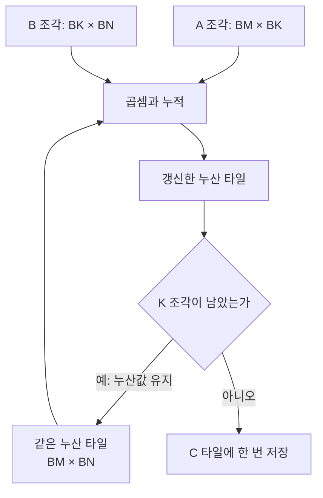
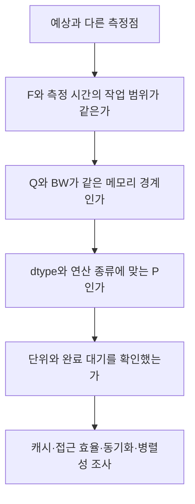

## Roofline과 Tiling — 같은 계산을 하면서 데이터를 덜 옮기는 법

> **4주차 핵심 질문**  
> 같은 계산을 하면서 데이터를 덜 읽어오면, 커널은 얼마나 빨라질 수 있을까?

---

## 목차

1. [이번 주에 알아야 할 큰 그림](#1-이번-주에-알아야-할-큰-그림)
2. [공통 예제의 수학과 계산 조건](#2-공통-예제의-수학과-계산-조건)
3. [Arithmetic Intensity — 이동한 데이터로 얼마나 계산할까](#3-arithmetic-intensity--이동한-데이터로-얼마나-계산할까)
4. [두 시간에서 Roofline 식으로](#4-두-시간에서-roofline-식으로)
5. [Roofline 그래프 읽기](#5-roofline-그래프-읽기)
6. [Tiling은 무엇을 나누고 무엇을 유지할까](#6-tiling은-무엇을-나누고-무엇을-유지할까)
7. [계산 예제 1 — 4×4 행렬곱에서 읽기와 쓰기 세기](#7-계산-예제-1--44-행렬곱에서-읽기와-쓰기-세기)
8. [계산 예제 2 — 4096×4096 행렬곱의 성능 상한](#8-계산-예제-2--40964096-행렬곱의-성능-상한)
9. [재사용 가정이 달라지면 산술 강도도 달라진다](#9-재사용-가정이-달라지면-산술-강도도-달라진다)
10. [큰 타일의 저장 공간과 병렬성 비용](#10-큰-타일의-저장-공간과-병렬성-비용)
11. [출력 타일과 K 방향 폭을 나누어 보기](#11-출력-타일과-k-방향-폭을-나누어-보기)
12. [선택 활동 — Python으로 계산표 확인하기](#12-선택-활동--python으로-계산표-확인하기)
13. [자주 생기는 오해와 그래프 점검](#13-자주-생기는-오해와-그래프-점검)
14. [연습문제 3개](#14-연습문제-3개)
15. [해답과 해설](#15-해답과-해설)
16. [스터디에서 설명하고 함께 점검하기](#16-스터디에서-설명하고-함께-점검하기)
17. [읽을 자료와 검증 범위](#17-읽을-자료와-검증-범위)

---

## 1. 이번 주에 알아야 할 큰 그림

### 1.1 계산량이 같아도 이동량은 달라진다

행렬곱 `C = A @ B`를 계산하는 두 구현이 있다고 하자. 한 구현은 곱셈할 때마다 A와 B의 값을 HBM에서 가져온다. 다른 구현은 필요한 입력 조각을 온칩 메모리에 두고 여러 출력 계산에 쓴다.

두 구현이 수행하는 곱셈과 덧셈의 수는 같다. HBM에서 읽는 횟수가 달라진다. 3주차의 시간 식을 떠올리면, 같은 연산량에서 이동량을 줄이는 일이 언제 도움이 되는지 예상할 수 있다.

| 살펴볼 것 | 답하려는 질문 | 이번 주의 도구 |
|---|---|---|
| 산술 강도 | 1 Byte를 이동시키면서 얼마나 계산하는가? | `I = F/Q` |
| 성능 상한 | 계산과 이동 중 어느 자원이 처리율을 제한하는가? | `min(P, BW × I)` |
| 타일 재사용 | 가져온 입력을 몇 개의 출력에 사용하는가? | 작은 행렬 그림과 읽기 횟수 |
| 타일의 비용 | 입력 조각과 중간 합을 어디에 얼마나 저장하는가? | 입력 버퍼·누산값 크기 |


이 흐름은 성능을 예상하는 순서다. Q가 줄었다는 사실만으로 실제 시간이 얼마나 줄었는지까지 확정하지는 않는다.

### 1.2 3주차의 질문을 그래프로 옮기기

지난주에는 `F/P`와 `Q/BW`를 계산해 큰 값을 골랐다. 이번에는 그 결과를 초당 처리율로 바꾼다. 시간이 짧을수록 처리율은 높으므로 그래프를 읽는 방향도 달라진다.

| 시간으로 볼 때 | 처리율로 볼 때 |
|---|---|
| 연산량을 처리하는 데 몇 초가 필요한가? | 1초에 몇 FLOPs를 처리하는가? |
| `max(F/P, Q/BW)` | `min(P, BW × I)` |
| 더 큰 시간이 제한 요인 | 더 낮은 상한이 제한 요인 |

시간의 하한과 처리율의 상한은 같은 제약을 서로 다른 단위로 나타낸 것이다.

### 1.3 이번 주의 성공 기준

1. 산술 강도의 분모를 저장 용량과 구분해 셀 수 있는가?
2. Roofline의 가로축·세로축·두 상한·분기점을 설명할 수 있는가?
3. 한 입력값이 여러 출력 계산에 쓰이는 곳을 타일 그림에서 찾을 수 있는가?
4. Tiling 전후에 같은 F와 달라진 Q를 계산할 수 있는가?
5. 큰 타일의 재사용 이점과 저장 공간·병렬성 비용을 함께 설명할 수 있는가?
6. 출력 타일 크기, K 방향 폭, 스레드 수를 구분할 수 있는가?

---

## 2. 공통 예제의 수학과 계산 조건

### 2.1 행렬곱의 세 축

일반적인 행렬곱은 다음 shape를 갖는다.

| 텐서 | shape | 역할 |
|---|---|---|
| A | `[M, K]` | 왼쪽 입력 |
| B | `[K, N]` | 오른쪽 입력 |
| C | `[M, N]` | 출력 |

$$
C_{ij}=\sum_{k=0}^{K-1}A_{ik}B_{kj}
$$

M과 N은 출력에 남는 축이고 K는 곱한 값을 누적하는 축이다. C의 한 원소를 구하려면 A의 한 행과 B의 한 열을 따라 K개씩 곱해 더한다.

이번 공통 계산은 정사각 행렬곱이다. 정사각 예제의 N은 세 변의 길이를 모두 나타내며 일반식에서는 위 표처럼 M·N·K를 구분한다.

```text
작은 예제: M = N = K = 4
큰 예제:   M = N = K = 4096
계산:      C = A @ B
자료형:    입력·출력·누산값 모두 FP32
```

여기서 `C = A @ B`는 기존 C에 무엇을 더하는 연산이 아니다. 누산값을 0으로 시작하고 마지막에 C에 저장하므로 기존 C를 읽는 양은 세지 않는다.

### 2.2 연산량은 어떤 관례로 셀까?

각 출력 원소에서 K번의 곱셈과 덧셈을 수행한다고 세면 다음 식을 얻는다.

$$
F=2MNK
$$

정사각 행렬에서는 `F = 2N³`이다. FMA 한 번을 곱셈과 덧셈으로 나누어 2 FLOPs로 세는 GEMM 성능 집계 관례를 따른다. [NVIDIA Matrix Multiplication Background](https://docs.nvidia.com/deeplearning/performance/dl-performance-matrix-multiplication/index.html)의 Background와 Math And Memory Bounds에서 이 집계 방식을 확인할 수 있다.

첫 곱을 그대로 대입한 뒤 나머지만 더하는 수학적 계산은 `MN(2K−1)`로 셀 수도 있다. 작은 4×4 예제에서는 두 관례의 차이가 눈에 띈다. 이 교안에서는 구현 비교와 Roofline의 F를 모두 `2MNK`로 맞춘다.

### 2.3 기호와 단위

| 기호 | 뜻 | 단위 |
|---|---|---|
| F | 수행하는 부동소수점 연산량 | FLOPs |
| Q | HBM에서 읽고 쓴 총 데이터량 | Byte |
| P | 해당 FP32 연산에 적용 가능한 최대 처리율 | FLOPs/s |
| BW | HBM 대역폭 | Byte/s |
| I | HBM 기준 산술 강도 `F/Q` | FLOP/Byte |
| R | 실제로 달성한 연산 처리율 | FLOPs/s |
| `R_roof` | 모델에서 계산한 성능 상한 | FLOPs/s |

행렬 B와 혼동하지 않도록 대역폭은 BW로 쓴다. FLOPs는 연산 횟수, FLOPs/s는 초당 처리율이다.

### 2.4 공통 가상 하드웨어와 제외 항목

| 항목 | 이 교안의 가정 |
|---|---|
| 연산 성능 | `P = 20 × 10¹² FLOPs/s = 20 TFLOPs/s` |
| HBM 대역폭 | `BW = 1 × 10¹² Byte/s = 1 TB/s` |
| 원소 크기 | FP32 1개 = 4 Byte |
| 저장 공간 | 입력·출력을 저장할 장치 메모리는 충분 |
| 입력·출력 위치 | 입력은 이미 장치에 있고 출력도 장치에 남음 |
| 누산값 | 전체 K를 처리하는 동안 온칩에 유지 |
| HBM 접근 | 각 예제에 명시한 읽기·쓰기만 발생 |
| 캐시 | 서로 다른 출력 타일 사이의 캐시 재사용 없음 |
| 실행 | 계산과 이동을 충분히 겹치며 필요한 병렬성 확보 |
| 제외 비용 | 시작 비용, 컴파일, CPU↔가속기 복사, 추가 동기화 비용 등 |

온칩 공간에 타일이 들어가는지는 뒤에서 따로 계산한다. 레지스터가 부족해 중간값을 메모리로 내보내는 spill이나 추가 파이프라인 버퍼도 위의 이동량에는 포함하지 않는다.

단위는 `1 GB = 10⁹ Byte`, `1 TB = 10¹² Byte`, `1 KiB = 1024 Byte`, `1 MiB = 1024² Byte`다. 대역폭과 누적 이동량은 십진 단위로, 작은 버퍼 크기는 이진 단위로 표시한다. 일반 FP32 연산에 BF16·희소 Tensor Core의 피크 성능을 대신 넣지 않는다.

---

## 3. Arithmetic Intensity — 이동한 데이터로 얼마나 계산할까

### 3.1 산술 강도의 정의

산술 강도는 정한 메모리 구간을 지나는 데이터량에 비해 얼마나 계산하는지 나타낸다.

$$
I=\frac{F}{Q}
$$

HBM에서 총 100 Byte를 읽고 쓰는 동안 1,000 FLOPs를 수행한다면 I는 10 FLOP/Byte다. 이 값은 **HBM에서 1 Byte를 이동할 때 수행하는 평균 연산량**이다. Byte 하나에 연산을 직접 적용한다거나, 계산 결과의 정밀도를 나타내는 값은 아니다.

이 정의는 [Scaling Book의 Arithmetic Intensity 설명](https://jax-ml.github.io/scaling-book/roofline/#where-does-the-time-go)을 따른다. 이번 주에는 장치 간 네트워크 대신 HBM 경계를 고정한다.

### 3.2 분모에는 저장 용량이 아닌 이동량을 넣는다

배열 하나를 HBM에서 여러 번 읽으면 그 배열을 담을 공간은 그대로지만 Q는 늘어난다. 반대로 온칩에 보관한 값을 다시 사용하면 연산량은 늘어도 그 재사용 때문에 HBM을 다시 읽을 필요는 없다.

| 바뀐 상황 | F | Q | I |
|---|---|---|---|
| 같은 계산에서 중복 HBM 읽기를 제거 | 같음 | 감소 | 증가 |
| 같은 입력을 다시 HBM에서 읽기 | 계산에 따라 결정 | 추가 읽기만큼 증가 | F가 같으면 감소 |
| 같은 데이터를 온칩에서 재사용 | 계산에 따라 결정 | 재사용분의 HBM 읽기 없음 | 재사용 없는 구현보다 높아질 수 있음 |

I는 수식의 이름만으로 정해지는 상수가 아니다. 같은 행렬곱도 구현과 캐시 조건에 따라 HBM 이동량이 다르다. [Roofline 원 보고서 3절](https://www2.eecs.berkeley.edu/Pubs/TechRpts/2008/Archive/EECS-2008-134.pdf)은 캐시를 거친 뒤 주 메모리로 이동하는 양을 산술 강도의 기준으로 삼는다.

### 3.3 Vector Add는 왜 원소를 묶어도 비슷할까?

지난주의 FP32 Vector Add는 입력 두 개를 읽고 출력 하나를 썼다.

$$
F=N,\qquad Q=12N,\qquad I=\frac{1}{12}\approx0.08333\ \mathrm{FLOP/Byte}
$$

N을 늘려도 분자와 분모가 함께 늘어 I는 그대로다. 여러 원소를 하나의 작업 묶음으로 처리해도 입력 `A[i]`가 다른 출력 `C[j]`의 계산에 새로 쓰이는 것은 아니다. 묶음 크기를 바꾸면 실제 실행 효율은 달라질 수 있지만 이 접근 조건의 I 자체는 높아지지 않는다.

### 3.4 행렬곱에는 어떤 재사용이 있을까?

`A[i,k]` 하나는 같은 행의 `C[i,0]`, `C[i,1]` 등 여러 출력을 계산할 때 필요하다. `B[k,j]` 하나는 같은 열의 `C[0,j]`, `C[1,j]` 등에 쓰인다.

```text
A[i,k] 재사용: 출력의 열 j를 바꾸며 사용
B[k,j] 재사용: 출력의 행 i를 바꾸며 사용
누산값 재사용: k를 바꾸며 같은 C[i,j]의 중간 합 갱신
```

Tiling은 이 관계를 이용한다. 가까이 가져온 A·B 조각을 여러 출력 계산에 쓰고 중간 합을 유지한 채 다음 K 조각을 처리한다.

---

## 4. 두 시간에서 Roofline 식으로

### 4.1 시간의 하한

3주차의 식을 BW 표기로 다시 적는다.

$$
T_{\mathrm{compute}}=\frac{F}{P},\qquad
T_{\mathrm{memory}}=\frac{Q}{BW}
$$

$$
T_{\mathrm{ideal}}=\max\left(\frac{F}{P},\frac{Q}{BW}\right)
$$

계산과 이동을 충분히 겹친다고 가정하면 큰 쪽의 시간이 기준이다. 최대 처리율을 사용했으므로 주어진 F와 Q에 대한 이상적 하한 추정이며 실측 시간이 이 값과 같다는 보장은 없다.

### 4.2 처리율로 바꾸면 왜 min일까?

F를 완료하는 데 걸린 시간이 T라면 처리율은 `F/T`다. 양수인 F·Q·P·BW에 대해 시간의 큰 값을 분모에 넣으면 두 처리율 중 작은 값을 얻는다.

$$
\begin{aligned}
R_{\mathrm{roof}}
&=\frac{F}{T_{\mathrm{ideal}}}\\
&=\min\left(\frac{F}{F/P},\frac{F}{Q/BW}\right)\\
&=\min\left(P,BW\frac{F}{Q}\right)\\
&=\min(P,BW\times I)
\end{aligned}
$$

처리율을 높이려면 계산과 데이터 공급 양쪽이 뒷받침해야 한다. 연산 장치가 아무리 빨라도 필요한 데이터를 공급할 수 있는 속도보다 빨리 결과를 만들 수는 없다. 데이터 공급이 충분히 빨라지면 P가 남은 상한이 된다.

$$
\frac{\mathrm{Byte}}{\mathrm{s}}\times\frac{\mathrm{FLOP}}{\mathrm{Byte}}
=\frac{\mathrm{FLOP}}{\mathrm{s}}
$$

`BW × I`와 P는 같은 단위이므로 직접 비교할 수 있다.


연산량이 `10¹² FLOPs`, 이동량이 `100 GB`인 가상 작업을 두 방식으로 읽은 그림이다. 왼쪽에서는 더 긴 메모리 시간 100 ms가 기준이고, 오른쪽에서는 더 낮은 메모리 성능 상한 10 TFLOPs/s가 기준이다. 두 막대를 더하지 않고 각 패널의 점선 위치를 고르면 같은 제약을 시간과 처리율로 확인할 수 있다.

### 4.3 분기점은 어디에 있을까?

두 상한이 같아지는 곳에서 `P = BW × I`이므로 다음 식을 얻는다.

$$
I_{\mathrm{ridge}}=\frac{P}{BW}
$$

공통 조건을 대입하면 분기점은 20 FLOP/Byte다.

$$
I_{\mathrm{ridge}}=\frac{20\times10^{12}}{10^{12}}=20\ \mathrm{FLOP/Byte}
$$

| 위치 | 두 시간의 관계 | 모델에서 낮은 성능 상한 |
|---|---|---|
| `I < 20` | 메모리 시간이 더 김 | HBM 대역폭 상한 |
| `I = 20` | 두 시간이 같음 | 두 상한이 만남 |
| `I > 20` | 연산 시간이 더 김 | 연산 처리율 상한 |

분기점 오른쪽에 있다는 것만으로 실제 연산 장치의 활용률이 높다고 단정하지는 않는다. 여기서는 두 자원 중 어느 상한이 더 낮은지를 판단한다.

### 4.4 상한과 실측값을 구분하자

실제 처리율은 `R = F/T_measured`로 계산한다. 연산 장치의 사용률, 접근 효율, 동기화, 작업 수 등의 영향으로 R은 상한보다 낮을 수 있다. 그래프에서 얼마나 떨어져 있는지만으로 원인 하나를 확정할 수는 없다.

[Nsight Compute의 Roofline Charts](https://docs.nvidia.com/nsight-compute/ProfilingGuide/#roofline-charts)는 측정한 성능점과 두 상한을 함께 보는 방법을 설명한다. 아래 교안의 그래프에는 아직 실측점을 넣지 않는다.

---

## 5. Roofline 그래프 읽기

### 5.1 축부터 확인한다


참고자료의 그림을 그대로 사용했다. 점은 각 구현의 **계산된 성능 상한**이다. 그래프의 `Naive matmul`은 곱셈마다 두 입력을 HBM에서 읽는 가상 기준을 뜻한다.

| 그래프의 요소 | 뜻 | 읽는 방법 |
|---|---|---|
| 가로축 | HBM 기준 산술 강도 | 오른쪽일수록 이동 Byte에 비해 계산이 많음 |
| 세로축 | 초당 연산 처리율 | 높을수록 같은 F를 짧은 시간에 처리 |
| 기울어진 선 | `BW × I` | 대역폭이 허용하는 연산 처리율 |
| 수평선 | P | 연산 장치의 최대 처리율 |
| 굵은 꺾인 선 | 두 상한 중 작은 값 | 각 I에서 적용되는 Roofline |
| 세로 점선 | `I_ridge = 20` | 제한 자원이 바뀌는 경계 |

세로축은 실행시간이 아니다. 같은 F에서 점이 위로 올라가면 시간이 줄어드는 방향이다.

### 5.2 로그 축에서도 무엇이 같고 무엇이 달라질까?

두 축은 로그 눈금이다. 0.1→1과 1→10은 모두 10배 변화이므로 같은 간격으로 표시된다. 간격이 같다고 차이가 같은 것은 아니다.

대역폭 구간에서는 `R = BW × I`이므로 I가 두 배가 되면 상한도 두 배가 된다. 로그 좌표에서는 `log R = log BW + log I`라서 기울기가 1이다. 연산 구간에서는 I가 늘어도 P가 그대로이므로 수평선이다.

BW를 두 배로 하면 로그 그래프의 대역폭 선은 위로 평행 이동한다. 선형 좌표에서 기울기가 두 배가 되는 것과 구분한다.

### 5.3 Vector Add부터 오른쪽으로 따라가기

공통 조건에서는 BW가 1 TB/s이므로 대역폭 상한의 TFLOPs/s 숫자와 I의 숫자가 같다. 이는 단위 환산과 이번 BW 값 때문에 생긴 일이며 두 물리량의 단위가 같다는 뜻은 아니다.

| 지점 | I (FLOP/Byte) | 상한 (TFLOPs/s) | 해석 |
|---|---:|---:|---|
| Vector Add | 약 0.08333 | 약 0.08333 | 읽고 쓰는 양에 비해 계산이 적음 |
| 재사용 없는 4096 행렬곱 | 약 0.2500 | 약 0.2500 | 행렬곱도 재사용 가정에 따라 왼쪽에 놓임 |
| 출력 타일 32×32 | 약 7.9689 | 약 7.9689 | 재사용으로 Q가 줄어듦 |
| 출력 타일 64×64 | 약 15.8760 | 약 15.8760 | 아직 분기점 왼쪽 |
| 출력 타일 128×128 | 약 31.5077 | 20.0000 | 연산 상한에 도달한 모델값 |

뒤에서 이 표의 Q와 I를 직접 계산한다. 먼저 그래프에서 같은 F를 유지하며 Q가 줄면 점의 가로 위치가 오른쪽으로 이동한다는 관계를 확인하자.

### 5.4 점을 움직이는 것과 상한선을 바꾸는 것

| 변화 | 고정되는 것 | 그래프에서 바뀌는 것 |
|---|---|---|
| 같은 계산의 HBM 이동량 감소 | F, P, BW | I가 증가해 가로 위치 변화 |
| 연산 성능 P 증가 | 해당 구현의 F와 Q, BW | 수평 상한이 높아지고 분기점이 오른쪽으로 이동 |
| 대역폭 BW 증가 | 해당 구현의 F와 Q, P | 대역폭 선이 올라가고 분기점이 왼쪽으로 이동 |

이미 연산 상한에 놓인 모델에서는 Q를 더 줄여도 `F/P` 아래로 시간이 내려가지 않는다. 실제 커널에서는 이 외의 병목이 남을 수 있다.

---

## 6. Tiling은 무엇을 나누고 무엇을 유지할까

### 6.1 출력 타일을 먼저 정한다

Tiling은 큰 계산을 작은 조각으로 나누고 그 조각을 계산하는 동안 입력을 재사용하는 방식이다. 행렬곱에서는 출력 C의 작은 직사각형을 먼저 정하면 이해하기 쉽다.

출력 타일의 크기를 `BM×BN`이라고 하자. 이 타일을 완성하려면 K 전체를 처리해야 한다. K를 한 번에 BK만큼씩 읽어 누산값에 더한다.

| 크기 | 담당하는 방향 | 연결되는 조각 |
|---|---|---|
| BM | 출력의 행 수 | A 조각의 행 수 |
| BN | 출력의 열 수 | B 조각의 열 수 |
| BK | 한 단계에서 처리할 K의 폭 | A 조각의 열 수, B 조각의 행 수 |

$$
A_{\mathrm{tile}}:[BM,BK],\qquad
B_{\mathrm{tile}}:[BK,BN],\qquad
\mathrm{acc}:[BM,BN]
$$

acc는 현재 출력 타일의 중간 합이다. 한 단계에서 A·B 조각을 곱해 acc에 더하고 다음 K 조각으로 옮겨도 같은 acc를 유지한다. 마지막 단계가 끝나면 출력 C에 한 번 저장한다.

이 구조는 [Triton Matrix Multiplication의 Motivations](https://triton-lang.org/main/getting-started/tutorials/03-matrix-multiplication.html#motivations)에 나온 블록 알고리즘과 대응한다.

### 6.2 A와 B가 각각 어디에서 재사용되는가?

한 단계의 A 원소 `A[i,k]`는 출력 타일의 BN개 열에 쓰인다. B 원소 `B[k,j]`는 BM개 행에 쓰인다.



다음 단계에서는 새 A·B 조각을 공급한다. 그림은 데이터와 누산값의 관계를 보여주는 개념도이며 메모리 명령이나 동기화 순서를 모두 표현한 GPU 코드가 아니다.

### 6.3 온칩에 둘 값과 HBM으로 돌려보낼 값

| 데이터 | 이번 모형의 보관 방식 |
|---|---|
| 현재 단계의 A·B 입력 조각 | 온칩에 가져와 그 단계에서 재사용 |
| 출력 타일의 중간 합 | 전체 K를 처리할 때까지 유지 |
| 최종 C 타일 | 완성되면 HBM에 한 번 저장 |

입력 버퍼를 Shared Memory 등에 두고 누산값을 레지스터 등에 두는 구현을 생각할 수 있다. 실제 저장 공간과 배치는 장치·컴파일러·구현에 따라 달라진다. [MLC의 Local Blocking](https://book.mlc.ai/chapter_gpu_acceleration/part1.html#local-blocking)과 [Shared Memory Blocking](https://book.mlc.ai/chapter_gpu_acceleration/part1.html#shared-memory-blocking)은 각각 가까운 저장 공간과 협력적 데이터 재사용을 살펴볼 출발점이다.

---

## 7. 계산 예제 1 — 4×4 행렬곱에서 읽기와 쓰기 세기

### 7.1 왼쪽 위 2×2 출력 타일

A·B·C는 모두 4×4 FP32 행렬이다. 출력 C의 왼쪽 위 2×2를 계산하고 K 방향도 두 칸씩 나눈다. 인덱스는 0부터 시작하며 `0:2`는 0과 1을 뜻한다.


초록색 영역은 두 단계 동안 유지하는 같은 누산 타일이다. 첫 단계에서는 파란 A 조각과 노란 B 조각의 곱을 더한다. 둘째 단계에서는 K 방향으로 옮긴 새 조각의 곱을 같은 누산 타일에 더한다.

$$
\begin{aligned}
C[0{:}2,0{:}2]
&=A[0{:}2,0{:}2]B[0{:}2,0{:}2]\\
&\quad+A[0{:}2,2{:}4]B[2{:}4,0{:}2]
\end{aligned}
$$

곱셈 기호를 생략한 두 항은 각각 2×2 행렬곱이다. 누산값은 0에서 시작하며 두 단계를 마친 뒤 출력에 한 번 저장한다.

### 7.2 한 원소를 손가락으로 따라가보자

첫 단계의 `A[0,0]`은 두 출력에 쓰인다.

```text
C[0,0]에 더할 항: A[0,0] × B[0,0]
C[0,1]에 더할 항: A[0,0] × B[0,1]
```

`B[0,0]`도 두 출력에 쓰인다.

```text
C[0,0]에 더할 항: A[0,0] × B[0,0]
C[1,0]에 더할 항: A[1,0] × B[0,0]
```

A 원소는 두 열에서, B 원소는 두 행에서 재사용된다. 두 번째 K 단계에도 같은 관계가 반복된다. 이 재사용은 HBM에서 가져온 값을 온칩에 유지한다는 가정에서 성립한다.

### 7.3 재사용하지 않는 비교 기준

출력은 16개다. 각 출력에서 K=4번 곱하고 더하며 매번 A와 B 원소를 하나씩 HBM에서 가져온다.

$$
\text{입력 읽기 원소 수}=16\times4\times2=128
$$

$$
Q_{\mathrm{read}}=128\times4=512\ \mathrm{Byte}
$$

각 출력의 중간 합은 온칩에 두고 최종 출력 16개만 저장한다.

$$
Q_{\mathrm{write}}=16\times4=64\ \mathrm{Byte},\qquad
Q=512+64=576\ \mathrm{Byte}
$$

재사용 없음은 A·B 입력을 다시 읽는다는 뜻이다. 이 비교에서도 C의 중간 합을 매번 HBM에 쓰고 읽는다고 가정하지는 않는다.

### 7.4 타일 안에서 재사용하는 경우

출력 타일 하나의 한 단계에는 A 4개와 B 4개, 총 8개 원소를 읽는다. 두 K 단계를 거치므로 타일 하나에서 읽는 입력은 16개다.

출력 타일은 총 4개다. 서로 다른 출력 타일 사이에서는 캐시 재사용이 없다고 가정한다.

$$
\text{입력 읽기 원소 수}=4\times2\times8=64
$$

$$
Q_{\mathrm{read}}=64\times4=256\ \mathrm{Byte}
$$

출력 쓰기는 여전히 64 Byte이므로 총 이동량은 320 Byte다.

### 7.5 연산량과 산술 강도 비교

두 방식 모두 출력 16개마다 FMA를 4번 수행한다.

$$
F=16\times4\times2=128\ \mathrm{FLOPs}
$$

| 항목 | 매 곱셈마다 입력 읽기 | 2×2 타일 안에서 재사용 |
|---|---:|---:|
| 입력 읽기 횟수 | 128원소 | 64원소 |
| 입력 읽기량 | 512 Byte | 256 Byte |
| 출력 쓰기량 | 64 Byte | 64 Byte |
| 총 Q | 576 Byte | 320 Byte |
| 총 F | 128 FLOPs | 128 FLOPs |
| I | 약 0.2222 FLOP/Byte | 0.4 FLOP/Byte |

읽기량은 절반이지만 출력 쓰기는 그대로다. 따라서 총 이동량은 절반이 아니라 `320/576`로 줄어든다. I는 `0.4/(128/576) = 1.8배` 높아진다.

이 작은 예제는 재사용과 바이트 집계를 이해하는 데 쓴다. 실제 4×4 GPU 실행에서는 시작 비용 등의 비중이 크므로 **I가 1.8배라는 사실을 실측 속도가 1.8배라는 뜻으로 해석하지 않는다.**

확인 질문: C 전체를 완성할 때 같은 A·B 원소를 어느 출력 타일에서 다시 읽는지 그림에 표시해보자.

---

## 8. 계산 예제 2 — 4096×4096 행렬곱의 성능 상한

### 8.1 비교할 구현과 가정

이제 세 행렬의 한 변을 N=4096으로 늘린다. 출력 타일은 `t×t`이고 K 방향 폭도 t다. `t=32,64,128`을 비교하며 4096은 세 값으로 모두 나누어떨어진다.

입력은 해당 출력 타일 안에서만 재사용한다. 출력 타일마다 K 전체를 처리하는 동안 누산값을 온칩에 유지하고 완성된 C를 한 번 쓴다. 출력 타일 사이의 캐시 재사용과 추가 전송은 없다.

### 8.2 모든 구현에서 F는 같다

$$
F=2N^3=2\times4096^3=137{,}438{,}953{,}472\ \mathrm{FLOPs}
$$

$$
T_{\mathrm{compute}}
=\frac{137{,}438{,}953{,}472}{20\times10^{12}}
\approx6.872\ \mathrm{ms}
$$

Tiling은 여기서 필요한 곱셈과 덧셈을 없애지 않는다. 각 입력을 HBM에서 몇 번 가져오는지가 달라진다.

### 8.3 재사용 없는 구현의 Q

출력 N²개에서 K=N번씩 계산한다. 매 곱셈마다 FP32 입력 두 개, 8 Byte를 읽는다.

$$
Q_{\mathrm{read}}=8N^3,\qquad Q_{\mathrm{write}}=4N^2
$$

$$
Q_{\mathrm{no\ reuse}}=8N^3+4N^2
=549{,}822{,}922{,}752\ \mathrm{Byte}
$$

이동량은 약 549.823 GB이고 메모리 시간은 약 549.823 ms다. 연산 시간보다 훨씬 길다.

여기서 I의 정확한 값은 0.25보다 조금 작다. 출력 쓰기까지 포함했기 때문이다. 표에 0.2500으로 보이는 것은 소수 넷째 자리 반올림이다.

### 8.4 타일 구현의 Q를 세 단계로 센다

| 셀 항목 | 개수 또는 크기 |
|---|---:|
| 출력 타일 수 | `(N/t)²` |
| 타일 하나의 K 단계 수 | `N/t` |
| 한 단계의 A·B 읽기 | `2 × t² × 4 = 8t² Byte` |

세 값을 곱하면 전체 입력 읽기량이다.

$$
Q_{\mathrm{read}}
=\left(\frac Nt\right)^2\frac Nt\,8t^2
=\frac{8N^3}{t}
$$

최종 출력은 한 번 쓰므로 다음과 같다.

$$
Q_{\mathrm{tile}}=\frac{8N^3}{t}+4N^2
$$

타일별 접근 횟수를 직접 세어 이 식을 얻었다. 입력 조각을 공유해 중복 읽기를 줄이는 구현 원리는 [CUDA의 Shared Memory in Matrix Multiplication](https://docs.nvidia.com/cuda/cuda-c-best-practices-guide/index.html#shared-memory-in-matrix-multiplication-c-ab)에서 확인할 수 있다.

### 8.5 t=64를 끝까지 계산하기

출력 타일은 `64² = 4096개`, 타일 하나의 K 단계는 64회다. 단계마다 A·B 입력을 `8×64² = 32,768 Byte` 읽는다.

$$
Q_{\mathrm{read}}=4096\times64\times32{,}768
=8{,}589{,}934{,}592\ \mathrm{Byte}
$$

$$
Q_{\mathrm{write}}=4\times4096^2=67{,}108{,}864\ \mathrm{Byte}
$$

$$
Q=8{,}657{,}043{,}456\ \mathrm{Byte}
$$

$$
I=\frac{137{,}438{,}953{,}472}{8{,}657{,}043{,}456}
\approx15.8760\ \mathrm{FLOP/Byte}
$$

공통 BW를 적용하면 메모리 시간은 약 8.657 ms다. I가 분기점 20보다 작으므로 성능 상한은 약 15.8760 TFLOPs/s이며 이상적 시간은 `max(6.872, 8.657) = 8.657 ms`다.

### 8.6 네 구현을 같은 표에 놓기

| 구현 | F (FLOPs) | Q (십진 GB) | I (FLOP/Byte) | 상한 (TFLOPs/s) | 메모리 시간 (ms) | 이상적 시간 (ms) |
|---|---:|---:|---:|---:|---:|---:|
| 재사용 없음 | 137,438,953,472 | 549.823 | 0.2500 | 0.2500 | 549.823 | **549.823** |
| t=32 | 137,438,953,472 | 17.247 | 7.9689 | 7.9689 | 17.247 | **17.247** |
| t=64 | 137,438,953,472 | 8.657 | 15.8760 | 15.8760 | 8.657 | **8.657** |
| t=128 | 137,438,953,472 | 4.362 | 31.5077 | 20.0000 | 4.362 | **6.872** |

연산 시간은 모두 약 6.872 ms다. t=128에서는 메모리 시간이 그보다 짧아져 연산 처리율이 모델의 제한 자원으로 남는다. 4.362 ms를 전체 시간으로 쓰면 안 된다.

이 표는 반올림한 값이다. 구현을 바꾸며 Q가 줄고 I가 오른쪽으로 이동하는 모습을 5절의 그래프와 연결해보자.

### 8.7 549.823 GB를 저장해야 한다는 뜻일까?

세 행렬의 저장 공간은 다음과 같다.

$$
3\times4N^2=201{,}326{,}592\ \mathrm{Byte}=192\ \mathrm{MiB}
$$

549.823 GB는 같은 입력을 거듭 읽은 누적 이동량이다. 이 값만 보고 장치 메모리 용량이 수백 GB여야 한다고 판단하지 않는다. 타일 버퍼와 누산값은 이 세 행렬의 공간과 구분해 뒤에서 센다.

### 8.8 표의 차이를 실제 가속 배수로 말할 수는 없다

재사용 없음은 모든 스칼라 입력 읽기가 HBM에 도달하는 비교 기준이다. 실제 단순 커널도 캐시나 브로드캐스트의 이점을 얻을 수 있다. 타일 구현도 필요한 온칩 공간과 병렬성을 확보하지 못하면 상한에 가까워지기 어렵다.

따라서 이 표는 재사용 가정이 시간 추정에 미치는 영향을 보여준다. 특정 GPU에서 얻을 가속 배수나 최적 타일 크기를 제시한 결과는 아니다.

---

## 9. 재사용 가정이 달라지면 산술 강도도 달라진다

### 9.1 t가 커질 때 I는 어떻게 변할까?

정사각 타일의 산술 강도를 정리하면 다음 식을 얻는다.

$$
I(t)=\frac{2N^3}{8N^3/t+4N^2}
=\frac{Nt}{4N+2t}
$$

N이 t보다 훨씬 크면 출력 쓰기의 상대적 비중이 작아져 `I ≈ t/4`로 볼 수 있다. t=32·64·128을 대입한 근사값은 각각 8·16·32다. 정확한 표의 7.9689·15.8760·31.5077이 그보다 조금 작은 이유는 출력 쓰기를 포함했기 때문이다.

이 근사는 입력 재사용의 효과를 빠르게 가늠할 때 편리하다. 분기점 바로 근처에서 어느 쪽인지 판단하려면 정확한 식으로 돌아간다.

### 9.2 선택 계산 — 분기점을 넘는 t

N=4096에서 I가 20 이상이 되는 조건을 풀어보자.

$$
\frac{4096t}{16384+2t}\ge20
\quad\Longrightarrow\quad
t\ge\frac{327680}{4056}\approx80.789
$$

`I≈t/4`만 보고 t=80을 정확한 경계라고 쓰면 출력 쓰기의 영향을 놓친다. 더구나 여기서는 타일이 N을 나누어떨어지게 해야 하며 후보도 32·64·128로 한정했다. 후보 중 분기점 오른쪽에 놓이는 첫 값은 128이다.

이 계산은 자원 제약을 무시한 모형의 경계다. t=128을 실제로 사용할 수 있는지는 입력 버퍼와 누산값을 살핀 뒤 판단한다.

### 9.3 전체 입력을 한 번만 읽는 가정

A·B를 각각 한 번 읽고 C를 한 번 쓴다면 다음 식이 나온다.

$$
Q_{\mathrm{once}}=12N^2,\qquad
I_{\mathrm{once}}=\frac{2N^3}{12N^2}=\frac N6
$$

N=4096에서는 I가 약 682.67 FLOP/Byte다. 타일 재사용 표보다 훨씬 오른쪽에 놓인다.

| 재사용 가정 | 읽기 방식 | 총 Q |
|---|---|---|
| 재사용 없음 | 곱셈할 때마다 입력 둘을 읽음 | `8N³ + 4N²` |
| 출력 타일 안에서 재사용 | 다른 출력 타일은 같은 입력을 다시 읽음 | `8N³/t + 4N²` |
| 이상적인 전체 재사용 | A·B를 전체 계산에서 한 번씩만 읽음 | `12N²` |

세 식은 서로 다른 조건을 나타낸다. 전체 입력을 단 한 번씩 읽는 구현이 유한한 온칩 공간과 실행 순서에서 가능한지는 별도로 따져야 한다. [Scaling Book의 Matrix multiplication](https://jax-ml.github.io/scaling-book/roofline/#matrix-multiplication)과 [Modern MLC의 GEMM·타일 재사용 설명](https://mlc.ai/modern-gpu-programming-for-mlsys/chapter_performance/index.html#the-roofline-model)을 비교하면 이 차이를 볼 수 있다.

### 9.4 HBM 산술 강도와 온칩 산술 강도

HBM에서 한 번 읽은 값도 Shared Memory나 레지스터에서는 여러 차례 접근한다. HBM Q가 줄었다고 모든 메모리 계층의 이동이 동시에 같은 비율로 줄어드는 것은 아니다.

이번 그래프는 HBM 경계의 Q와 BW를 짝지었다. 온칩 메모리의 제약을 보고 싶다면 그 경계를 지나는 데이터량과 그 공간의 대역폭으로 별도 모델을 세운다. HBM Q를 Shared Memory 대역폭으로 나누면 서로 다른 경계를 섞게 된다.

---

## 10. 큰 타일의 저장 공간과 병렬성 비용

### 10.1 입력 버퍼와 누산값을 따로 센다

한 단계의 입력만 보관하고 `BM=BN=BK=t`라면 입력 버퍼는 다음 크기다.

$$
S_{\mathrm{input}}=4t^2+4t^2=8t^2\ \mathrm{Byte}
$$

FP32 누산값은 출력 타일 전체를 유지한다.

$$
S_{\mathrm{acc}}=4t^2\ \mathrm{Byte}
$$

| 출력 타일 | A·B 입력 버퍼 합 | 누산값의 논리적 저장량 | 전체 출력 타일 수 |
|---|---:|---:|---:|
| 32×32 | 8 KiB | 4 KiB | 16,384개 |
| 64×64 | 32 KiB | 16 KiB | 4,096개 |
| 128×128 | 128 KiB | 64 KiB | 1,024개 |

입력 버퍼와 누산값은 다른 저장 공간에 놓일 수 있으므로 두 열을 더해 곧바로 Shared Memory 요구량이라고 부르지 않는다. 누산값 열은 타일 전체의 양이며 스레드 하나의 레지스터 사용량도 아니다.


왼쪽에서 입력 버퍼와 누산값을 따로 보고, 오른쪽에서 전체 출력 타일 수를 확인하자. 이 그림처럼 BM·BN·BK를 함께 두 배로 키우면 두 저장량은 각각 네 배가 되고 출력 타일 수는 4분의 1로 줄어든다. 이 관계만으로 실제 occupancy나 최적 타일을 정할 수는 없다.

### 10.2 한 단계 버퍼와 실제 할당량의 차이

이 표에는 다음 조각을 미리 가져오는 별도 버퍼가 없다. 여러 단계를 겹치려고 입력 버퍼를 여러 벌 두면 저장 공간이 더 필요하다. 주소 계산과 임시값, 데이터 배치, 하드웨어 할당 단위도 실제 자원 사용량에 영향을 준다.

큰 타일이 데이터를 더 많이 재사용하더라도 저장 공간이 모자라 중간값을 HBM으로 내보낸다면, 앞에서 계산한 Q가 달라진다. 타일이 온칩에 유지된다는 가정을 다시 확인해야 한다.

### 10.3 병렬성의 두 문제

타일을 키우면 서로 다른 두 이유로 실행 효율이 달라질 수 있다.

| 살펴볼 범위 | 큰 타일이 바꾸는 것 | 확인할 질문 |
|---|---|---|
| GPU 전체의 작업 수 | 출력 타일 수가 감소 | 여러 실행 단위에 분배할 작업이 충분한가? |
| 각 SM의 자원 사용 | 작업 하나의 레지스터·Shared Memory 요구량 증가 | 동시에 상주할 작업 수가 줄어드는가? |

첫 번째는 전체 작업을 어떻게 나누는지의 문제이고 두 번째는 한 실행 단위에 작업을 얼마나 함께 둘 수 있는지의 문제다. 출력 타일 수만으로 occupancy를 계산할 수는 없다.

CUDA의 occupancy는 한 SM에서 활성 상태인 warp 수를 가능한 최대 활성 warp 수로 나눈 비율이다. 레지스터·Shared Memory 사용량이 상주 가능한 작업 수를 제한한다. 높은 occupancy 자체가 높은 성능을 보장하지는 않는다. [CUDA Calculating Occupancy](https://docs.nvidia.com/cuda/cuda-c-best-practices-guide/index.html#calculating-occupancy)

### 10.4 타일 크기와 스레드 수는 다르다

128×128 출력 타일에는 16,384개 결과가 들어간다. 이 사실이 스레드 16,384개를 만든다는 뜻은 아니다. 한 스레드가 여러 출력값을 맡거나 여러 스레드가 협력하는 방식은 구현에서 정한다.

MLC의 Local Blocking은 한 스레드 안에서 여러 출력을 계산하며 값을 재사용하는 모습을, Shared Memory Blocking은 같은 block의 스레드가 입력을 나누어 가져오고 공유하는 모습을 보여준다. 출력 원소 수와 실행 스레드 수를 구분해서 읽자. [MLC GPU Acceleration Part 1](https://book.mlc.ai/chapter_gpu_acceleration/part1.html#local-blocking)

공통 계산은 타일의 논리적 크기까지만 정한다. 실제 스레드 배치와 자원 사용량을 정하지 않은 상태에서 특정 장치의 최적 타일을 고를 수는 없다.

---

## 11. 출력 타일과 K 방향 폭을 나누어 보기

### 11.1 t 하나로 묶었던 세 값을 분리한다

앞의 표에서는 비교를 단순하게 하려고 BM·BN·BK를 모두 t로 놓았다. 실제로는 출력의 행·열 크기와 K 방향 폭을 독립적으로 생각할 수 있다.

$$
S_{\mathrm{input}}=4BK(BM+BN),\qquad
S_{\mathrm{acc}}=4BM\,BN
$$

BM·BN이 같아도 BK를 키우면 한 단계의 입력 버퍼는 커진다. 출력 타일은 그대로이므로 누산값 크기는 그대로다. 대신 K 전체를 처리하는 단계 수는 줄어든다.

### 11.2 읽기용 의사코드

```text
각 출력 타일의 시작 위치 (m0, n0)에 대해:
    acc[BM, BN]을 0으로 초기화한다

    k0를 0부터 K까지 BK씩 이동하며:
        A[m0:m0+BM, k0:k0+BK]를 가져온다
        B[k0:k0+BK, n0:n0+BN]를 가져온다
        두 조각의 행렬곱을 acc에 더한다
        acc는 다음 K 단계까지 온칩에 유지한다

    K 방향 처리가 모두 끝나면:
        acc를 C[m0:m0+BM, n0:n0+BN]에 한 번 저장한다
```

이 코드는 데이터 재사용을 읽기 위한 의사코드다. 실행 가능한 GPU 커널이 아니며 주소 계산·스레드 배치·동기화·경계 처리는 생략했다. 모든 차원은 대응하는 타일 크기로 나누어떨어진다고 가정한다.

acc 초기화는 K 반복문 밖에 있다. 안에서 매번 0으로 만들면 앞 단계의 결과가 사라진다. 또 매 단계마다 acc를 HBM에 저장하면 이 교안의 한 번 쓰기 가정과 다른 구현이 된다.

### 11.3 실제 구현에서 더 필요한 것

| 의사코드의 표현 | 구현할 때 확인할 것 |
|---|---|
| 입력 조각을 가져온다 | 어떤 스레드가 어느 주소를 읽는가? |
| 가져온 입력을 함께 사용한다 | 읽을 데이터가 준비됐는가? |
| 다음 K 조각을 가져온다 | 기존 입력 사용을 마치기 전에 덮어쓰지 않는가? |
| 누산값을 유지한다 | 필요한 저장 공간이 충분한가? |
| C에 저장한다 | 실제 출력 범위 안에 있는가? |

특히 Shared Memory로 협력하는 코드에는 데이터 준비와 버퍼 재사용의 순서를 보장하는 장치가 필요하다. 여기서는 그 비용을 산술 강도 식에 넣지 않았다. [CUDA의 행렬곱·Shared Memory 예제](https://docs.nvidia.com/cuda/cuda-c-best-practices-guide/index.html#shared-memory-in-matrix-multiplication-c-ab)

Triton의 `BLOCK_SIZE_M/N/K`도 같은 세 방향을 구분한다. 공식 튜토리얼의 자료형과 실제 커널 코드를 그대로 이번 FP32 가상 조건의 성능 근거로 쓰지 않는다. 이번 주에는 첫 블록 알고리즘까지만 읽어도 된다.

---

## 12. 선택 활동 — Python으로 계산표 확인하기

### 12.1 GPU 없이 실행하는 검산 코드

아래 코드는 Python 표준 라이브러리만 사용한다. 행렬을 할당하거나 GPU를 실행하지 않고 8절의 F와 Q를 식으로 계산한다.

```python
# 손계산 검산용: GPU 벤치마크가 아니다.
from math import isclose

N = 4096
P = 20e12
BW = 1e12
F = 2 * N**3


def report(label, q):
    intensity = F / q
    roof = min(P, BW * intensity)
    compute_ms = F / P * 1e3
    memory_ms = q / BW * 1e3
    ideal_ms = max(compute_ms, memory_ms)
    assert isclose(F / roof * 1e3, ideal_ms)
    print(
        f"{label}: Q={q} Byte, I={intensity:.4f}, "
        f"roof={roof / 1e12:.4f} TFLOPs/s, "
        f"ideal={ideal_ms:.3f} ms"
    )


report("no reuse", 8 * N**3 + 4 * N**2)
for t in (32, 64, 128):
    assert N % t == 0
    tile_count = (N // t)**2
    stages = N // t
    q = tile_count * stages * (8 * t**2) + 4 * N**2
    assert q == 8 * N**3 // t + 4 * N**2
    report(f"t={t}", q)

assert 8 * N**3 // 64 + 4 * N**2 == 8_657_043_456
```

### 12.2 계산으로 얻은 값

```text
no reuse: Q=549822922752 Byte, I=0.2500, roof=0.2500 TFLOPs/s, ideal=549.823 ms
t=32: Q=17246978048 Byte, I=7.9689, roof=7.9689 TFLOPs/s, ideal=17.247 ms
t=64: Q=8657043456 Byte, I=15.8760, roof=15.8760 TFLOPs/s, ideal=8.657 ms
t=128: Q=4362076160 Byte, I=31.5077, roof=20.0000 TFLOPs/s, ideal=6.872 ms
```

출력의 I 단위는 FLOP/Byte다. 위 숫자는 가상 조건을 대입한 계산 결과이며 실행시간을 측정한 로그가 아니다.

### 12.3 하나의 조건만 바꾸어 관찰하기

| 바꿀 값 | 계산하기 전에 예상할 것 |
|---|---|
| P만 두 배 | 어떤 구현의 상한이 올라갈까? |
| BW만 두 배 | 분기점과 메모리 시간이 어디로 움직일까? |
| t | Q의 읽기 항과 출력 쓰기 항이 각각 어떻게 바뀔까? |
| N | 타일이 나누어떨어지는가? 출력 타일 수와 F·Q가 어떻게 바뀔까? |

이 계산기에는 온칩 자원 한도가 없다. 계산 결과가 좋더라도 그 타일을 실제로 실행할 수 있는지는 별도 조건이다. 실제 측정값을 넣어보는 활동은 후속 실습에서 다룬다.

---

## 13. 자주 생기는 오해와 그래프 점검

### 13.1 같은 단어가 다른 양을 가리킬 때

| 오해 | 확인할 내용 |
|---|---|
| Roofline의 세로축은 실행시간이다 | FLOPs/s 단위의 처리율이다. 같은 F에서 높을수록 시간은 짧다. |
| 산술 강도는 연산량을 메모리 용량으로 나눈 값이다 | 지정한 구간에서 읽고 쓴 누적 Byte로 나눈다. |
| Tiling은 FLOPs를 줄인다 | 이번 예제에서는 F를 유지하며 중복 HBM 읽기를 줄인다. |
| 타일링하면 입력을 전체 계산에서 한 번만 읽는다 | 이번 모형은 출력 타일 사이에 같은 입력을 다시 읽는다. |
| t가 두 배면 총 Q가 정확히 절반이다 | 읽기 항은 절반이지만 출력 쓰기 항은 그대로다. |
| 타일이 클수록 무조건 빠르다 | 저장 공간·작업 수·실행 효율도 함께 바뀐다. |
| 128×128 타일은 스레드 16,384개다 | 출력 원소 수와 스레드 수는 별도로 정한다. |
| 누산값 64 KiB는 스레드 하나의 레지스터 사용량이다 | 타일 전체의 논리적 누산값 크기다. |
| BK를 두 배로 하면 HBM 산술 강도도 두 배다 | 단계당 읽기와 전체 단계 수를 함께 계산해야 한다. |
| 로그 그래프에서 BW가 두 배면 대각선의 기울기도 두 배다 | 기울기 1은 그대로이며 선의 높이가 바뀐다. |
| 그래프의 선 위에 있으니 실제 성능도 그 값이다 | 이 교안의 점들은 측정점이 아니라 계산한 상한이다. |
| I가 높으면 어떤 프로그램이든 더 빠르다 | F가 다른 작업의 절대 실행시간은 I만으로 비교할 수 없다. |

### 13.2 실제 측정점이 상한보다 아래라면

관측한 시간으로 처리율을 구할 때는 F와 측정 구간이 같은 작업을 가리켜야 한다. 입력 복사나 다른 커널까지 포함한 시간에 행렬곱만의 F를 나누면, 단일 커널의 처리율과 다른 값이 된다.



같은 I에서 점이 상한보다 낮다면 그 모델에는 잠재적인 여유가 있다. 다만 낮아진 원인이 메모리 접근인지, 작업 부족인지, 동기화인지까지 그래프 하나로 구분할 수는 없다.

### 13.3 상한을 넘는 것처럼 보인다면

먼저 서로 다른 기준을 섞었는지 살핀다.

- Q에 HBM을 매번 읽는다고 가정했지만 실제로는 캐시를 활용했는가?
- 비동기 실행이 끝나기 전에 시간을 멈췄는가?
- FLOPs 집계와 P의 자료형·연산 종류가 다른가?
- TFLOPs/s와 FLOPs/s, GB와 GiB를 섞었는가?
- 입력·출력 이동의 일부를 다른 구간에서 처리했는가?

이상적 하한보다 실측 시간이 짧아 보인다면, 그 실측이 손계산과 같은 F·Q·처리율 조건인지부터 확인한다.

### 13.4 후속 실습에 남길 기록

| 기록할 항목 | 비교에 필요한 이유 |
|---|---|
| 장치·자료형·연산 | P를 같은 기준으로 선택 |
| M·N·K와 BM·BN·BK | 연산량, 이동량, 경계 처리 조건 확인 |
| 실제 커널 구간과 완료 대기 | 측정한 시간의 의미 확인 |
| 캐시 상태와 반복 방식 | HBM Q 가정 확인 |
| 레지스터·Shared Memory 사용량 | 온칩 자원 제약 확인 |
| HBM 트래픽과 실제 시간 | 손계산과 다른 항을 찾기 |

이번 주에는 이 표의 질문을 이해하는 데 집중한다. 프로파일러 설치와 실제 커널 최적화는 공통 과제에 포함하지 않는다.

---

## 14. 연습문제 3개

문제 1·2는 공통 활동이고 문제 3은 선택 확장이다. 공통 가상 조건은 `P=20×10¹² FLOPs/s`, `BW=10¹² Byte/s`, FP32 원소당 4 Byte다. 각 문제에서 정한 비용만 세고 입력은 이미 장치에 있다고 가정한다.

### 문제 1. 어느 상한을 바꾸면 빨라질까?

어떤 커널의 연산량은 `10¹² FLOPs`, HBM 이동량은 `100 GB`다.

1. 산술 강도, Roofline 성능 상한, 연산 시간, 메모리 시간, 이상적 시간을 구하자.
2. 연산 성능만 두 배로 늘렸을 때 같은 값을 계산하자.
3. HBM 대역폭만 두 배로 늘렸을 때 같은 값을 계산하자.
4. 각 변화에서 그래프의 어느 선과 분기점이 바뀌는지 설명하자.

### 문제 2. 입력 버퍼에 들어가는 타일은?

예제 2의 t=32·64·128 후보를 비교한다. 한 작업에 허용되는 **A·B 입력 버퍼의 합은 96 KiB**다. K 방향 폭도 t이며 한 단계의 입력만 보관한다. 누산값은 별도 공간에 둘 수 있다.

1. 입력 버퍼 조건을 통과하는 가장 큰 후보를 고르자.
2. 그 후보의 이상적 실행시간을 구하자.
3. 조건을 통과한 가장 큰 타일이 실제로도 가장 빠르다고 결론 내릴 수 있는지 설명하자.

96 KiB는 이번 문제의 입력 버퍼 한도다. 실제 GPU 제품의 사양이나 누산값까지 포함한 총 온칩 한도로 해석하지 않는다.

### 문제 3. 선택 확장 — K 방향 폭만 늘리면?

행렬 크기는 N=4096, 출력 타일은 **64×64로 고정**한다. 한 단계에서 읽는 K 방향 폭 BK를 32와 64로 바꾼다. 출력 타일 사이의 캐시 재사용은 없고 누산값은 K 전체를 처리할 때까지 유지하며 최종 C만 한 번 쓴다.

1. 각 경우의 출력 타일당 K 단계 수를 구하자.
2. 단계당 A·B 입력 버퍼와 누산값 크기를 구하자.
3. 전체 HBM 이동량, 산술 강도, 이상적 시간을 비교하자.
4. 입력 버퍼가 두 배가 되면 HBM 산술 강도도 두 배가 되는지 설명하자.

### 공통 풀이 틀

```text
계산할 작업과 자료형:
재사용을 허용하는 범위:
총 F:
입력 읽기 Q_read:
출력 쓰기 Q_write:
총 Q:
I = F/Q:
R_roof = min(P, BW × I):
T_compute, T_memory, T_ideal:
입력 버퍼와 누산값:
모델에서 예상한 제한 자원:
실제 실행에서 따로 확인할 조건:
```

---

## 15. 해답과 해설

### 15.1 문제 1 — 성능선과 분기점의 변화

기본 조건의 산술 강도는 10 FLOP/Byte다.

$$
I=\frac{10^{12}}{100\times10^9}=10
$$

$$
R_{\mathrm{roof}}=\min(20\times10^{12},10^{12}\times10)
=10\times10^{12}\ \mathrm{FLOPs/s}
$$

연산 시간은 50 ms, 메모리 시간은 100 ms이므로 이상적 시간은 100 ms다.

| 조건 | I (FLOP/Byte) | 분기점 (FLOP/Byte) | 상한 (TFLOPs/s) | 연산 시간 | 메모리 시간 | 이상적 시간 |
|---|---:|---:|---:|---:|---:|---:|
| 기본 | 10 | 20 | 10 | 50 ms | 100 ms | **100 ms** |
| P만 두 배 | 10 | 40 | 10 | 25 ms | 100 ms | **100 ms** |
| BW만 두 배 | 10 | 10 | 20 | 50 ms | 50 ms | **50 ms** |


세 패널은 같은 축을 사용하며 커널의 가로 위치 I=10도 고정했다. 연산 성능을 높인 가운데 패널에서는 그 위치의 상한이 그대로지만, 대역폭을 높인 오른쪽 패널에서는 상한이 20 TFLOPs/s로 올라간다. 표시한 점은 모두 계산한 상한이다.

P를 두 배로 늘리면 수평 상한은 40 TFLOPs/s로 올라가고 분기점은 40으로 옮겨진다. 하지만 이 커널의 I=10에서 대역폭 상한은 그대로다. 연산 시간을 줄여도 더 긴 메모리 시간이 남는다.

BW를 두 배로 늘리면 대역폭 선은 로그 그래프에서 위로 이동한다. 분기점은 10이 되고 이 커널은 두 시간이 같은 경계에 놓인다. F와 Q를 바꾸지 않았으므로 I는 세 경우 모두 10이다.

### 15.2 문제 2 — 버퍼 조건을 통과하는 후보

입력 버퍼는 `8t² Byte`다.

| 후보 | A·B 입력 버퍼 | 96 KiB 한도 | 이상적 시간 |
|---|---:|---|---:|
| 32×32 | 8 KiB | 통과 | 약 17.247 ms |
| 64×64 | 32 KiB | 통과 | 약 8.657 ms |
| 128×128 | 128 KiB | 초과 | 이번 구성에서는 사용 불가 |

통과하는 가장 큰 후보는 **64×64**이고 모델의 이상적 시간은 약 **8.657 ms**다. 누산값 16 KiB는 별도 공간이라는 조건이므로 입력 버퍼 한도에 더하지 않는다.

t=128의 탈락은 BK도 128이고 한 단계 입력 버퍼를 둔 현재 구성에 관한 판단이다. BK나 버퍼 구성을 바꾸면 필요한 입력 공간도 달라진다.

버퍼에 들어간다는 조건만으로 실제 최적 타일을 정할 수는 없다. 레지스터 사용량, 동기화, 데이터 접근, 병렬성 때문에 32와 64의 실제 시간도 측정해야 한다. 문제에서 물은 가장 큰 유효 후보와 실측으로 고를 가장 빠른 후보는 별개의 판단이다.

### 15.3 문제 3 — BK가 커지면 줄어드는 것은 단계 수

출력 타일 수는 두 경우 모두 `(4096/64)² = 4096개`다. 한 단계에 읽는 입력은 다음 크기다.

$$
Q_{\mathrm{step}}=4(64BK+BK64)=512BK\ \mathrm{Byte}
$$

| 항목 | BK=32 | BK=64 |
|---|---:|---:|
| 타일당 K 단계 수 | 128 | 64 |
| 단계당 A·B 입력 버퍼 | 16 KiB | 32 KiB |
| 타일당 누산값 | 16 KiB | 16 KiB |
| 전체 입력 읽기 | 8,589,934,592 Byte | 8,589,934,592 Byte |
| 전체 출력 쓰기 | 67,108,864 Byte | 67,108,864 Byte |
| 전체 HBM 이동량 | **8,657,043,456 Byte** | **8,657,043,456 Byte** |
| I | 약 15.8760 FLOP/Byte | 약 15.8760 FLOP/Byte |
| 이상적 시간 | 약 8.657 ms | 약 8.657 ms |


파란 A 조각은 가로로, 노란 B 조각은 세로로 커지지만 초록 누산 타일은 그대로다. 아래 식은 출력 타일 하나의 입력 읽기를 끝까지 합친 값이다. 한 번에 16 KiB씩 128회 읽거나 32 KiB씩 64회 읽거나 모두 2 MiB이므로, 단계당 버퍼와 누적 이동량을 구분해서 볼 수 있다.

한 단계의 읽기량은 두 배가 되지만 단계 수가 절반이다. 예를 들어 출력 타일 하나에서 읽는 양은 `128×16 KiB`와 `64×32 KiB`로 같다. 전체 출력 타일 수와 출력 쓰기도 그대로이므로 총 Q가 같다.

### 15.4 일반식에서 BK가 소거되는 이유

FP32 행렬 `A[M,K]`, `B[K,N]`, `C[M,N]`에 대해 같은 방식으로 세어보자.

$$
\begin{aligned}
Q_{\mathrm{read}}
&=\frac{M}{BM}\frac{N}{BN}\frac{K}{BK}
\times4BK(BM+BN)\\
&=4MNK\left(\frac1{BN}+\frac1{BM}\right)
\end{aligned}
$$

$$
Q=4MNK\left(\frac1{BN}+\frac1{BM}\right)+4MN
$$

단계 수의 분모와 단계당 읽기의 분자에 BK가 있어 소거된다. 이 식은 모든 차원이 타일 크기로 나누어떨어지고 타일 안에서만 재사용하며 누산값을 온칩에 유지하고 최종 C만 한 번 쓰는 조건에서 나온다. 패딩·spill·추가 전송은 없다.

**BK만 늘린다고 이 모형의 HBM 산술 강도가 높아지지는 않는다.** 다만 BK는 버퍼 크기·반복 횟수·명령 구성에 영향을 주므로 실제 시간까지 같다고 결론 내릴 수는 없다.

---

## 16. 스터디에서 설명하고 함께 점검하기

### 16.1 네 질문을 같은 행렬곱으로 연결한다

| 담당 관점 | 설명할 내용 | 남길 자료 |
|---|---|---|
| 산술 강도 | F가 같아도 재사용 조건에 따라 Q와 I가 달라지는 이유 | 재사용 조건별 F·Q·I 표 |
| Roofline | 두 상한과 분기점, 시간식과 처리율식의 관계 | 축·단위·분기점이 표시된 그림 |
| Tiling | A·B의 재사용과 K 전체를 누적하는 과정 | 4×4 행렬의 2×2 타일 그림 |
| 타일의 비용 | 입력 버퍼·누산값·작업 수가 바뀌는 방식 | 타일별 저장 공간과 이상적 시간 표 |

정리에는 자료형, 메모리 구간, 캐시와 재사용의 가정을 함께 적는다. 참고한 자료의 링크와 읽은 절, 아직 설명하기 어려운 질문도 남긴다.

### 16.2 모임에서 확인할 순서

1. 4×4 그림에서 A 원소 하나와 B 원소 하나가 쓰이는 출력을 표시한다.
2. 재사용 없는 경우와 2×2 타일 경우의 읽기·쓰기를 각자 센다.
3. 4096 행렬곱의 F와 t=64의 Q를 계산해 표와 대조한다.
4. 구한 I를 Roofline에 놓고 상한과 이상적 시간을 읽는다.
5. 버퍼 제한을 적용해 수식으로 좋았던 후보가 실제 구성에 들어가는지 본다.
6. 선택 문제에서 BK를 바꾸고 무엇이 같고 달라지는지 설명한다.

### 16.3 토론 질문

- 입력을 반으로 읽게 됐는데 총 Q는 왜 정확히 절반이 아닐까?
- 타일 안에서만 재사용하는 식과 전체 입력을 한 번씩 읽는 식은 어디에서 갈라질까?
- t=128의 메모리 시간이 4.362 ms인데 전체 기준 시간은 왜 6.872 ms일까?
- 입력 버퍼에 들어가는 것과 GPU 전체에 작업이 충분한 것은 어떻게 다를까?
- BK를 바꿔 Q가 같아도 실측 시간이 달라질 수 있는 이유는 무엇일까?
- 실측점을 그래프에 추가하려면 무엇을 같은 기준으로 세어야 할까?

### 16.4 용어 사전

| 용어 | 이번 주에 필요한 뜻 |
|---|---|
| Arithmetic Intensity | 특정 메모리 구간의 이동 Byte당 연산량 |
| Roofline | 산술 강도별로 대역폭·연산 처리율의 상한을 나타내는 모델 |
| Ridge point | 두 상한이 만나는 산술 강도 `P/BW` |
| Throughput | 단위 시간에 처리하는 양. 이 교안에서는 FLOPs/s |
| GEMM | 일반 행렬곱. 이번 예제는 기존 C를 읽지 않는 `C=A@B` |
| Tiling·Blocking | 큰 계산을 조각으로 나누어 가까이 둔 데이터를 재사용하는 방식 |
| Output tile | 한 작업이 계산하는 출력 행렬의 조각 |
| BM·BN | 출력 타일의 행·열 크기 |
| BK | 한 단계에서 처리하는 누적 방향 K의 폭 |
| Accumulator | K 방향 계산의 중간 합을 유지하는 저장값 |
| Shared Memory | 같은 GPU thread block의 협력에 쓰는 온칩 저장 공간 |
| Register | 연산에 필요한 값과 중간값을 가까이 보관하는 저장 공간 |
| Occupancy | SM의 활성 warp 수와 가능한 최대 활성 warp 수의 비율 |
| Spill | 레지스터에 담지 못한 값 등을 메모리로 내보내는 일 |

### 16.5 마지막으로 기억할 관계

```text
같은 F에서 Q를 줄인다
    → HBM 기준 I가 커진다
    → 대역폭 구간에서는 가능한 성능 상한이 높아진다
    → 연산 상한을 만나면 F/P가 기준으로 남는다

BK를 고정하고 출력 타일 BM×BN을 키운다
    → 타일 안에서 입력을 재사용하는 횟수가 늘어난다
    → 한 단계 입력 버퍼와 누산값의 공간도 커진다
    → 실제 성능은 자원 사용과 작업 병렬성까지 확인한다
```

다음 xPU 비교에서는 연산 종류와 메모리 구간을 맞춰 성능 수치를 읽고 뒤의 커널 실습에서는 이번 계산표 옆에 실측 시간과 HBM 트래픽을 놓고 차이를 살펴본다.

---

## 17. 읽을 자료와 검증 범위

### 17.1 공통 읽기

| 자료 | 읽을 범위 | 확인할 질문 |
|---|---|---|
| [Scaling Book 1장: All About Rooflines](https://jax-ml.github.io/scaling-book/roofline/#where-does-the-time-go) | 두 시간 식 복습 후 Arithmetic Intensity 정의부터 **Visualizing rooflines**까지 | 두 시간의 비교가 왜 두 성능 상한의 비교가 될까? |
| [MLC GPU Acceleration Part 1](https://book.mlc.ai/chapter_gpu_acceleration/part1.html#local-blocking) | **Local Blocking / Shared Memory Blocking**의 그림과 첫 설명 | 같은 입력이 여러 출력 계산에 쓰이는 곳은 어디일까? |

TVM 스케줄 코드 전체를 이해하거나 실행할 필요는 없다. 다중 장치 통신, 하드웨어 특화 Tensorization은 이번 공통 범위에 넣지 않는다.

### 17.2 주제별 선택 자료

| 주제 | 자료와 읽을 절 | 연결할 내용 |
|---|---|---|
| 행렬곱 성능 모형 | [Modern MLC: What Makes a Kernel Fast](https://mlc.ai/modern-gpu-programming-for-mlsys/chapter_performance/index.html#the-roofline-model)의 **The Roofline Model / GEMM / Optimizing Memory-Bound Kernels** | 전체 재사용과 타일 재사용의 차이 |
| GEMM 구조 | [NVIDIA Matrix Multiplication Background](https://docs.nvidia.com/deeplearning/performance/dl-performance-matrix-multiplication/index.html)의 **Math And Memory Bounds / GPU Implementation** | `2MNK`와 K 방향 누적 |
| Shared Memory 재사용 | [CUDA 행렬곱 사례](https://docs.nvidia.com/cuda/cuda-c-best-practices-guide/index.html#shared-memory-in-matrix-multiplication-c-ab)의 **Shared Memory in Matrix Multiplication (C=AB)** | 공통 입력의 중복 읽기와 동기화 |
| 타일 자원 비용 | [CUDA Calculating Occupancy](https://docs.nvidia.com/cuda/cuda-c-best-practices-guide/index.html#calculating-occupancy), 같은 문서의 **Effects of Shared Memory** | 레지스터·Shared Memory와 상주 가능한 작업 수 |
| 세 타일 차원 | [Triton Matrix Multiplication](https://triton-lang.org/main/getting-started/tutorials/03-matrix-multiplication.html#motivations)의 **Motivations** 첫 블록 알고리즘 | BM·BN·BK와 누산값 |
| 실측점 해석 | [Nsight Compute Roofline Charts](https://docs.nvidia.com/nsight-compute/ProfilingGuide/#roofline-charts)의 **Overview / Analysis** | 측정점과 상한의 차이 |
| Roofline 원전 | [Williams·Waterman·Patterson의 2008년 보고서](https://www2.eecs.berkeley.edu/Pubs/TechRpts/2008/Archive/EECS-2008-134.pdf), **3. The Roofline Model**, 본문 1~2쪽(PDF 3~4쪽) | 산술 강도에서 주 메모리 이동을 세는 이유 |

각 자료의 실제 제품 사양·측정 결과는 이 교안의 가상 FP32 조건과 구분한다. Triton `/main/` 문서는 바뀔 수 있으므로 실제 커널을 실행하는 주차에는 설치 버전에 맞춰 다시 확인한다.
